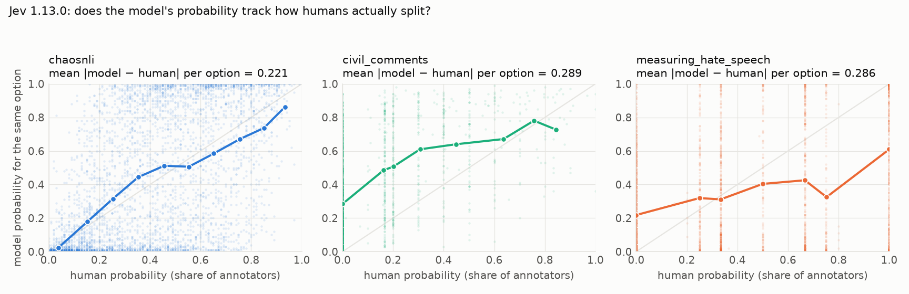
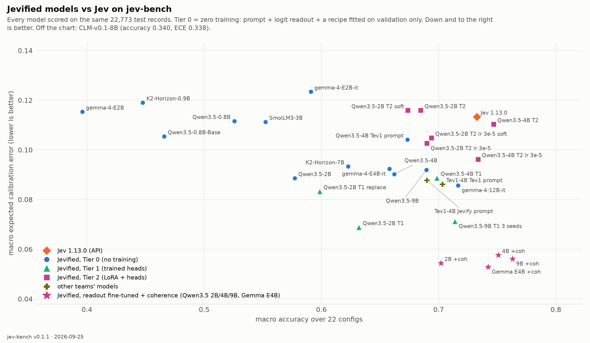

<div align="center">

# Jevify

**Turn any open LLM into a calibrated, Jev-style System One decision model.**

[**Try it**](https://uspraveenraj--jevify-playground.modal.run) ·
[**Findings**](docs/FINDINGS.md) ·
[jev-bench on the Hub](https://huggingface.co/datasets/Praveenrajus/jev-bench) ·
[Jev baseline + label audit](reports/jev-1.13.0/README.md) ·
[Behavioral probes](reports/jev-1.13.0/probes/README.md) ·
[Tier 1 write-up](reports/tier1/README.md) ·
[Jev API contract](docs/JEV_CONTRACT.md) ·
[Dataset rationale](docs/DATASETS.md)

</div>

A *System One* model doesn't write text. It reads a `state`, answers typed questions, and returns
probability distributions your code can branch on:

| primitive | question | answer |
|---|---|---|
| `choice` | which of these K options? | probabilities over the options + `confidence` |
| `score`  | where on these K ordered levels? | probabilities over levels, expected `score`, `confidence` |
| `noul`   | is this true? | a single `P(yes)` |

TypeSafe's [Jev](https://typesafe.ai) made this a product category: fast, cheap, and — the actual
claim — **calibrated**: an answer given 0.8 should be right about 80% of the time. Jev ships no
paper, weights or data. Jevify is the open version: a benchmark that can measure the claim, an
engine that gives any Hugging Face checkpoint the same interface, and a training recipe that
optimizes the same objective.

## Headline findings

Full catalogue with evidence and caveats in **[docs/FINDINGS.md](docs/FINDINGS.md)**.

**1 · Jev is calibrated right up until humans disagree — which is when calibration matters.**
On ChaosNLI, where 100 annotators label every item, Jev answers at p = 0.94–0.98 on items the
annotators split 60/40; its distributions sit **TVD 0.33** from the human ones, and 0.43 on
hate-speech vote shares. It assigns ~0.29 "toxic" to comments *zero* Jigsaw annotators flagged.
Meanwhile it is excellent and well calibrated on crisp, grounded questions (ARC 0.979, FEVER
0.972, ECE ≤ 0.06).



**2 · Evaluating on held-out *records* instead of held-out *sources* would have shipped the
wrong architecture.** A trained head that replaces the model's own scorer gains +0.077 accuracy
on sources it trained on and loses **−0.098** on sources it never saw. Making it a
zero-initialized residual on that scorer — so training provably starts at Tier 0 — keeps the gain
(+0.080) and erases the regression (−0.000). Two independently trained heads, on Qwen3.5-2B and
Qwen3.5-4B, both learn to keep the model's prior at full strength — LM weights **0.95 / 0.98 / 1.01**
and **0.96 / 0.97 / 1.01** — which is itself the evidence that replacing it was wrong.


**3 · Jevified open models now beat Jev on calibration and on human agreement, and are within
3.5 points on accuracy.** Qwen3.5-4B with residual heads: macro accuracy **0.698 vs Jev's 0.733**,
**ECE 0.089 vs 0.113**, **TVD to human label distributions 0.360 vs 0.432**, and Score accuracy
0.507 vs 0.503. Qwen3.5-2B reaches ECE **0.069**, the best of anything tested. The finding in (2)
replicates on both backbones — at 2B the residual erases the regression, at 4B it turns it into a
**+0.035** gain on held-out sources.

**4 · Structure generalizes; knowledge does not.** Heads trained with ≤16 options transfer
unchanged to K=151 (clinc150 moves −0.008). What collapses under replacement is knowledge
(arc_challenge −0.199, mmlu −0.119 *even when trained*) and ordinal scales never seen
(measuring_hate_speech −0.482).

**5 · Instruction tuning does hurt calibration — 1.3–1.8× worse raw ECE — but it is almost
entirely a temperature problem.** Gemma-4-E2B-it starts at ECE 0.361 and lands at 0.158 after one
scalar per primitive; its accuracy is +0.195 over its base checkpoint for +0.043 ECE. Take the
instruct checkpoint and always fit the temperature.
[· detail](docs/FINDINGS.md#5-does-instruction-tuning-hurt-calibration)

**6 · What hurts Jev is ambiguity, not option count.** Controlled within-item probes: with the
gold answer always present, clinc150 goes 0.995 → 0.910 from K=2 to K=151, while GoEmotions is
0.850 at K=2 and 0.300 by K=25. Option order flips 0–13% of answers, scaling with ambiguity
rather than K; opaque option keys cost nothing as long as descriptions remain; nonsense options
attract ≤3.3% of the mass.

**7 · The primitives are different instruments.** The same yes/no question is ~2× better
calibrated asked as a Noul than as a two-option Choice (ECE 0.028 vs 0.054); Score beats an
unordered Choice over the same levels. This is why Tier 1 gives Noul its own absolute head
instead of a softmax over {yes, no}.

**8 · Two of our own benchmark bugs, found by reading the model's errors.** HelpSteer2 verbosity
levels contradicted NVIDIA's verbatim scale, and GoEmotions' single-label subset hid rater
disagreement (rebuilt from raw votes; plurality agreement is only 0.66, which is the accuracy
ceiling). Low benchmark scores deserve an audit before they become claims.

## Try it

**Playground:** [https://uspraveenraj--jevify-playground.modal.run](https://uspraveenraj--jevify-playground.modal.run) — ask a Jevified open model typed questions and watch the
distributions. Scales to zero, so the first question waits ~30 s for a cold start.

**Hosted API**, same wire format as TypeSafe's:

```bash
curl -X POST https://uspraveenraj--jevify-playground.modal.run/api/v1/systemone   -H 'Content-Type: application/json'   -d '{"state": "I was charged twice, please refund.", "model": "jevify-latest",
       "questions": {"refund": {"type": "noul", "instructions": "Is this a refund request?"}}}'
```

The official `typesafe-sdk` works against it unchanged:

```python
# TYPESAFE_BASE_URL=https://uspraveenraj--jevify-playground.modal.run/api
from typesafe_sdk import Noul, TypeSafeClient
with TypeSafeClient() as client:
    r = client.system_one(state="I was charged twice, please refund.", model="jevify-latest",
                          questions={"refund": Noul(instructions="Is this a refund request?")})
```

**Models:** [jevify-qwen3.5-4b](https://huggingface.co/Praveenrajus/jevify-qwen3.5-4b) ·
[jevify-qwen3.5-2b](https://huggingface.co/Praveenrajus/jevify-qwen3.5-2b) — ~11 MB each; the
backbone is pulled from its own repo, so nothing is duplicated.

```python
from jevify import load_jevified
model = load_jevified("Praveenrajus/jevify-qwen3.5-4b")
model.ask(state, questions)
```

## What's here

**jev-bench** — 22 configs, 166k rows of real human-labeled data reformatted into System One
questions in Jev's exact wire format, with **human label distributions** on four configs
(ChaosNLI, Civil Comments, Measuring Hate Speech, GoEmotions) so calibration is measured against
how humans actually split. Natural base rates everywhere. → `jevify/bench`, `jevify-bench build`.

**Metrics and figures** — ECE, Brier, NLL, RPS, selective accuracy, AURC, AUROC, TVD/KL to human
distributions; reliability diagrams, calibration maps with bootstrap CIs, risk–coverage curves,
model-vs-human plots. → `jevify/bench/metrics.py`, `jevify/bench/figures.py`.

**Behavioral probes** — within-item experiments that isolate one factor: decision-set size (same
items, gold kept, K distractors), option order, opaque option keys, distractor injection, and the
same question asked through a different primitive. → `jevify/bench/probes.py`.

**The engine (Tier 0)** — render `state` + question, score every allowed answer by teacher-forcing
against a shared prefix (KV cache expanded across candidates, so 151-option Choice is one prefix
pass), then calibrate. Raw log-scores are stored on every prediction, so temperature scaling,
permutation averaging and contextual-prior correction are offline CPU experiments; nothing is
tuned on test. → `jevify/engine`.

**A drop-in server** — `jevify-serve --model <hf-id>` exposes `/v1/systemone` and `/v1/models`.
The official `typesafe-sdk` works against it by setting `TYPESAFE_BASE_URL`; that is a test in
this repo. → `jevify/server.py`.

**A Jev runner** — score the real API on the same records, same metrics, same figures.
→ `jevify-run api|report|recipe|compare`.

## Leaderboard

Every model on the same 22,773 test records. Tier 0 = no training (prompt + logit readout + a
recipe fitted on validation splits only). Tier 1 = trained decision heads, six sources held out
of training. **TVD→human** is the mean distance to human label distributions on the four
calibration-gold configs — lower is better, and it is the number Jev's own claim rests on.

| model | tier | macro acc | macro ECE | macro Brier | sel@90 | choice acc | score acc | noul acc | TVD→human | GPU | test cost |
|---|---|---|---|---|---|---|---|---|---|---|---|
| **Jev 1.13.0 (TypeSafe API)** | API | 0.733 | 0.113 | 0.349 | 0.760 | 0.770 | 0.503 | 0.881 | 0.432 |  |  |
| Qwen/Qwen3.5-4B (Tier 1 residual) | Tier 1 residual | 0.698 | 0.089 | 0.378 | 0.729 | 0.699 | 0.507 | 0.862 | 0.360 | A100-80GB | $1.28 |
| Qwen/Qwen3.5-4B | Tier 0 | 0.662 | 0.093 | 0.402 | 0.689 | 0.687 | 0.468 | 0.796 | 0.438 | A100-80GB | $0.96 |
| google/gemma-4-E4B-it | Tier 0 | 0.658 | 0.148 | 0.426 | 0.678 | 0.699 | 0.432 | 0.798 | 0.432 | A100-80GB | $1.00 |
| Qwen/Qwen3.5-2B (Tier 1 residual) | Tier 1 residual | 0.632 | 0.069 | 0.445 | 0.657 | 0.596 | 0.449 | 0.835 | 0.374 | A100-80GB | $0.67 |
| Qwen/Qwen3.5-2B (Tier 1 replace) | Tier 1 replace | 0.599 | 0.083 | 0.475 | 0.621 | 0.567 | 0.378 | 0.828 | 0.416 | A100-80GB | $0.62 |
| google/gemma-4-E2B-it | Tier 0 | 0.591 | 0.158 | 0.502 | 0.609 | 0.595 | 0.440 | 0.716 | 0.490 | L4 | $0.75 |
| Qwen/Qwen3.5-2B | Tier 0 | 0.577 | 0.089 | 0.485 | 0.599 | 0.545 | 0.424 | 0.750 | 0.458 | A100-80GB | $0.66 |
| HuggingFaceTB/SmolLM3-3B | Tier 0 | 0.552 | 0.111 | 0.519 | 0.570 | 0.504 | 0.401 | 0.744 | 0.458 | A100-80GB | $0.64 |
| Qwen/Qwen3.5-0.8B | Tier 0 | 0.526 | 0.113 | 0.543 | 0.544 | 0.435 | 0.388 | 0.759 | 0.440 | L4 | $0.55 |
| Qwen/Qwen3.5-0.8B-Base | Tier 0 | 0.466 | 0.105 | 0.582 | 0.478 | 0.326 | 0.412 | 0.692 | 0.452 | L4 | $0.50 |
| IFM/K2-Horizon-0.9B | Tier 0 | 0.448 | 0.119 | 0.589 | 0.461 | 0.344 | 0.343 | 0.670 | 0.479 | L4 | $0.35 |
| google/gemma-4-E2B | Tier 0 | 0.396 | 0.115 | 0.609 | 0.404 | 0.247 | 0.382 | 0.600 | 0.496 | L4 | $0.69 |



Refresh with `python scripts/leaderboard.py`; every row has `results/<run>/` with its predictions,
per-config metrics, recipe and figures.

## Roadmap

- [x] jev-bench v0.1.1, Jev 1.13.0 baseline, figures, label audit, behavioral probes
- [x] Tier 0 engine + server + offline recipe search
- [x] Tier 0 sweep: 9 open checkpoints scored on all 22,773 test records against Jev
- [x] Tier 1 residual decision heads, with held-out-source generalization measured
- [x] Findings, figures and reports published ([docs/FINDINGS.md](docs/FINDINGS.md))
- [x] Published models + hosted playground and API
- [x] Tier 1 replicated on a second backbone (Qwen3.5-4B)
- [ ] More diverse ordinal scales in training; Tier 1 at 7B+ and across families
- [ ] Tier 2: LoRA where Tier 1 leaves a gap the benchmark can see
- [ ] Label-first synthetic data pipeline; HF Space; model zoo; VLM backbones; vision-tower autoresearch

## Why tiers, and why no RL

Calibration comes from optimizing a strictly proper scoring rule against real outcomes. TypeSafe
calls their version RLCD. When the model *emits* a decision you need RL to push that objective
through a sampling step; when the decision is read from a differentiable head on the backbone's
hidden states, the same objective is just a loss. Jevify trains heads (and optionally LoRA) by
gradient descent on log/Brier/ranked-probability losses — no reward model, no rollouts — and each
tier has to earn its place on jev-bench.

## Quickstart

```bash
pip install -e ".[bench,engine,serve,dev]"

# the benchmark
jevify-bench list
jevify-bench build --out data/jev-bench                     # or load Praveenrajus/jev-bench from the Hub

# score Jev (or any /v1/systemone server) on it
TYPESAFE_API_KEY=... jevify-run api --records data/jev-bench --out preds/jev.jsonl
jevify-run report --records data/jev-bench --preds preds/jev.jsonl --md report.md --figures figures/

# Jevify a checkpoint and serve it
jevify-serve --model Qwen/Qwen3.5-0.8B --port 8000
TYPESAFE_BASE_URL=http://localhost:8000 python -c "from typesafe_sdk import *; print(TypeSafeClient().system_one('Refund please', {'r': Noul(instructions='Is this a refund request?')}))"

# behavioral probes
jevify-bench probe --records data/jev-bench --out data/jev-probes --n 200
jevify-run api --records data/jev-probes --out preds/probes.jsonl
jevify-bench probe-report --records data/jev-probes --preds preds/probes.jsonl --out results/probes
```

Tests: `pytest` (engine and server tests download a 135M model and run on CPU).

## License

Apache-2.0 for the code. Benchmark rows carry their upstream licenses (see the manifest and
[docs/DATASETS.md](docs/DATASETS.md)).
