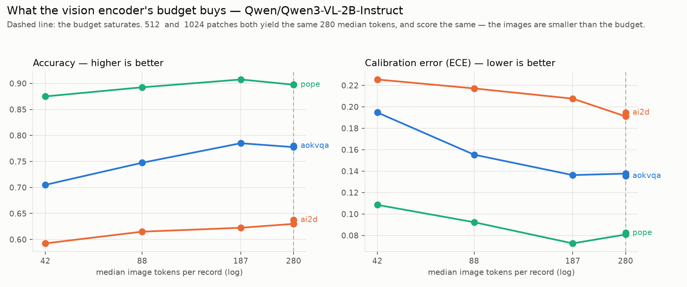
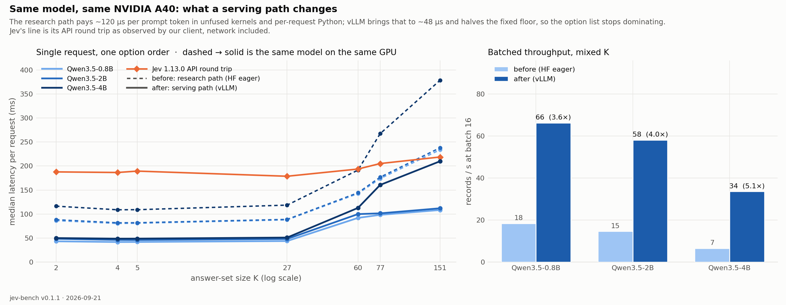
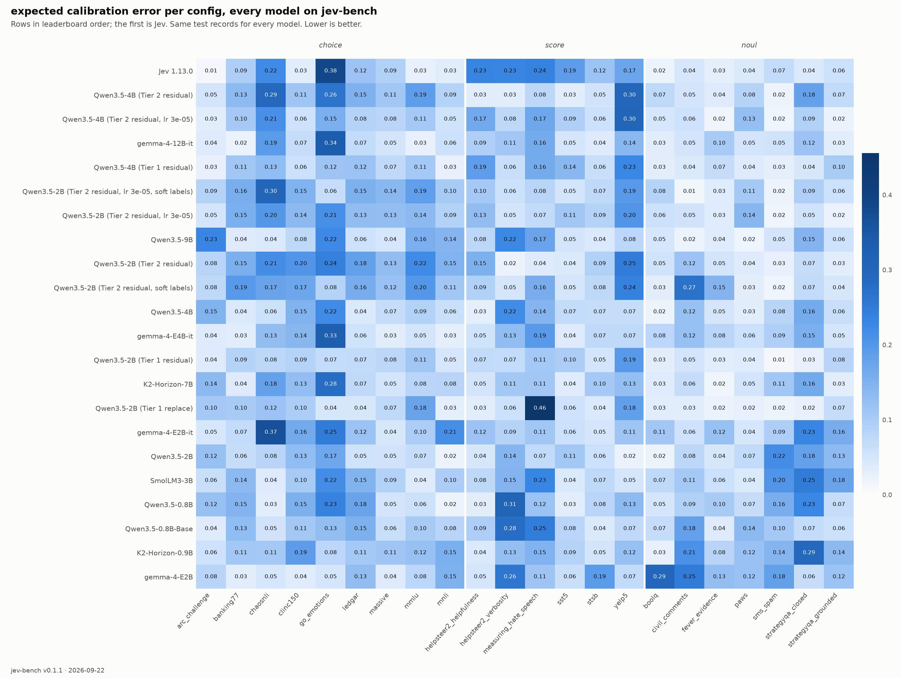

<div align="center">

# Jevify

**Turn any open LLM into a calibrated, Jev-style System One decision model.**

[**Try it**](https://uspraveenraj--jevify-playground.modal.run) ·
[**Findings**](docs/FINDINGS.md) ·
[jev-bench on the Hub](https://huggingface.co/datasets/Praveenrajus/jev-bench) ·
[Jev baseline + label audit](results/jev-1.13.0/README.md) ·
[Behavioral probes](results/jev-1.13.0/probes/README.md) ·
[Tier 1 write-up](reports/tier1/README.md) ·
[Jev API contract](docs/JEV_CONTRACT.md) ·
[Dataset rationale](docs/DATASETS.md)

</div>

A *System One* model doesn't write text. It reads a `state`, answers typed questions, and returns
probability distributions your code can branch on:

| primitive | question | answer |
|---|---|---|
| `choice` | which of these K options? | probabilities over the options + `confidence` |
| `score`  | where on these K ordered levels? | probabilities over levels, expected `score`, `confidence` |
| `noul`   | is this true? | a single `P(yes)` |

TypeSafe's [Jev](https://typesafe.ai) made this a product category: fast, cheap, and — the actual
claim — **calibrated**: an answer given 0.8 should be right about 80% of the time. Jev ships no
paper, weights or data. Jevify is the open version: a benchmark that can measure the claim, an
engine that gives any Hugging Face checkpoint the same interface, and a training recipe that
optimizes the same objective.

## Headline findings

Full catalogue with evidence and caveats in **[docs/FINDINGS.md](docs/FINDINGS.md)**.

**1 · Jev is calibrated right up until humans disagree — which is when calibration matters.**
On ChaosNLI, where 100 annotators label every item, Jev's confidence is essentially **flat no
matter how much the annotators agree** — 0.81 / 0.84 / 0.83 / 0.88 as agreement goes from a
split (< 50%, n = 191) through contested (50–70%, n = 828) and clear (70–90%, n = 523) to
consensus (≥ 90%, n = 57), Pearson r = 0.046 — while its accuracy on those same bands runs
**0.47 / 0.55 / 0.73 / 0.96**. It is more confident than the human majority on 80% of items; its
distributions sit **TVD 0.33** from the human ones, and 0.43 on hate-speech vote shares.
Meanwhile it is excellent and well calibrated on crisp, grounded questions (ARC 0.979, FEVER
0.972, ECE ≤ 0.06).


**2 · Evaluating on held-out *records* instead of held-out *sources* would have shipped the
wrong architecture — and the head tells you itself when it has stopped generalizing.** A trained
head that replaces the model's own scorer gains +0.077 accuracy on sources it trained on and loses
**−0.098** on sources it never saw. Making it a zero-initialized residual on that scorer — so
training provably starts at Tier 0 — keeps the gain (+0.080). The first version of this README said
it also "erased the regression (−0.000)". **Five seeds say otherwise:** held-out accuracy is
**0.579 ± 0.049**, bimodal — two seeds match Tier 0 (0.628), three regress by ~0.09 — while
trained-source accuracy is stable at 0.635 ± 0.007. What separates the basins is the weight the
head learns on the model's own log-score: 0.95 for the seeds that held up, 0.92–0.93 for the ones
that collapsed, and the same ordering at 4B (ρ = 0.90 and 0.97 within each backbone). Every extra
epoch on the trained sources erodes that trust, early stopping on trained-source loss cannot see
it — and **capping the schedule at six epochs collapses the spread to 0.621 ± 0.004** with the
weight at 0.965 for every seed and the trained gain intact. So Tier 1 is "+0.08 where it trained,
Tier 0 where it did not, if it stops early", and the LM weight is the diagnostic. At 4B, five
seeds: trained +0.047 every time, held-out 0.715 ± 0.025 against Tier 0's 0.714 — the +0.035 first
reported was one seed at the top of the spread. At 9B, three seeds with the cap from the start:
held-out **0.743 ± 0.002**, and on the sources it trained on it beats Jev on accuracy and calibration
(0.703 / ECE 0.064 vs 0.694 / 0.122) with the backbone frozen.


**3 · An open 4B now matches or beats Jev on every macro number — and Jev still wins where it counts
most.** Qwen3.5-4B with LoRA and residual heads (Tier 2) at LoRA lr 3e-5: macro accuracy **0.734 vs
Jev's 0.733**, macro ECE **0.096 vs 0.113**, TVD to human label distributions **0.337 vs 0.432**,
ChaosNLI ECE 0.211 vs 0.222. At lr 1e-4 the same model reaches **0.747** accuracy for a worse
ECE (0.110). The qualifier is the split: it wins 9 of 22 configs on accuracy and 12 on ECE, not all 22, and on the
six sources it never trained on Jev leads **0.835 to 0.765** — the open model's overall edge comes
from the sixteen it did train on (0.722 vs 0.694). One seed each.
[`Praveenrajus/jevify-qwen3.5-4b-t2-lowlr`](https://huggingface.co/Praveenrajus/jevify-qwen3.5-4b-t2-lowlr). Without touching the backbone, Qwen3.5-4B with residual heads alone
reaches 0.698 / ECE 0.089 / TVD 0.360; the 2B head's ECE of 0.069 is the best of anything tested
but, per (2), seed-dependent on unseen sources.

**4 · Structure generalizes; knowledge does not.** Heads trained with ≤16 options transfer
unchanged to K=151 (clinc150 moves −0.008). What collapses under replacement is knowledge
(arc_challenge −0.199, mmlu −0.119 *even when trained*) and ordinal scales never seen
(measuring_hate_speech −0.482).

**5 · LoRA buys the accuracy a frozen backbone cannot, and at 4B it buys calibration too.**
Tier 2 (rank-16 LoRA trained jointly with the residual heads, one A40) lifts Qwen3.5-2B from
0.632 to **0.690** macro accuracy and Qwen3.5-4B from 0.698 to **0.747**, and fixes the Tier 1 weak
spot outright: the held-out ordinal scale gains **+0.17** accuracy *and* gets better calibrated.
The learning rate decides the calibration, and three seeds per arm agree: at 3e-5 the 2B model is
better than at 1e-4 on the sources it never trained on — accuracy **0.716 ± 0.003** vs 0.700 ± 0.002,
ECE **0.083 ± 0.004** vs 0.104 ± 0.014 — at the same trained-source accuracy, and its agreement with
human label distributions (TVD 0.339) is the best of any model tested (Jev 0.432). Two things the
seeds took away: training on human label distributions did not help (TVD 0.433), and the low
learning rate does *not* rescue the ambiguous-question calibration the LoRA costs — ChaosNLI ECE
ranges 0.16–0.33 across seeds in both arms, at Jev's level (0.222) and far from the Tier 1
residual's 0.077. One thing they added: Tier 2's held-out accuracy is seed-stable (±0.003) where
Tier 1's was bimodal (±0.049) — partly because every LoRA run stops after one or two passes, the
regime in which (2) showed the head is stable too. At 4B the same learning-rate trade holds: 3e-5
gives held-out 0.765 / ECE 0.098 against 0.769 / 0.107 at 1e-4. And soft labels fail at the low
learning rate as well (TVD 0.364 vs 0.332 for hard labels): the loss, not the schedule, is what
makes them worse at matching human distributions.
[· detail](docs/FINDINGS.md#7-tier-2-letting-the-backbone-move)

**6 · Instruction tuning does hurt calibration — 1.3–1.8× worse raw ECE — but it is almost
entirely a temperature problem.** Gemma-4-E2B-it starts at ECE 0.361 and lands at 0.123 after one
scalar per primitive; its accuracy is +0.195 over its base checkpoint for +0.008 ECE. Take the
instruct checkpoint and always fit the temperature — on the exact distribution: our own fitter read
the 4-decimal wire format, which zeroed real high-K probabilities and cost the Gemma models 0.03–0.06
ECE until it was fixed. [· detail](docs/FINDINGS.md#4-tier-0-any-open-llm-with-no-training)
[· detail](docs/FINDINGS.md#5-does-instruction-tuning-hurt-calibration)

**7 · What hurts Jev is ambiguity, not option count.** Controlled within-item probes: with the
gold answer always present, clinc150 goes 0.995 → 0.910 from K=2 to K=151, while GoEmotions is
0.850 at K=2 and 0.300 by K=25. Option order flips 0–13% of answers, scaling with ambiguity
rather than K; opaque option keys cost nothing as long as descriptions remain; nonsense options
attract ≤3.3% of the mass.

**8 · The primitives are different instruments.** The same yes/no question is ~2× better
calibrated asked as a Noul than as a two-option Choice (ECE 0.028 vs 0.054); Score beats an
unordered Choice over the same levels. This is why Tier 1 gives Noul its own absolute head
instead of a softmax over {yes, no}.

**9 · Two of our own benchmark bugs, found by reading the model's errors.** HelpSteer2 verbosity
levels contradicted NVIDIA's verbatim scale, and GoEmotions' single-label subset hid rater
disagreement (rebuilt from raw votes; plurality agreement is only 0.66, which is the accuracy
ceiling). Low benchmark scores deserve an audit before they become claims.

**10 · It transfers to vision — and a picture question answers in under 80 ms.** Qwen3-VL-2B,
no training, on POPE / A-OKVQA / AI2D (4,244 records): a recipe fitted on validation splits takes
macro ECE from 0.128 to **0.047** (POPE 0.046, A-OKVQA 0.037, AI2D 0.059) at unchanged accuracy.
The raw readout shows the text ordering — Noul better calibrated than Choice — and the recipe
erases it: the raw gap measured what a temperature could fix, not which primitive is easier.
Starving the vision encoder costs accuracy *and* calibration together (42 → 187 image tokens:
+0.048 accuracy, −0.037 ECE); the dangerous regime — losing accuracy while keeping confidence —
never appears, and the budget saturates silently (512 and 1024 patches both give 280 tokens).
Served through the same `ask` path as the text models, an image question takes **68–79 ms** on
one A40 (~350 input tokens, 85% of them image), four questions about one image 221 ms, 12.6
records/s batched — under Jev's 180–220 ms text round trip, and Jev takes no images.
And the vision tower was the wrong place to look: a LoRA trained on the readout over 2,000 A-OKVQA
records transfers to science diagrams it never saw when it lives in the **decoder** (AI2D 0.652 →
**0.707**, macro ECE 0.047 → **0.035**) and barely when confined to the tower (0.669); after the
decoder LoRA the fitted Choice temperature is 1.001 — training on a proper scoring rule made the
recipe redundant on the trained primitive.
Published: [`Praveenrajus/jevify-qwen3-vl-2b`](https://huggingface.co/Praveenrajus/jevify-qwen3-vl-2b) (Tier 0) ·
[`Praveenrajus/jevify-qwen3-vl-2b-t2`](https://huggingface.co/Praveenrajus/jevify-qwen3-vl-2b-t2) (decoder LoRA).
[· detail](docs/FINDINGS.md#9-vision-does-any-of-this-transfer)




**11 · Jev's flat latency curve is arithmetic, not architecture — and a serving path gives our
engine the same shape.** Jev's round trip barely moves with the number of options (186 ms at K=4,
219 ms at K=151). Controlled probes with the server's own clock say why: **~75 ms fixed + ~5.5 µs
per input token**, linear to 27,000 tokens, with option tokens costing exactly what state tokens
cost — no cache, no fixed window, no batching wait. 151 options are ~1,300 tokens, ~7 ms. The
answer is a template filled in one pass (2,570 "output" tokens in 128 ms), not a decode. Our
research path paid ~120 µs per token on an A40, so the same options cost it 150 ms; the same model
on the same GPU through vLLM pays ~48 µs, halves the fixed floor and runs 4–5× more records per
second. Below K≈60 a 2B on our A40 now answers in ~46 ms — 4× under Jev's round trip.
[· probes](results/jev-latency-probe/README.md) · [detail](docs/FINDINGS.md#1-what-jev-actually-does)



The original ladder (research path, four sizes, three tiers) is kept as
[`results/latency/latency_ladder.png`](results/latency/latency_ladder.png); Jev's server-time fit is
[`results/jev-latency-probe/server_time_vs_tokens.png`](results/jev-latency-probe/server_time_vs_tokens.png).

**12 · At 8–12B the picture holds, and the speed claim gets its honest form.** Qwen3-VL-8B,
Qwen3.5-9B and Gemma-4-12B on the vision configs, no training: macro accuracy **0.84** (2B: 0.78),
AI2D 0.75–0.77 (2B: 0.65), macro ECE **0.032** for the 8B after a recipe — and Qwen3.5-9B's *raw*
readout is already calibrated (ECE 0.045 before any temperature), the only checkpoint tested for
which that is true. An image question answers in **120 ms** (Qwen3-VL-8B) to **175 ms** (Gemma-4-12B)
on one A40, still under Jev's 180–220 ms text round trip; through vLLM the 9B text model sits at
56–70 ms for K ≤ 27. The comparison that matters: on the *same* model and prompt, the readout costs
the prefill (85–180 ms) while decoding the answer as text costs 52–106 ms per token on top — an
eight-token answer is 4–7× the readout, a 32-token one 13–27×. Generation pays for tokens a typed
decision never asked for; that is the saving, at 2B or 12B.
[· detail](docs/FINDINGS.md#10-the-8b-class-is-a-small-models-speed-the-whole-story)


## Try it

**Playground:** [https://uspraveenraj--jevify-playground.modal.run](https://uspraveenraj--jevify-playground.modal.run) — ask a Jevified open model typed questions and watch the
distributions. Scales to zero, so the first question waits ~30 s for a cold start.

**Hosted API**, same wire format as TypeSafe's:

```bash
curl -X POST https://uspraveenraj--jevify-playground.modal.run/api/v1/systemone   -H 'Content-Type: application/json'   -d '{"state": "I was charged twice, please refund.", "model": "jevify-latest",
       "questions": {"refund": {"type": "noul", "instructions": "Is this a refund request?"}}}'
```

The official `typesafe-sdk` works against it unchanged:

```python
# TYPESAFE_BASE_URL=https://uspraveenraj--jevify-playground.modal.run/api
from typesafe_sdk import Noul, TypeSafeClient
with TypeSafeClient() as client:
    r = client.system_one(state="I was charged twice, please refund.", model="jevify-latest",
                          questions={"refund": Noul(instructions="Is this a refund request?")})
```

**Models:** [jevify-qwen3.5-4b-t2-lowlr](https://huggingface.co/Praveenrajus/jevify-qwen3.5-4b-t2-lowlr)
(Tier 2, the balanced one: accuracy 0.734 = Jev, ECE 0.096 and TVD 0.337 both better) ·
[jevify-qwen3.5-4b-t2](https://huggingface.co/Praveenrajus/jevify-qwen3.5-4b-t2)
(Tier 2: heads + a LoRA merged at load, 97 MB — macro accuracy 0.747, above Jev's 0.733) ·
[jevify-qwen3.5-4b](https://huggingface.co/Praveenrajus/jevify-qwen3.5-4b) ·
[jevify-qwen3.5-2b](https://huggingface.co/Praveenrajus/jevify-qwen3.5-2b) (Tier 1, ~11 MB each) ·
[jevify-qwen3-vl-2b](https://huggingface.co/Praveenrajus/jevify-qwen3-vl-2b) (vision, Tier 0 recipe) ·
[jevify-qwen3-vl-2b-t2](https://huggingface.co/Praveenrajus/jevify-qwen3-vl-2b-t2) (vision, decoder LoRA merged at load).
The backbone is pulled from its own repo, so nothing is duplicated.

```python
from jevify import load_jevified
model = load_jevified("Praveenrajus/jevify-qwen3.5-4b")
model.ask(state, questions)
```

## What's here

**jev-bench** — 22 configs, 166k rows of real human-labeled data reformatted into System One
questions in Jev's exact wire format, with **human label distributions** on four configs
(ChaosNLI, Civil Comments, Measuring Hate Speech, GoEmotions) so calibration is measured against
how humans actually split. Natural base rates everywhere. → `jevify/bench`, `jevify-bench build`.

**Metrics and figures** — ECE, Brier, NLL, RPS, selective accuracy, AURC, AUROC, TVD/KL to human
distributions; reliability diagrams, calibration maps with bootstrap CIs, risk–coverage curves,
model-vs-human plots. → `jevify/bench/metrics.py`, `jevify/bench/figures.py`.

**Behavioral probes** — within-item experiments that isolate one factor: decision-set size (same
items, gold kept, K distractors), option order, opaque option keys, distractor injection, and the
same question asked through a different primitive. → `jevify/bench/probes.py`.

**The engine (Tier 0)** — render `state` + question, score every allowed answer by teacher-forcing
against a shared prefix (KV cache expanded across candidates, so 151-option Choice is one prefix
pass), then calibrate. Raw log-scores are stored on every prediction, so temperature scaling,
permutation averaging and contextual-prior correction are offline CPU experiments; nothing is
tuned on test. → `jevify/engine`.

**A drop-in server** — `jevify-serve --model <hf-id>` exposes `/v1/systemone` and `/v1/models`.
The official `typesafe-sdk` works against it by setting `TYPESAFE_BASE_URL`; that is a test in
this repo. → `jevify/server.py`.

**A Jev runner** — score the real API on the same records, same metrics, same figures.
→ `jevify-run api|report|recipe|compare`.

**Training that runs anywhere** — Tier 1, Tier 2 and the vision pass with no cloud dependency:
`python -m jevify.train tier1|tier2|vision --model-id … --run-id …`. The Modal app calls the same
functions. → `jevify/train.py`.

**Vision** — images ride on `state` (PIL, path, URL, data URI or bytes); the question and answer set
are unchanged, and so is the serving path: `load_jevified("Praveenrajus/jevify-qwen3-vl-2b")` or
`jevify-serve --model Praveenrajus/jevify-qwen3-vl-2b` (or `--vision` with any VLM checkpoint). The
vision tower is addressable, not opaque: `describe()` it, set a pixel budget and *measure* the tokens
it actually produced, freeze it, or train a LoRA confined to it — `python -m jevify.train vision
--lora vision|decoder|both` adapts the readout itself, since a VLM prompt has no per-option slot
positions that survive image-token expansion. Scoping uses a full-path regex because suffix names
like `q_proj` exist on both halves of a VLM, so a suffix list silently adapts everything. Tower
swapping is deliberately not offered — the projector is trained against one encoder's geometry.
→ `jevify/engine/vision.py`, `jevify/engine/vision_tier2.py`, `jevify/engine/vision_backbone.py`,
`scripts/vision_budget.py`, `scripts/latency_vision.py`.

## Leaderboard

Every model on the same 22,773 test records. Tier 0 = no training (prompt + logit readout + a
recipe fitted on validation splits only, with the corrected fitter of FINDINGS 4.5). Tier 1 = trained decision heads, six sources held out
of training. **TVD→human** is the mean distance to human label distributions on the four
calibration-gold configs — lower is better, and it is the number Jev's own claim rests on.

| model | tier | macro acc | macro ECE | macro Brier | sel@90 | choice acc | score acc | noul acc | TVD→human | GPU | test cost |
|---|---|---|---|---|---|---|---|---|---|---|---|
| **Jev 1.13.0 (TypeSafe API)** | API | 0.733 | 0.113 | 0.349 | 0.760 | 0.770 | 0.503 | 0.881 | 0.432 |  |  |
| Qwen/Qwen3.5-4B (Tier 2 residual) | Tier 2 residual | 0.747 | 0.110 | 0.342 | 0.774 | 0.770 | 0.529 | 0.903 | 0.347 | A40 |  |
| Qwen/Qwen3.5-4B (Tier 2 residual, lr 3e-05) | Tier 2 residual | 0.734 | 0.096 | 0.342 | 0.762 | 0.761 | 0.518 | 0.884 | 0.337 | A40 |  |
| google/gemma-4-12B-it | Tier 0 | 0.716 | 0.086 | 0.359 | 0.740 | 0.749 | 0.507 | 0.855 | 0.405 | A40 |  |
| Qwen/Qwen3.5-9B (Tier 1 residual, 6-epoch cap, mean of 3 seeds) | Tier 1 residual | 0.714 | 0.071 | 0.362 | 0.740 | 0.725 | 0.507 | 0.878 | 0.376 | A40 |  |
| Qwen/Qwen3.5-4B (Tier 1 residual) | Tier 1 residual | 0.698 | 0.089 | 0.378 | 0.729 | 0.699 | 0.507 | 0.862 | 0.360 | A100-80GB | $1.28 |
| Qwen/Qwen3.5-2B (Tier 2 residual, lr 3e-05, soft labels) | Tier 2 residual | 0.694 | 0.105 | 0.390 | 0.724 | 0.697 | 0.497 | 0.859 | 0.364 | A40 |  |
| Qwen/Qwen3.5-2B (Tier 2 residual, lr 3e-05) | Tier 2 residual | 0.690 | 0.103 | 0.389 | 0.720 | 0.693 | 0.510 | 0.840 | 0.332 | A40 |  |
| Qwen/Qwen3.5-9B | Tier 0 | 0.689 | 0.092 | 0.379 | 0.717 | 0.716 | 0.503 | 0.815 | 0.423 | A40 |  |
| Qwen/Qwen3.5-2B (Tier 2 residual) | Tier 2 residual | 0.685 | 0.116 | 0.410 | 0.713 | 0.671 | 0.508 | 0.854 | 0.370 | A40 |  |
| Qwen/Qwen3.5-2B (Tier 2 residual, soft labels) | Tier 2 residual | 0.674 | 0.116 | 0.412 | 0.703 | 0.682 | 0.471 | 0.837 | 0.433 | A40 |  |
| Qwen/Qwen3.5-4B | Tier 0 | 0.662 | 0.090 | 0.401 | 0.689 | 0.687 | 0.468 | 0.796 | 0.438 | A100-80GB | $0.96 |
| google/gemma-4-E4B-it | Tier 0 | 0.658 | 0.092 | 0.398 | 0.682 | 0.700 | 0.432 | 0.798 | 0.434 | A100-80GB | $1.00 |
| Qwen/Qwen3.5-2B (Tier 1 residual) | Tier 1 residual | 0.632 | 0.069 | 0.445 | 0.657 | 0.596 | 0.449 | 0.835 | 0.374 | A100-80GB | $0.67 |
| IFM/K2-Horizon-7B | Tier 0 | 0.623 | 0.093 | 0.436 | 0.647 | 0.617 | 0.409 | 0.813 | 0.434 | A40 |  |
| Qwen/Qwen3.5-2B (Tier 1 replace) | Tier 1 replace | 0.599 | 0.083 | 0.475 | 0.621 | 0.567 | 0.378 | 0.828 | 0.416 | A100-80GB | $0.62 |
| google/gemma-4-E2B-it | Tier 0 | 0.591 | 0.123 | 0.484 | 0.612 | 0.594 | 0.440 | 0.716 | 0.492 | L4 | $0.75 |
| Qwen/Qwen3.5-2B | Tier 0 | 0.577 | 0.089 | 0.485 | 0.599 | 0.545 | 0.424 | 0.750 | 0.458 | A100-80GB | $0.66 |
| HuggingFaceTB/SmolLM3-3B | Tier 0 | 0.552 | 0.111 | 0.519 | 0.570 | 0.504 | 0.401 | 0.744 | 0.460 | A100-80GB | $0.64 |
| Qwen/Qwen3.5-0.8B | Tier 0 | 0.526 | 0.112 | 0.542 | 0.544 | 0.436 | 0.388 | 0.759 | 0.440 | L4 | $0.55 |
| Qwen/Qwen3.5-0.8B-Base | Tier 0 | 0.466 | 0.105 | 0.582 | 0.478 | 0.326 | 0.412 | 0.692 | 0.452 | L4 | $0.50 |
| IFM/K2-Horizon-0.9B | Tier 0 | 0.448 | 0.119 | 0.589 | 0.461 | 0.344 | 0.343 | 0.670 | 0.479 | L4 | $0.35 |
| google/gemma-4-E2B | Tier 0 | 0.396 | 0.115 | 0.609 | 0.404 | 0.247 | 0.382 | 0.600 | 0.496 | L4 | $0.69 |


Per config, for every model at once — Jev's Score row is the dark one:



Refresh with `python scripts/leaderboard.py`; every row has `results/<run>/` with its predictions,
per-config metrics, recipe and figures.

## Roadmap

- [x] jev-bench v0.1.1, Jev 1.13.0 baseline, figures, label audit, behavioral probes
- [x] Tier 0 engine + server + offline recipe search
- [x] Tier 0 sweep: 9 open checkpoints scored on all 22,773 test records against Jev
- [x] Tier 1 residual decision heads, with held-out-source generalization measured
- [x] Findings, figures and reports published ([docs/FINDINGS.md](docs/FINDINGS.md))
- [x] Published models + hosted playground and API
- [x] Tier 1 replicated on a second backbone (Qwen3.5-4B)
- [x] Training portable off Modal (`python -m jevify.train`)
- [x] VLM backbones: Tier 0 on POPE / A-OKVQA / AI2D; vision tower inspectable, budgetable, freezable, LoRA-scopable
- [x] Vision-encoder budget sweep: accuracy and calibration degrade together, budget saturation measured
- [x] Tier 2: LoRA jointly with residual heads — +0.058 macro accuracy at 2B; at lr 3e-5 the best held-out ECE and human-agreement of any model; overfits after one pass
- [x] Tier 2 ablation: learning rate vs hard-label loss — the learning rate was the cause of the overconfidence; soft-label training is a negative result on human agreement
- [x] Latency: Jev's server-time law measured; vLLM serving path with the same numbers, 4-5x throughput
- [x] Five-seed error bars on Tier 1: held-out generalization is seed-dependent (0.579 ± 0.049); README corrected
- [x] The LM-weight diagnostic and the epoch-cap intervention (0.621 ± 0.004); 4B replicated over five seeds
- [x] Tier 2 at 4B: macro 0.747, above Jev's 0.733; Jev still leads on held-out sources — published as `jevify-qwen3.5-4b-t2`
- [x] Vision served at Jev speed: recipe-fitted Qwen3-VL-2B published; 68–79 ms per image question on one A40
- [x] Seeds on the Tier 2 arms: the learning-rate result holds (3 seeds each); LoRA held-out accuracy is seed-stable
- [ ] Soft labels at the low learning rate; the low learning rate at 4B
- [x] Vision Tier 2: LoRA on the readout, tower vs decoder vs both — the decoder is where transfer lives (AI2D +0.055 held out)
- [x] 8B-class study: Qwen3-VL-8B, Qwen3.5-9B, Gemma-4-12B — vision Tier 0, latency, readout vs generation on one A40
- [x] Gemma-4-12B text Tier 0 (0.716, closest to Jev without training); Tier 1 at 9B (seed-stable, beats Jev on trained sources)
- [x] Recipe fitter fixed (it read the rounded wire format); every Tier 0 run refitted; T(K) measured and left opt-in
- [x] Tier 2 at the low learning rate on 4B (matches Jev's accuracy, better ECE and human agreement); soft labels fail at both rates
- [ ] More ordinal scales; Decision 1.0 (vLLM Semantic Router) on jev-bench; synthetic structure data
- [ ] Label-first synthetic data pipeline; HF Space; model zoo

## Why tiers, and why no RL

Calibration comes from optimizing a strictly proper scoring rule against real outcomes. TypeSafe
calls their version RLCD. When the model *emits* a decision you need RL to push that objective
through a sampling step; when the decision is read from a differentiable head on the backbone's
hidden states, the same objective is just a loss. Jevify trains heads (and optionally LoRA) by
gradient descent on log/Brier/ranked-probability losses — no reward model, no rollouts — and each
tier has to earn its place on jev-bench.

## Quickstart

```bash
pip install -e ".[bench,engine,serve,dev]"

# the benchmark
jevify-bench list
jevify-bench build --out data/jev-bench                     # or load Praveenrajus/jev-bench from the Hub

# score Jev (or any /v1/systemone server) on it
TYPESAFE_API_KEY=... jevify-run api --records data/jev-bench --out preds/jev.jsonl
jevify-run report --records data/jev-bench --preds preds/jev.jsonl --md report.md --figures figures/

# Jevify a checkpoint and serve it
jevify-serve --model Qwen/Qwen3.5-0.8B --port 8000
TYPESAFE_BASE_URL=http://localhost:8000 python -c "from typesafe_sdk import *; print(TypeSafeClient().system_one('Refund please', {'r': Noul(instructions='Is this a refund request?')}))"

# behavioral probes
jevify-bench probe --records data/jev-bench --out data/jev-probes --n 200
jevify-run api --records data/jev-probes --out preds/probes.jsonl
jevify-bench probe-report --records data/jev-probes --preds preds/probes.jsonl --out results/probes
```

Tests: `pytest` (engine and server tests download a 135M model and run on CPU).

## License

Apache-2.0 for the code. Benchmark rows carry their upstream licenses (see the manifest and
[docs/DATASETS.md](docs/DATASETS.md)).
