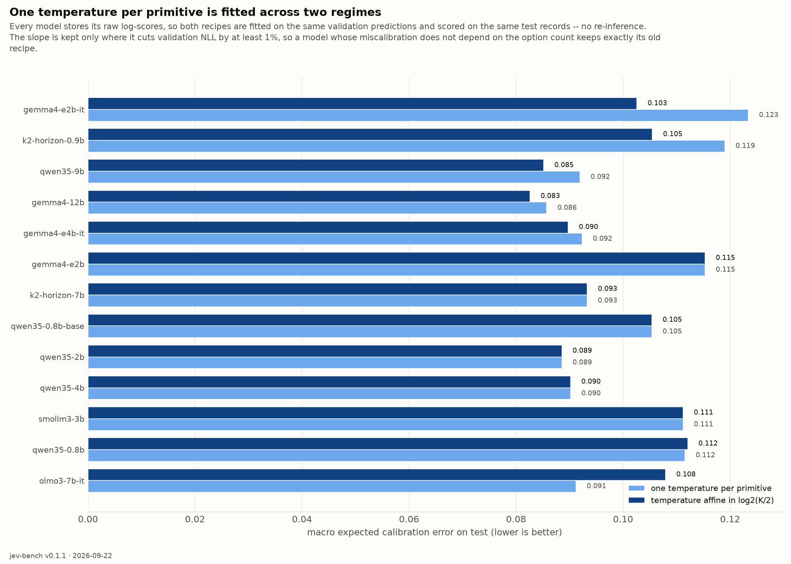
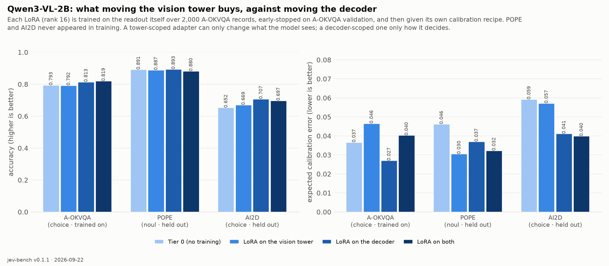
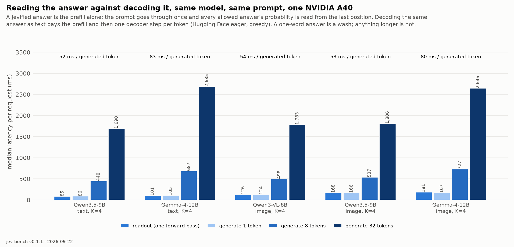
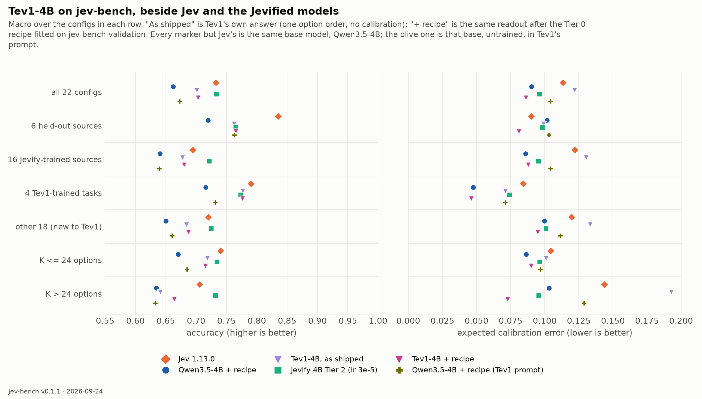

# Findings

Everything this project has established, with the evidence and the caveats. Each entry names
where the number comes from so it can be checked or rerun. Findings about **Jev** come from
22,773 test records plus 14,800 controlled probe requests against the live API; findings about
**Jevified open models** come from nine Tier 0 checkpoints and two Tier 1 variants on the same
records.

Contents: [Jev's behaviour](#1-what-jev-actually-does) · [Controlled probes](#2-controlled-probes)
· [The benchmark itself](#3-what-we-got-wrong-in-the-benchmark) · [Tier 0](#4-tier-0-any-open-llm-with-no-training)
· [Instruction tuning](#5-does-instruction-tuning-hurt-calibration) · [Tier 1](#6-tier-1-trained-decision-heads)
· [Tier 2](#7-tier-2-letting-the-backbone-move) · [Engineering](#8-engineering-findings) · [Vision](#9-vision-does-any-of-this-transfer)
· [The 8B class](#10-the-8b-class-is-a-small-models-speed-the-whole-story) · [Tev1](#11-tev1-the-same-base-model-fine-tuned-by-someone-else)
· [Benchmarks we did not write](#12-three-benchmarks-we-did-not-write) · [CLM](#13-clm-a-contrastive-system-one-model-measured)
· [Open questions](#14-open-questions)

---

## 1. What Jev actually does

**1.1 Crisp, grounded decisions are excellent and well calibrated.** ARC-Challenge 0.979,
MMLU 0.923, FEVER-with-evidence 0.972, BoolQ 0.917, StrategyQA-grounded 0.956 — all at
ECE ≤ 0.06. As a router or a guard on well-specified questions, the confidence signal is
usable exactly as advertised. *(baseline, [report](../results/jev-1.13.0/README.md))*

**1.2 Where humans disagree, the probabilities do not track human uncertainty.** This is the
central negative finding about Jev. On ChaosNLI — 100 annotators per item — the mean distance
between Jev's distribution and the human one is **TVD 0.33**, with answers at p = 0.94–0.98 on
items where annotators split 60/40. On Measuring Hate Speech vote shares, TVD 0.43. On Civil
Comments it assigns ~0.29 "toxic" to comments **zero** annotators flagged. Calibration is the
product claim, and it fails on precisely the inputs where calibration is the thing you need.

**1.3 The System Two gap is measurable.** Same StrategyQA questions, closed-book 0.785 vs
grounded 0.956 — a 17-point gap that isolates retrieval from reasoning.

**1.4 LLM-response judging is weak.** HelpSteer2 helpfulness 0.363 and verbosity 0.341 exact,
0.81 / 0.84 within one level. Using Jev as an automatic judge of assistant outputs is not
supported by these numbers.

**1.5 Fine-grained emotion is its worst task.** GoEmotions 0.282 at ECE 0.384 — confidently
wrong. Note the ceiling: human raters agree with the plurality label only 66% of the time (§3.3).

**1.6 It over-flags toxicity relative to the annotators.** Civil Comments accuracy 0.729 on a
set that is ~92% non-toxic, with AUROC 0.829 — the *ranking* is fine, the *operating point* is
not. Anyone porting a threshold across question wordings should re-fit it.

**1.7 Confidence is a rescaled max-probability, not entropy.** Choice `confidence` is exactly
`(p_max − 1/K)/(1 − 1/K)` on every sample taken. Score `confidence` is not reproducible from the
published distribution by any standard statistic (a bimodal `[0.54, 0.15, 0.31]` scores 0.0;
a K=10 answer with p_max 0.52 scores 0.80), so Jevify defines and documents its own.
*(see [JEV_CONTRACT.md](JEV_CONTRACT.md))*

**1.8 Noul is absolute; Choice is relative.** TypeSafe's own docs show the same question
returning 0.22 as a Noul and 0.01/0.99 as a yes/no Choice, with `P(x) + P(¬x) = 1.19`. These are
separate instruments, which turns out to matter for how you *build* one (§2.6, §6.2).

**1.9 Operational facts.** Probabilities are rounded to 0.01 — which makes NLL explode on
high-K configs (GoEmotions 9.9) and means **Brier and ECE are the proper scores to read**.
Answers are not deterministic (±0.01–0.02 across identical calls). Latency is flat in the number
of questions per request: ~185 ms median over 22,773 single-question requests, and 12 questions
in one call took 527 ms.

---

**1.10 Confidence that does not track agreement, in numbers.** Over the 1,599 ChaosNLI test items,
Pearson r between Jev's confidence and the annotators' agreement is **0.046**. By agreement band
— split (< 50%, n = 191), contested (50–70%, n = 828), clear (70–90%, n = 523), consensus (≥ 90%,
n = 57) — mean confidence is **0.81 / 0.84 / 0.83 / 0.88**, flat, while accuracy is
**0.47 / 0.55 / 0.73 / 0.96**. Jev is more confident than the human majority on 80% of items.

---

**1.11 Where Jev's time goes.** Its round trip barely moves with the number of options (186 ms at
K=4, 219 ms at K=151), which invites guesses about caching, set encoders or fixed compute windows.
Controlled probes with the server's own clock (`x-envoy-upstream-service-time`, network excluded)
rule all of those out: **server time is ~75 ms fixed plus ~5.5 µs per input token, linear to
27,000 tokens, and an option token costs exactly what a state token costs.** Nonces in every option
(+851 tokens): +12 ms. Shuffled options: +0. Eight requests in flight: same server time as one.
Eight questions in one request: +3 ms. The flat curve is arithmetic — 1,300 option tokens × 5.5 µs
is 7 ms, invisible under the floor — and the difference from our engine (~120 µs/token on an A40
research path) is throughput, not architecture. At K=255 the API reports 2,570 *output* tokens in
128 ms of server time: an answer template of ~10 slots per option filled in one pass, not decoded.
~180k input tokens/s per request is the throughput of a ~2B model on one H100-class GPU; a 30B
model would need ~8-way tensor parallelism and, at $0.042/M input tokens, would lose money
saturated. A bound from the outside, not an observation — but it makes the "30B-class" guess
the expensive hypothesis. *(probes: `results/jev-latency-probe/`)*

**1.12 An independent probe agrees.** Archer Hume's "Jev's Architecture Unmasked" (17 September 2026,
jev-1.13.0, the same server clock) reaches the same conclusions from the outside — the answer is read
out, not decoded; latency is linear in input tokens; Choice confidence is the rescaled p_max — and
measures MMLU ECE 0.031 on 1,200 items against our 0.027. It adds four things we had not measured:
questions in one request are isolated branches over a shared state (a secret placed in a sibling
question scores 0.00, moved into the state 0.90); beyond ~100 questions, question text costs about
twice what state text costs per token (our "option token = state token" was measured with one
question per request, so both can hold); adding an irrelevant option shifts the odds between the
others (options are scored jointly, as our readout already does); and the tokenizer is closest to
Qwen's (348 of 415 probes). Where it differs: it reads the throughput as a ~10B-active mixture of
experts; our bound in 1.11 pointed to ~2B-class per-request compute. Both are inferences, not
measurements. <https://archerhume.com/posts/jevs-architecture-unmasked/>

---

## 2. Controlled probes

Within-item experiments: the same state and gold answer, one factor changed, 200 items per
source, 14,800 requests. *(full write-up: [probes](../results/jev-1.13.0/probes/README.md))*

**2.1 Decision-set size is a cost, not a cliff.** With the gold option always present and K−1
distractors added: clinc150 0.995 → 0.910 from K=2 to K=151; banking77 0.995 → 0.820 at K=77;
ledgar 1.000 → 0.775 at K=100. Roughly 1.5–3 accuracy points per doubling of K, ECE staying
≤ 0.10.

**2.2 Ambiguity is the cliff.** GoEmotions is 0.850 at K=2 and 0.300 by K=25, where it flattens,
with ECE climbing to 0.34. What hurts Jev is human disagreement, not cardinality — and the
cross-dataset view would have suggested the opposite, since large-K datasets score lower.

**2.3 Option order flips 0–13% of answers**, scaling with ambiguity rather than K: MMLU 0.000,
ARC 0.005, MNLI 0.025, clinc150 (K=151) 0.040, ledgar 0.075, GoEmotions 0.130.

**2.4 It reads option semantics, not label strings.** Replacing option keys with
`option_1 … option_K` while keeping descriptions costs nothing (banking77 0.820 → 0.810,
clinc150 0.905 → 0.915). Removing the descriptions too drops it to chance (0.005–0.020). Useful
if you route to internal IDs.

**2.5 Nonsense options attract ≤ 3.3% of the probability mass**, and flip the answer ≤ 1.5% of
the time.

**2.6 The primitive is an instrument, not a skin.** The same yes/no question is roughly **twice
as well calibrated as a Noul than as a two-option Choice** at equal accuracy (BoolQ ECE 0.028 vs
0.054; Civil Comments 0.056 vs 0.126). Score beats an unordered Choice over the same levels by
~2.5 accuracy points on all three ordinal tasks. This directly shaped the Tier 1 head design.

---

## 3. What we got wrong in the benchmark

Low scores can mean a weak model or a broken benchmark. Every weak result was checked by reading
samples of the model's actual errors. *(full audit: [report](../results/jev-1.13.0/README.md))*

**3.1 Most labels hold up and Jev's low scores are real.** ChaosNLI, Civil Comments, Measuring
Hate Speech and SST-5 errors are genuine — overconfidence on items where annotators split, and a
stricter toxicity threshold than the raters used.

**3.2 HelpSteer2 verbosity was our bug.** v0.1 framed levels 0/1 as "too short" and 2 as
"appropriate". NVIDIA's verbatim scale is a *length* scale: 0 succinct → 4 verbose. The wrong
wording pushed normal-length answers to 2–3 when annotators said 1. Replaced with the paper's
exact wording (helpfulness too) in v0.1.1 and re-run.

**3.3 GoEmotions hid its own disagreement.** The single-label subset discards the fact that
raters disagree; several of Jev's "errors" were better than the label (*"You're a life saver,
wish you a blessed new year"* labelled `admiration`, Jev says `gratitude` at p = 1.00 — Jev is
right). Rebuilt in v0.1.1 from the raw per-rater annotations with vote shares as soft labels.
**Mean rater agreement with the plurality label is 0.66**, which is the ceiling for exact
accuracy on that config.

**3.4 A benchmark must not rebalance classes.** jev-bench samples each source's natural label
distribution. Stratifying would make a calibrated model look miscalibrated by shifting base
rates; `--stratify` exists for building training mixes only.

---

## 4. Tier 0: any open LLM, with no training

Render the question, score the allowed answers from the model's own logits, then fit a recipe
(permutation averaging, contextual-prior correction, per-primitive temperature and a Platt bias
for Noul) on **validation splits only**. Twelve checkpoints, all 22,773 test records.

**4.1 Tier 0 reaches Jev's calibration without any training.** Macro ECE 0.086–0.123 across the
sweep against Jev's 0.113, and **nine of the twelve checkpoints are better calibrated than Jev**
(Gemma-4-12B 0.086, Qwen3.5-2B 0.089, Qwen3.5-4B 0.090). What is missing is accuracy:
0.396–0.716 vs Jev's 0.733 — Gemma-4-12B at 0.716 is the closest, with no training at all.
*(Numbers after the fitter fix of 4.5.)*

**4.2 Every model needs a different recipe — and the contextual prior is a small-model fix.** The
content-free prior correction adds **+0.06 to +0.12 Choice accuracy below 1B** (Qwen3.5-0.8B +0.124,
K2-Horizon-0.9B +0.104, Qwen3.5-0.8B-Base +0.061) and **0 to +0.02 from 2B up**, in every family
(Qwen3.5-2B +0.013, SmolLM3-3B +0.020, Qwen3.5-4B/9B, K2-7B, all four Gemma checkpoints ~0).
An earlier version of this section called it a family effect ("worth ~10 points to Qwen and K2,
nothing to Gemma"); that was a size confound — the first sweep's Qwen and K2 checkpoints were the
small ones. Gemma instead needs the most temperature scaling (Choice temperatures of 2.6–3.3, where
Qwen's sit between 1.0 and 1.2). A single fixed recipe would mis-rank these models; the per-primitive
search finds this automatically. 

**4.3 A Platt bias on Noul is not optional for small models.** A temperature cannot move a binary
decision threshold. Adding a learned bias on the yes log-score took Qwen3.5-0.8B's Noul accuracy
from 0.654 to 0.759 and K2's from 0.517 to 0.670.

**4.4 Permutation averaging is cheap insurance.** Raw, small models show severe first-option bias
(Gemma-4-E2B base picks the first-listed option 91% of the time against Jev's 7%). Averaging two
orderings recovers 2–4 Choice-accuracy points and cuts Choice ECE by a third.

**4.5 The recipe was fitted on rounded probabilities, and it cost the Gemma models 0.03–0.06 ECE.**
The answer path rounds each distribution to the wire format's 4 decimals. The fitter took the log
of that rounded distribution, so on a 151-option source every option below 5·10⁻⁵ — a genuine
probability at that K — became exactly zero and entered the temperature fit as log(10⁻¹²) = −27.6.
A temperature then had to explain outliers the model never produced. It only bites a model that
is overconfident *at high K*, because that is what produces sub-10⁻⁴ probabilities, and the Gemma-4
instruct models are exactly that. Refitting every Tier 0 run from its stored log-scores with the
exact distribution (no re-inference):

| model | macro ECE, published | refitted | change |
|---|---|---|---|
| Gemma-4-12B-it | 0.149 | **0.086** | −0.063 |
| Gemma-4-E4B-it | 0.148 | **0.092** | −0.056 |
| Gemma-4-E2B-it | 0.158 | **0.123** | −0.035 |
| the other nine checkpoints | | | ≤ 0.003 either way |

Accuracy moves by at most 0.001 (a temperature cannot reorder options; only the permutation choice can shift). The earlier story that
Gemma "needs the most calibration and gets the least from it" was substantially the fitter's fault.
Every Tier 0 number in this document and on the leaderboard is now from the corrected fitter; a test
pins that the fitter sees the exact distribution while the answer keeps the wire precision. One
exception, stated rather than hidden: the "Tier 0, recipe refit without held-out sources" reference
rows inside the Tier 1 and Tier 2 comparisons of Sections 6–7 were computed before the fix. For the
Qwen backbones they compare against, the fix moves those rows by at most 0.004 (Qwen3.5-4B held-out
ECE 0.139 → 0.135); no comparison drawn from them changes.
*(`results/recipe-k/`)*

**4.6 A temperature that varies with the option count: sometimes, so it is an option.** Gemma-4-12B
was ECE 0.10 at K≤5 and 0.34 at K>30 before the fix; Qwen3.5-9B the reverse (0.15 / 0.06). One
scalar per primitive is fitted across both regimes, so we tried T(K) = T + b·log₂(K/2), fitted on
validation, kept only when it lowers validation NLL by ≥1% and the option counts span at least two
doublings. Across twelve models it helped five (Gemma-4-E2B-it 0.123 → 0.103, K2-0.9B 0.119 →
0.105, Qwen3.5-9B 0.092 → 0.085, Gemma-4-12B 0.086 → 0.083, Gemma-4-E4B-it 0.092 → 0.090), left six
alone (validation did not ask for it), and **hurt one on test** despite validation approving it
(Olmo-3-7B 0.091 → 0.108). A parameter that validation cannot reliably gate is not a default; it is
`fit_recipe(..., k_slope=True)`. Two lessons from building it: the Score sources span only K=5–7,
where a fitted slope (−1.4 to −2.2) was pure overfitting — hence the range guard; and the
objective is a ridge (lower T and steeper slope together), on which one-parameter-at-a-time search
stalled at a slope of 0.15 where the optimum was 0.75.

---

## 5. Does instruction tuning hurt calibration?

Yes, measurably — and less than you would expect after calibration.

**5.1 Instruct checkpoints start 1.3–2.1× worse calibrated.** Raw macro ECE: Qwen3.5-0.8B 0.179
vs its base 0.138; Gemma-4-E2B-it **0.370** vs its base 0.180. *(Rescored on jev-bench v0.1.1; the
first version quoted 0.191/0.146 and 0.361/0.201 from v0.1.0, before the label audit of Section 3.)* Gemma-4-E2B-it is the worst-calibrated
model in the sweep before calibration. This is the overconfidence/mode-dropping effect TypeSafe's
own AI primer describes, reproduced.

**5.2 But it is almost entirely a temperature problem, and temperature is free.** After one scalar
per primitive fitted on validation, Gemma-it goes 0.370 → 0.123 and the pairs nearly converge
(0.112 vs 0.105; 0.123 vs 0.115 — after the fitter fix of 4.5; 0.158 before it). Instruction tuning distorts the confidence *scale*, not the
*ranking* — Gemma-it's accuracy barely moves under calibration (0.598 → 0.591).

**5.3 The accuracy gain dwarfs the residual calibration cost.** Gemma-4-E2B-it is **+0.195 accuracy**
over its base checkpoint for +0.008 ECE (+0.043 before the fitter fix); Qwen3.5-0.8B is +0.060 for +0.007. Discrimination is the
thing calibration cannot manufacture — temperature only rescales an existing ranking — and it shows
in Brier, which penalizes both (0.484 vs 0.609 for the Gemma pair).

**5.4 So: take the instruct checkpoint, and always fit the temperature.** The early hypothesis that
base models would win because "RLHF wrecks calibration" was wrong in this setting, and the sweep
is what corrected it. *Caveat:* base checkpoints run without a chat template, so prompt format
differs between rows of a pair; the Qwen pair is the cleaner of the two and shows the same direction
with a smaller gap.

---

## 6. Tier 1: trained decision heads

A small head reads the backbone's hidden state at each option's own line, so it can score what an
option *means* rather than how likely its identifier token is. Trained with strictly proper scoring
rules — log score for Choice/Noul, ranked probability score for the ordinal Score. Six sources are
held out of training entirely, plus ChaosNLI which has no train split.
*(full write-up: [tier1](../reports/tier1/README.md))*

**6.1 The finding: in-distribution evaluation would have shipped the wrong design.** A head that
**replaces** the LM scorer gains +0.077 mean accuracy on trained sources (14 of 15 improved, ECE
0.100 → 0.056) and loses **−0.098 on held-out sources**. Held out *records* would have shown only
the win; held out *sources* showed the harm.

**6.2 Structure generalizes; knowledge does not.** clinc150 has 151 options and the heads trained
with at most 16 — it barely moves (−0.008), so the K-agnostic design works. What collapses is
knowledge (`arc_challenge` −0.199, `mmlu` −0.119 **even though mmlu was in training**) and ordinal
scales never seen (`measuring_hate_speech` −0.482, `yelp5` −0.091). The head discards what the
backbone knows and relearns a scorer from 8,685 examples.

**6.3 The fix is to correct the model's prior, not replace it.**
`score_i = w·lm_i + f([h_dec, h_i, h_dec ⊙ h_i])` with `f`'s last layer zero-initialized, so training
provably *starts at Tier 0* — a unit test asserts an untrained residual head reproduces Tier 0's
distribution to 1e-4. Result on Qwen3.5-2B, one seed: trained +0.080, **held-out −0.000**, better
calibrated in both regimes.

**6.3a Five seeds: the held-out result is seed-dependent, and the published run was the top of
the distribution.** Same features, same data, same early stopping; only head initialization and
data order vary:

| Qwen3.5-2B residual, seed | held-out acc | held-out ECE | trained acc | trained ECE |
|---|---|---|---|---|
| 0 | 0.626 | 0.097 | 0.630 | 0.058 |
| 1 | 0.636 | 0.089 | 0.627 | 0.061 |
| 2 | 0.542 | 0.193 | 0.643 | 0.083 |
| 3 | 0.534 | 0.189 | 0.642 | 0.078 |
| 4 | 0.555 | 0.157 | 0.635 | 0.079 |
| **mean ± sd** | **0.579 ± 0.049** | **0.145 ± 0.050** | 0.635 ± 0.007 | 0.072 ± 0.011 |
| published run | 0.631 | 0.090 | 0.632 | 0.061 |
| Tier 0, for reference | 0.628 | 0.097 | 0.552 | 0.100 |

Trained-source behaviour is stable. Held-out behaviour is bimodal: two seeds match Tier 0, three
regress by ~0.09 *and* become overconfident on unseen sources — the replacement head's failure
mode, milder. Early stopping selects on validation loss over *trained* sources, which says nothing
about which basin the head landed in for unseen ones. The corrected statement of 6.3: the residual
halves the replacement head's held-out damage on average (−0.049 vs −0.098) and keeps the trained
gain; it does not remove the regression. The "−0.000" that headlined the first version of this
document was one seed. This is what the seed study was for.

**What separates the basins is visible in the head itself.** The residual head learns a weight on
the model's own log-score (6.4). Across the five seeds that weight, on Choice, is 0.946 and 0.955
for the two seeds that held up and 0.924, 0.925 and 0.934 for the three that collapsed; the
collapsed seeds are also the ones whose best epoch came later (8–10 vs 5–6). Within a backbone the
LM weight *orders* held-out accuracy — Spearman 0.90 over these five, 0.97 over the five 4B seeds
below — though not across backbones pooled (0.61), since a 4B head at 0.93 is still a better model
than a 2B head at 0.95. The reading: every extra epoch of head training on the sixteen trained
sources erodes trust in the prior a little, the erosion is what costs the unseen sources, and
early stopping on trained-source loss cannot see it.

**The intervention.** If that reading is right, capping the schedule should hold the weight up and
collapse the spread. Same five seeds, everything identical except a cap of six epochs:

| Qwen3.5-2B residual, seed | held-out acc | held-out ECE | trained acc | trained ECE | LM weight (choice) | best epoch |
|---|---|---|---|---|---|---|
| 0 | 0.616 | 0.107 | 0.637 | 0.067 | 0.964 | 5 |
| 1 | 0.621 | 0.104 | 0.635 | 0.068 | 0.966 | 5 |
| 2 | 0.620 | 0.107 | 0.635 | 0.068 | 0.966 | 5 |
| 3 | 0.622 | 0.115 | 0.633 | 0.069 | 0.963 | 5 |
| 4 | 0.628 | 0.096 | 0.635 | 0.068 | 0.966 | 4 |
| **mean ± sd, cap 6** | **0.621 ± 0.004** | 0.106 ± 0.007 | 0.635 ± 0.002 | 0.068 ± 0.001 | 0.963–0.966 | |
| mean ± sd, 20 epochs | 0.579 ± 0.049 | 0.145 ± 0.050 | 0.635 ± 0.007 | 0.072 ± 0.011 | 0.924–0.955 | |
| Tier 0, for reference | 0.628 | 0.097 | 0.552 | 0.100 | | |

The spread goes from ±0.049 to ±0.004, the bimodality is gone, the LM weight sits at 0.965 for
every seed, and the trained-source gain is untouched. That is the causal version of the
correlation above. What the cap does *not* do is beat Tier 0 on unseen sources: 0.621 against
0.628. The honest summary of Tier 1 is therefore "+0.08 on the sources it trained on, Tier 0 on
the ones it did not, *provided the head stops early*" — and the LM weight is the diagnostic that
says whether it did. A head reporting 0.93 has already spent part of its prior.

**6.3b At 4B, five seeds: the trained-source gain is real; the held-out gain was one seed.** The
first version of this section reported held-out **+0.035** from a single run. Over five seeds
(the published run plus four), held-out accuracy is **0.715 ± 0.025** against Tier 0's 0.714 —
no gain on average, the published seed at the top of the spread again — while trained-source
accuracy is 0.688 ± 0.005 against 0.641 (**+0.047**, every seed). The LM-weight rule holds here
too: the two seeds above 0.73 held-out carry weights of 0.952 and 0.964, the three near 0.70
carry 0.928–0.933, ρ = 0.97. These ran the 20-epoch schedule; the six-epoch cap has not been run
at 4B. *(`results/qwen35-2b-t1r-e6-s0` … `-s4`, `results/qwen35-4b-t1r-s1` … `-s4`)*

**6.3c At 9B, with the six-epoch cap from the start: seed-stable, and ahead of Jev where it trained.**
Qwen3.5-9B residual heads, three seeds, the schedule 6.3a found stable:

| Qwen3.5-9B residual, seed | held-out acc | held-out ECE | trained acc | trained ECE | macro acc | macro ECE | LM weight (choice) |
|---|---|---|---|---|---|---|---|
| 0 | 0.744 | 0.084 | 0.703 | 0.068 | 0.715 | 0.072 | 0.957 |
| 1 | 0.743 | 0.092 | 0.704 | 0.059 | 0.714 | 0.068 | 0.963 |
| 2 | 0.741 | 0.092 | 0.702 | 0.066 | 0.713 | 0.074 | 0.959 |
| **mean** | **0.743 ± 0.002** | 0.089 | **0.703** | **0.064** | 0.714 | **0.071** | |
| Jev 1.13.0 | 0.835 | 0.090 | 0.694 | 0.122 | 0.733 | 0.113 | |

The spread is ±0.002 — the capped schedule is as stable at 9B as at 2B. On the sixteen trained
sources the frozen 9B with heads beats Jev on accuracy *and* calibration (0.703 / 0.064 vs 0.694 /
0.122); over all 22 configs its macro ECE of 0.071 is the second best of anything tested, behind
only the 2B head's 0.069. Jev still leads the held-out sources by 0.09, as it does against every
model here. *(`results/qwen35-9b-t1r-s0` … `-s2`)*

**6.4 Both heads chose to keep the prior at full strength.** Learned LM weights came out
**0.95 / 0.98 / 1.01** on 2B and **0.96 / 0.97 / 1.01** on 4B for choice / score / noul — two
independently trained heads on different backbones agreeing to within 0.02 that the Tier 0 scorer
was worth keeping. That is the cleanest evidence that replacement was the wrong design.

**6.5 Jevified open models now beat Jev on calibration and on human agreement.** Qwen3.5-2B reaches
macro ECE **0.069** against Jev's 0.113; Qwen3.5-4B reaches TVD to human label distributions **0.360**
against Jev's 0.432 and Score accuracy **0.507** against 0.503 — on the exact axis where Jev's
calibration claim is weakest (§1.2). On raw macro accuracy Jev still leads, but the gap is now
**0.733 vs 0.698**.

**6.6 What the heads actually buy** is semantic matching, not recall: GoEmotions +0.156,
Civil Comments +0.203, HelpSteer2 verbosity +0.193, MASSIVE +0.145. These are tasks where the answer
depends on reading option semantics — exactly where a learned matching function should beat a logit
on an identifier token.

**6.7 Ordinal generalization is the remaining weak spot.** Both held-out `score` sources still
regress (−0.093, −0.069). Only four ordinal sources are in training and they share a
sentiment/quality flavour, so an unseen scale gets mapped onto them.

---

## 7. Tier 2: letting the backbone move

Tier 1 froze the backbone and asked a head to read judgment out of hidden states that were
never trained to hold it. Tier 2 adds LoRA — rank 16 on every attention and MLP projection,
10.9M trainable parameters, 0.58% of the model — trained jointly with the same zero-initialized
residual heads. Qwen3.5-2B, the same 5,885 training records, the same six held-out sources,
2.5 hours on one A40.

**7.1 It overfits after a single pass.** Validation loss went 0.774 → 0.835 → 0.863 across three
epochs while training loss fell 0.568 → 0.351 → 0.173. Early stopping kept epoch 0. Whatever a 2B
backbone can learn about *deciding* from 5,885 records, it learns in one pass; after that it
memorizes them. The published checkpoint is that single pass, taken at a learning rate that was
still ramping up. The learned LM weights are 0.98 / 0.98 / 0.99 — still, as at Tier 1, ≈ 1.

**7.2 Even one pass buys accuracy the head could not — on held-out sources too.** Same
protocol as Section 6 (Tier 0 refitted without the held-out sources, for fairness):

| Qwen3.5-2B | held-out acc | held-out ECE | held-out Brier | trained acc | trained ECE | trained Brier |
|---|---|---|---|---|---|---|
| Tier 0 | 0.628 | 0.097 | 0.436 | 0.552 | 0.100 | 0.506 |
| Tier 1 replace | 0.522 | 0.155 | 0.550 | 0.627 | 0.056 | 0.446 |
| Tier 1 residual | 0.631 | **0.090** | 0.459 | 0.632 | **0.061** | 0.439 |
| **Tier 2 (LoRA + residual)** | **0.697** | 0.109 | **0.384** | **0.680** | 0.119 | **0.420** |
| Jev 1.13.0 | 0.835 | 0.090 | 0.235 | 0.694 | 0.122 | 0.391 |

+0.066 held-out accuracy over the residual head, and the Brier score — a strictly proper score
that charges for both miscalibration and missed answers — improves on both splits. On the
sources it trained on, a 2B model is now within 0.014 accuracy of Jev. Macro over all 22 configs:
accuracy **0.685** (from 0.632), Score accuracy **0.508** — the best of any model tested, Jev
included.

**7.3 What moved is the Tier 1 weak spot: ordinal scales.** Section 6 left held-out *ordinal*
generalization as the open problem. It is where LoRA helps most: `measuring_hate_speech`, a
held-out ordinal scale, gains **+0.219** accuracy *and* drops from ECE 0.106 to 0.037;
`strategyqa_grounded` improves on both axes; `sst5` +0.128; `helpsteer2_verbosity` ECE halves.

**7.4 What it costs is the base model's humility on ambiguous questions.** ECE rises on nearly
every Choice source: ChaosNLI 0.077 → **0.215** (Jev: 0.222), GoEmotions 0.069 → 0.242, `mmlu`,
`mnli`, `clinc150`, `ledgar` all +0.10 or more. Macro ECE goes 0.069 → 0.116 — now marginally
*worse* than Jev's 0.113. The residual head had preserved the base model's uncertainty where
humans disagree; letting the backbone move erased it. On the models map the Tier 2 point sits
between the Tier 1 residual and Jev: **LoRA moves an open model toward Jev's profile — Jev's
accuracy, and Jev's overconfidence on ambiguity.**

**7.5 Two hypotheses for the overconfidence, tested.** Either the *loss* caused it — cross-entropy,
RPS and BCE against the hard majority label, even on the sources that carry human vote
distributions — or the *learning rate* did, since one pass already overfits. Both were run as
separate arms, same seed, same data, same held-out sources:

| Qwen3.5-2B, Tier 2 arm | macro acc | macro ECE | held-out acc | held-out ECE | TVD→human |
|---|---|---|---|---|---|
| hard labels, LoRA lr 1e-4, 3 epochs (7.2–7.4) | 0.685 | 0.116 | 0.697 | 0.109 | 0.370 |
| hard labels, **lr 3e-5**, 2 epochs | **0.690** | **0.103** | **0.714** | **0.086** | **0.332** |
| **soft labels** (human distributions where they exist), lr 1e-4 | 0.674 | 0.116 | 0.672 | 0.139 | 0.433 |
| Tier 1 residual, for reference | 0.632 | 0.069 | 0.631 | 0.090 | 0.374 |

**The learning rate was the cause; the loss was not — and three seeds per arm say the same.**
Soft-label training, the hypothesis I wrote as "most likely" in the previous revision, is a
negative result: it improves ECE exactly where the distributions were used in training
(GoEmotions 0.242 → 0.084) but *worsens* agreement with human distributions overall — TVD 0.433,
identical to Jev's, and 0.099 → 0.280 on `civil_comments` — which is the one metric it was built
to optimize. Why it fails on the Noul source is not yet understood, and the obvious combination
(soft labels at the low learning rate) has not been run.

The two hard-label arms were then run at two more seeds each (init, data order, slot
subsampling). Mean ± sd over three seeds, Jev and the five-seed Tier 1 residual for reference:

| Qwen3.5-2B, Tier 2 arm | held-out acc | held-out ECE | trained acc | trained ECE | macro acc | macro ECE | TVD→human | ChaosNLI ECE |
|---|---|---|---|---|---|---|---|---|
| LoRA lr 1e-4, 3 epochs | 0.700 ± 0.002 | 0.104 ± 0.014 | 0.681 ± 0.013 | 0.118 ± 0.004 | 0.686 ± 0.010 | 0.114 ± 0.007 | 0.360 (0.344–0.370) | 0.262 (0.197–0.376) |
| LoRA **lr 3e-5**, 2 epochs | **0.716 ± 0.003** | **0.083 ± 0.004** | 0.679 ± 0.010 | **0.107 ± 0.006** | **0.690 ± 0.008** | **0.100 ± 0.005** | **0.339** (0.323–0.363) | 0.228 (0.159–0.328) |
| Tier 1 residual, 5 seeds (6.3a) | 0.579 ± 0.049 | 0.145 ± 0.050 | 0.635 ± 0.007 | 0.072 ± 0.011 | | | 0.374 (published seed) | 0.077 (published seed) |
| Jev 1.13.0 | 0.835 | 0.090 | 0.694 | 0.122 | 0.733 | 0.113 | 0.432 | 0.222 |

Three things survive the seeds, and one does not.

*Survives:* the low learning rate is better on the sources the model never trained on —
+0.016 accuracy with both spreads at 0.003 or less, and ECE 0.083 against 0.104 — at the same
trained-source accuracy. Every low-LR seed keeps the LM weight at 0.99; every high-LR seed
pulls it to 0.975, the direction 6.3a associates with held-out damage.

*Survives, and is new:* **Tier 2's held-out accuracy is seed-stable where Tier 1's was
bimodal** — ±0.002 and ±0.003 against ±0.049. Part of that is the schedule: every Tier 2 run
stops after its first or second pass, and 6.3a's intervention shows that a short schedule alone
stabilizes the Tier 1 head (0.621 ± 0.004 with a cap of six epochs). Whether a LoRA that
trains longer would rediscover the bimodality is untested.

*Survives as a direction, not a magnitude:* human-distribution agreement. All three low-LR
seeds beat all three high-LR seeds on the mean, but the ranges overlap (0.363 vs 0.344), so the
honest statement is "≈0.02 better, every seed under Jev's 0.432".

*Does not survive:* the previous revision's claim that the low learning rate "recovers the
calibration" on ambiguous questions. ChaosNLI ECE spans 0.159–0.328 within the low-LR arm and
0.197–0.376 within the other; the means (0.228, 0.262) sit at Jev's 0.222 and far from the Tier
1 residual's 0.077. The LoRA's cost on contested items is real, seed-independent, and not
removed by the learning rate. The one-seed comparison (0.196 vs 0.215) was noise.

**Soft labels at the low learning rate — the combination left open above — settle it.** Held-out
0.711 / 0.100 (hard labels at the same rate: 0.714 / 0.086), macro accuracy 0.694 (0.690), but TVD
to human distributions **0.364 against 0.332** and ChaosNLI ECE 0.300 against 0.196. The earlier
soft-label arm's accuracy loss was the learning rate's; its failure to improve agreement with
humans is the loss's own, and it holds at the right learning rate too. Training on vote
distributions makes the model *worse* at reproducing them than training on the majority label.
*(`results/qwen35-2b-t2-lowlr-soft/`)*

One general lesson survives either way: with LoRA capacity, a small change in learning rate moves
calibration by more than the entire Tier 0 → Tier 1 step did. Calibration under fine-tuning is a
hyperparameter question before it is an objective question. *(`results/qwen35-2b-t2{,-s1,-s2}/`,
`results/qwen35-2b-t2-lowlr{,-s1,-s2}/`)*

**7.6 At 4B the LoRA gains accuracy and calibration together, and does not overfit after one
pass.** Qwen3.5-4B, the original recipe (lr 1e-4, 3 epochs): validation loss 0.720 → **0.633** →
0.785, so the best epoch is the *second* — at 2B every epoch after the first was worse. Held-out
accuracy **0.769** (Tier 0: 0.714) with held-out ECE **0.107** (Tier 0: 0.139); trained accuracy
0.739, above Jev's 0.694 on those sources. Macro over all 22 configs: **0.747 accuracy, 0.110 ECE,
0.347 TVD** — the first open model above Jev's 0.733 on the overall number, with Jev still ahead on
the six held-out sources (0.835 vs 0.769). One seed; effect sizes (+0.049 macro over the 4B residual
head, +0.085 over Tier 0) are larger than the Tier 1 seed spread, but the 4B Tier 2 spread itself is
unmeasured.

**7.7 At the low learning rate the 4B matches Jev's accuracy and beats it on both calibration
numbers.** Same model, lr 3e-5, two epochs:

| Qwen3.5-4B, Tier 2 | macro acc | macro ECE | TVD→human | held-out acc / ECE | trained acc / ECE | ChaosNLI ECE |
|---|---|---|---|---|---|---|
| lr 1e-4 (7.6) | **0.747** | 0.110 | 0.347 | **0.769** / 0.107 | **0.739** / 0.111 | 0.290 |
| **lr 3e-5** | 0.734 | **0.096** | **0.337** | 0.765 / **0.098** | 0.722 / **0.095** | **0.211** |
| Jev 1.13.0 | 0.733 | 0.113 | 0.432 | 0.835 / 0.090 | 0.694 / 0.122 | 0.222 |

The learning-rate result replicates at 4B in the same direction as at 2B: a little accuracy on
trained sources traded for calibration everywhere, held-out accuracy essentially unchanged (0.765 vs
0.769). It is the first model here that is not behind Jev on any of the three macro numbers —
accuracy level, ECE and human agreement better — while Jev remains ahead on the held-out sources.
One seed; the 2B seed study (7.5) puts the noise on held-out accuracy at ±0.003. Published as
`Praveenrajus/jevify-qwen3.5-4b-t2-lowlr`. *(`results/qwen35-4b-t2-lowlr/`)*

*Reproduce: `python -m jevify.train tier2 --model-id Qwen/Qwen3.5-2B --run-id qwen35-2b-t2`, then
`scripts/process_tier1.py --run-id qwen35-2b-t2 --tier0 qwen35-2b`. Results: `results/qwen35-2b-t2/`.*

---

## 8. Engineering findings

**8.1 One answer-cue convention keeps every candidate single-token across every tokenizer tested.**
`"Answer: "` followed by a bare candidate keeps digits, letters, two-letter identifiers and yes/no
to one token in Qwen3.5, Gemma 4, K2-Horizon, SmolLM3, Olmo 3 and Apertus. With a leading-space
candidate instead, Score digits silently became two tokens. Identifiers are then *discovered* per
tokenizer (A–Z, then single-token AA–ZZ), so Choice up to K=255 stays on the batched path.

**8.2 Tree attention is exact where it is supported, and must be verified per architecture.** Scoring
every candidate in one sequence under a block-diagonal mask matches naive recompute to 2e-5 in fp32.
In bf16 the difference reaches 0.04 in probability, so the engine's self-check runs in probability
space and falls back to cache expansion on any architecture that ignores a custom 4D mask. Large-K
items went 0.41 s → 0.15 s on an L4.

**8.3 The LM head over every position is the hidden memory cost.** A 32×1500-token batch over
Qwen's 250k vocab is a 24 GB logits tensor — an OOM that looks like a batch-size problem. Computing
logits only at needed positions fixed it.

**8.4 A feature extractor must reuse the scorer's exact tokenization.** Re-encoding the prompt text
put the decision position at the cue's trailing space instead of the merged `" A"` token one position
earlier — a ~0.5 nat disagreement that would have silently poisoned the residual. The two paths are
now pinned together by a test.

**8.5 Silent data bugs are the expensive ones.** The Modal job's dataset download never included
`train.jsonl`, so the first Tier 1 job trained on **zero records** and reported a plausible-looking
validation loss. A smoke run with tiny caps caught it before any real spend.

**8.6 A serving path reproduces the research readout, once the same tokenization bug was fixed a
second time.** ``VLLMScorer`` runs the Tier 0 readout on vLLM — ``allowed_token_ids`` masks every
token but the K identifiers and the processed log-probs are then exactly the log-softmax over
them. On 60 identical records the first version disagreed with the HF path by a median 0.04 in
probability (max 0.13) on both a hybrid and a pure-attention backbone — so not kernel numerics.
It was 8.4 again: the cue ends in a space, "Answer: " + "A" tokenizes with the space *merged into
the candidate*, and the HF scorer's joint tokenization feeds the model "…Answer:" and scores " A".
Fed as text, vLLM saw "…Answer: " and predicted what follows a standalone space while the logit
read was still " A". Feeding the joint tokenization's ids instead brings the two paths to a
median |Δp| of 0.007 (Qwen3.5-2B) and 0.011 (SmolLM3-3B), max 0.03–0.06, 59/60 identical argmax —
inside the ±0.01–0.02 jitter the Jev API shows on *identical* calls. The same 122 prompts,
including 151-option ones, score in 2.2 s.

**8.7 The cacheable prompt order costs accuracy.** Putting the question and options *before* the
state makes the repeated part of the prompt a prefix a serving engine can cache, so a repeated
question would cost only its state tokens. Measured on Qwen3.5-2B over the full validation split:
**−0.042 macro accuracy** — ARC 0.80 → 0.50, MMLU −0.12, MNLI −0.115 — with ECE roughly unchanged.
Answer choices shown before the passage they refer to is a known weakness of small models. So the
order is an option (``Recipe.state_last``), not the default; the state-first order is already
cache-friendly for the "one state, many questions" pattern, which is how the API is shaped.

**8.8 Cost.** The entire study — nine Tier 0 checkpoints, two Tier 1 variants, all 22,773 records
each — ran for about **$11** of GPU on Modal (L4 for ≤1B, A100-80GB above), plus roughly $0.15 of
Jev API calls for 37,573 requests.

**8.9 A fitter must never see the wire format.** The rounding defect of 4.5 is a cousin of 8.4:
two paths that should have been one — the answer the API returns and the distribution the recipe is
fitted on — were the same function, and the answer's formatting leaked into the fit. It passed every
test we had, because every test used K ≤ 5, where nothing rounds to zero. The regression test now
uses K=151.

**8.10 The Qwen3.5 hybrid layers were running on reference kernels.** Qwen3.5's Gated DeltaNet
layers fall back to a pure-PyTorch implementation unless `flash-linear-attention` (and its separate
`fla-core` ops package) is installed; the fallback is correct and roughly half the speed. Installed
into the project's own environment: 9.7 → **18.7 records/s** on the Qwen3.5-2B Tier 0 readout,
warmed (the first pass compiles Triton kernels and is slower), with the readout unchanged —
|Δp| against the stored reference predictions is the same 0.010 median before and after. Every
Qwen3.5 run in this document before this point used the slow path; none of their numbers change,
only their cost.

**8.11 A hybrid model's cache is not all keys and values — and a mask does not reach a recurrence.**
Scoring Tev1 in its own prompt format (Section 11) sent Qwen3.5 down the multi-token candidate path
for the first time: after its empty assistant turn, 3 of the first 151 two-letter option ids are two
tokens. It crashed. Qwen3.5's `LinearAttentionLayer` keeps its convolution and recurrent states in
*dicts*, which the cache expansion skipped, so those states stayed at batch 1. The fix grows tensors
wherever they are held, and the multi-token path then matches naive recomputation to |Δp| 10⁻⁴. The
same investigation found a quieter hazard: the block-diagonal "tree" mask of 8.2 cannot isolate
candidates in a layer that reads its inputs as a recurrence rather than through attention, and its
self-check (probabilities within 0.1 of naive, same argmax) can pass on a confident model anyway. It is
now never used on a model with recurrent layers. And option ids are chosen as single tokens *in the
context the answer actually follows* (`identifiers(context=...)`), so the Tev1 format never needs the
multi-token path at all. No earlier number changes: every previous Qwen3.5 run used single-token
candidates. *(commit 3c720c8; `tests/test_readout_cache.py`)*

**8.12 A two-character merge made the scorer CPU-bound.** The scorer encodes a long prompt once and,
for each candidate, re-encodes only the text after the last newline — valid only when that tail
re-encodes to exactly the end of the prompt's own tokens. A prompt ending in a merged `"\n\n"` (a
chat template's empty assistant turn) fails that at the last newline, so every candidate re-encoded
the whole prompt: 151 full encodes of a ~3,000-token prompt for one question, one CPU core at 100%,
the GPU idle most of the time, 80 records a minute. The scorer now tries earlier newlines before
giving up. On 408 real renderings in both formats the result is token-for-token identical to full
re-encoding, and tokenization is 17× faster in the Tev1 format (the run went to ~500 records a
minute). *(commit da214de)*

---

## 9. Vision: does any of this transfer?

The open questions used to end by asking whether a System One question survives
when the option semantics live in an image. It does, and more of the text findings come
with it than we expected.

**9.1 A VLM Jevifies without changing the contract.** `state` carries images, the
question is the same typed object, and the answer set is the same single-token identifiers.
Qwen3-VL-2B-Instruct, no training, 4,244 test records; "raw" is the readout as-is, "fitted"
is after the Tier 0 recipe — a temperature per primitive and a Noul bias, fitted on the
validation splits only (401 A-OKVQA, 500 AI2D, 500 POPE):

| source | primitive | n | acc | ECE raw | ECE fitted | Brier fitted | AUROC |
|---|---|---|---|---|---|---|---|
| `pope` (object hallucination) | noul | 2,000 | 0.896 → 0.891 | 0.086 | **0.046** | 0.079 | 0.958 |
| `aokvqa` (knowledge VQA) | choice K=4 | 744 | 0.793 | 0.124 | **0.037** | 0.299 | — |
| `ai2d` (science diagrams) | choice | 1,500 | 0.652 | 0.175 | **0.059** | 0.454 | — |
| macro | | | 0.780 → 0.779 | 0.128 | **0.047** | | |

Recipe: Choice temperature 1.92; Noul temperature 2.63 and a bias of **+1.8** log-odds toward
*yes* — the untrained readout is reluctant to assert that an object is present, and the recipe
has to push it. On POPE the bias moves the decision threshold, which costs 0.005 accuracy on
test (it gained 0.004 on validation: noise at n=500).

**9.2 The primitive ordering transfers on the raw readout — and the recipe erases it.** In
text, on the *same* yes/no questions, Jev's Noul is about twice as well calibrated as its
two-way Choice (§2.6). The raw vision readout shows the same ordering across different sources:
Noul 0.086, Choice 0.124 and 0.175. After each primitive gets its temperature the three sit at
0.046, 0.037 and 0.059 — within a few thousandths of each other, in a different order. What the
raw ordering measured was how much of each primitive's miscalibration a scalar can remove, not
which primitive is intrinsically easier. The text finding stands as stated (it is a fact about
Jev's outputs, which we cannot refit); the vision replication is a statement about *untuned*
readouts only, and the first version of this section overclaimed it.

**9.3 Nearly a quarter of a "2B" VLM is vision.** The inventory `describe()` returns for
Qwen3-VL-2B: a 407M-parameter, 24-layer `Qwen3VLVisionModel` tower (19.1% of the model) plus
a 75.5M projector (3.6%) — 22.7% in front of a 1.65B decoder. Tier 0 and Tier 1 read the
decoder, so that entire stage is upstream of anything the decision head can fix.

**9.4 Starving the encoder degrades accuracy and calibration together — the model knows it
knows less.** Same records, same prompt, same decoder; only the pixel budget moves. 400
records per source:

| budget (28×28 patches) | measured tokens | ai2d acc / ECE | aokvqa acc / ECE | pope acc / ECE | macro acc | macro ECE |
|---|---|---|---|---|---|---|
| 64 | 42 | 0.593 / 0.225 | 0.705 / 0.195 | 0.875 / 0.109 | 0.724 | 0.176 |
| 128 | 88 | 0.615 / 0.217 | 0.748 / 0.155 | 0.892 / 0.092 | 0.752 | 0.155 |
| 256 | 187 | 0.623 / 0.208 | 0.785 / 0.136 | 0.907 / 0.073 | 0.772 | 0.139 |
| 512 | 280 | 0.630 / 0.191 | 0.777 / 0.138 | 0.897 / 0.081 | 0.768 | 0.137 |
| 1024 | 280 | 0.637 / 0.195 | 0.780 / 0.136 | 0.897 / 0.082 | 0.772 | 0.137 |

Between 42 and 187 tokens, macro accuracy rises 0.048 **and** macro ECE falls 0.037. The
dangerous regime — losing accuracy while holding confidence — does not appear at any budget
we tested. On POPE specifically, the most starved encoder (42 tokens) is still better
calibrated (0.109) than either Choice task at *any* budget. A hallucination-prone setting did
not produce confident hallucination; it produced appropriate doubt.

**9.5 The budget saturates, and only the measured token count reveals it.** Budgets of 512 and
1024 patches both yield 280 median tokens, and score within noise of each other — the images
are simply smaller than the budget. A deployment reading its own config would believe it had
doubled the visual signal. This is why `pixel_budget()` reports what applied and
`image_tokens()` measures the consequence: the nominal setting is not evidence. Practically,
~187 tokens captures essentially all the accuracy available to this model on these sources.

*Caveat: the sweep uses 400 records per source and the Tier 0 table above uses the full test
caps, so the two tables are not directly comparable. Within the sweep, every budget sees the
identical records, which is the comparison that matters.*

**9.6 Scoping LoRA to a vision tower cannot be expressed with suffix names.** peft matches
`target_modules` against the end of a module path, and `q_proj` is a suffix on both halves of
a VLM. A suffix list meaning "adapt the encoder" silently adapts the whole model — the kind of
mistake that produces a result rather than an error. `lora_pattern()` returns a full-path regex
instead, and a test asserts the vision pattern matches nothing under the decoder.

**9.7 What we deliberately did not build.** Swapping one vision tower for another. The
projector is trained against a specific encoder's output geometry, so the swap succeeds
mechanically and destroys the model. Doing it honestly means retraining the projector, which is
a larger job than Jevification and a different claim.

**9.8 Served, an image question costs 68–79 ms — under Jev's text round trip.** The published
vision model goes through the same `ask` path as the text models (`load_jevified`,
`jevify-serve`); images arrive in `state` as a PIL object, a path, a URL, a data URI or bytes,
go through the model's processor, and the answer is read from one position. On one A40, median
over 30 real records per source:

| source | primitive | K | p50 ms | p90 ms | input tokens | of which image |
|---|---|---|---|---|---|---|
| `pope` | noul | 2 | 68 | 80 | 352 | 300 |
| `aokvqa` | choice | 4 | 79 | 83 | 351 | 260 |
| `ai2d` | choice | 4 | 79 | 147 | 358 | 296 |

Batched, 12.6 records/s at batch 8. Jev's text round trip on the same client is 180–220 ms
(§1.11); Jev has no image input, so the comparison is only that a picture question answered
locally is faster than a text question answered remotely. Two facts about the shape of the
cost: the image is ~85% of the tokens, so the pixel budget (9.4) is the latency lever, and the
research path here (Hugging Face eager) is *faster* than the same path on the text 2B at K=4
(82 ms, `results/latency/`) — Qwen3-VL's decoder is plain attention while Qwen3.5's hybrid layers run on
reference kernels. Several questions about one image are one batched forward: four questions
cost 221 ms, one costs 68 ms, and a URL costs its download once per request (~450 ms for the
sample image) rather than once per question — the first version of the served path fetched it
per question and took 1.7 s for the same four (`results/latency/latency_vision*.json`).

**9.9 A Tier 0 model is its recipe, so it ships as a repo.** `Praveenrajus/jevify-qwen3-vl-2b`
holds `jevify_config.json` (backbone, modality, the fitted temperatures and bias) and the results
table; `load_jevified("Praveenrajus/jevify-qwen3-vl-2b")` pulls Qwen3-VL-2B from its own repo
and applies the recipe. Nothing is duplicated or relicensed. `scripts/publish_recipe.py` does
this for any recipe-fitted run.

**9.10 Letting the vision tower move buys a third of what letting the decoder move buys.**
Section 9.6 made the tower addressable; this is the experiment it was built for. A VLM prompt
has no per-option slot positions that survive image-token expansion, so the vision Tier 2
trains the *readout itself* — the restricted log-softmax over the allowed answers at the answer
position, the quantity Tier 0 reads — with the primitive's proper scoring rule, and the adapter
merges into the backbone at load. Three rank-16 LoRAs, identical data (2,000 A-OKVQA train
records), identical early stopping (A-OKVQA validation), identical learning rate (1e-4), each
followed by its own recipe fit; POPE and AI2D never appeared in training:

| arm | trainable | A-OKVQA (trained) acc / ECE | POPE (held out) | AI2D (held out) | macro acc | macro ECE |
|---|---|---|---|---|---|---|
| Tier 0, no training | — | 0.793 / 0.037 | 0.891 / 0.046 | 0.652 / 0.059 | 0.779 | 0.047 |
| LoRA on the vision tower (+ projector) | 7.2M | 0.792 / 0.046 | 0.887 / **0.030** | 0.669 / 0.057 | 0.783 | 0.045 |
| LoRA on the decoder | 17.4M | 0.813 / **0.027** | **0.893** / 0.037 | **0.707** / 0.041 | **0.804** | **0.035** |
| LoRA on both | 24.7M | **0.819** / 0.040 | 0.880 / 0.032 | 0.697 / 0.040 | 0.799 | 0.037 |

Four things to read off it.

*The decoder is where the transfer lives.* Trained on photographs with knowledge questions, the
decoder adapter gains **+0.055 on AI2D** — science diagrams, a source it never saw and the one we
called "plausibly perceptual" in the open questions — and lowers its ECE from 0.059 to 0.041. The
tower adapter, which can only change what the model sees, gains +0.017 on the same source and
nothing on the source it trained on. AI2D's weakness was not (mostly) in the eyes.

*Adapting both is not additive.* "Both" lands between the two on every held-out number and
below the decoder alone on macro accuracy (0.799 vs 0.804): with the tower free to move as well,
the same 2,000 records are spent on two halves and generalize slightly worse.

*Training the readout on a proper scoring rule makes the temperature redundant — on the trained
primitive.* After the decoder LoRA, the fitted Choice temperature is **1.001** (Tier 0 needed
1.92): the raw readout is already calibrated (Choice ECE 0.033 before any recipe, 0.149 at Tier
0), and the recipe changes nothing. On Noul, which the adapter never trained, the recipe still
works — but less than at Tier 0 (temperature 1.31 and bias +1.4, against 2.63 and +1.8): the
decoder's yes/no readout moved toward calibration on a primitive it was not trained on.

*It overfits after one pass, like the text 2B.* Every arm's best epoch is 0; validation loss then
rises (decoder 0.427 → 0.485 → 0.786). The 2,000-record budget is the constraint, not the
adapter.

One seed per arm, so read differences under ~0.02 with the Tier 2 seed study (7.5) in mind; the
decoder-vs-tower gap on AI2D (0.038) and on macro accuracy (0.021) are the claims.
*(`results/qwen3vl-2b-t2-{vision,decoder,both}/`, `scripts/vision_lora_figure.py`; published:
`Praveenrajus/jevify-qwen3-vl-2b-t2`.)*

---

## 10. The 8B class: is a small model's speed the whole story?

A fair objection to Section 9: a 2B model answers fast at anything, so "68 ms under Jev's round
trip" says little. This section repeats the measurements at the size people actually deploy —
Qwen3-VL-8B, Qwen3.5-9B (whose checkpoints are natively multimodal) and Gemma-4-12B — on the
same A40, and adds the comparison the objection is really about: the same model, the same
prompt, *decoding* its answer instead of reading it.

**10.1 Quality: the 8B class is a different tier of VLM, and one of them arrives calibrated.**
Tier 0, the vision configs, 4,244 test records, recipe fitted on validation splits:

| model | POPE (noul) acc / ECE | A-OKVQA (choice) | AI2D (choice) | macro acc | macro ECE | raw macro ECE | recipe |
|---|---|---|---|---|---|---|---|
| Qwen3-VL-2B (§9) | 0.891 / 0.046 | 0.793 / 0.037 | 0.652 / 0.059 | 0.779 | 0.047 | 0.128 | T 1.92 / 2.63, Noul bias +1.8 |
| **Qwen3-VL-8B** | 0.889 / **0.025** | 0.868 / 0.032 | **0.767** / **0.038** | **0.842** | **0.032** | 0.109 | T 2.26 / 3.58, bias +2.3 |
| **Qwen3.5-9B** | **0.895** / 0.030 | **0.876** / **0.028** | 0.750 / 0.060 | 0.841 | 0.039 | **0.045** | T 1.11 / 1.38, bias +0.1 |
| Gemma-4-12B | 0.868 / 0.035 | 0.825 / 0.049 | 0.746 / 0.055 | 0.813 | 0.046 | 0.126 | T 2.80 / 3.34, bias **−2.8** |

Three things. AI2D — the diagram source, 0.652 at 2B — is 0.75–0.77 for all three, so the 2B's
weakness was capacity, not the readout. Qwen3.5-9B's *raw* readout is already calibrated (macro
ECE 0.045 before any recipe; temperatures near 1, no Noul bias), where Qwen3-VL-8B and Gemma-4
need temperatures of 2.3–3.6: whatever Qwen3.5's post-training did to its yes/no and
option-letter probabilities, it left them honest, and it is the only checkpoint tested — text or
vision, any size — for which that is true. And the Noul bias has a *sign*: the two Qwen models
under-assert that an object is present (bias +2.3 toward yes), Gemma-4 over-asserts it (−2.8) —
the hallucination-prone direction, corrected by the recipe to ECE 0.035, but visible in the raw
readout as a model that says "yes, there is a dining table" too readily.

**10.2 Latency: still under Jev's round trip, at 8–12B, with an image.** One request at a time
through the served path, median over 30 real records per source, Hugging Face eager:

| model | image question, K=2–4 | batched | text K=2–27 | text K=60 | text K=151 |
|---|---|---|---|---|---|
| Qwen3-VL-2B (§9.8) | 68–79 ms | 12.6 rec/s | — | — | — |
| Qwen3-VL-8B | **120–123 ms** | 5.3 rec/s | — | — | — |
| Qwen3.5-9B | 169–172 ms | 3.9 rec/s | 89–100 ms · vLLM **56–70 ms** | 250 · vLLM 179 | 486 · vLLM 321 |
| Gemma-4-12B | 173–179 ms | 7.0 rec/s (batch 4) | 102–126 ms | 311 | 680 |
| Jev 1.13.0 API, text | no image input | — | 179–189 ms | 194 | 219 |

An image question on a 12B model answers in 175 ms on one A40; Jev's *text* round trip is
180–220 ms. Through vLLM the 9B text model sits at 56–70 ms for K ≤ 27 — a third of Jev — and
crosses Jev's curve only above K ≈ 60, where 1,600-token option lists make it a throughput
problem again (§1.11). Qwen3.5-9B's image path is slower than Qwen3-VL-8B's (169 vs 121 ms) for
the reason §9.8 gave: its hybrid layers run on reference kernels here. Gemma-4 uses a fixed 280
soft tokens per image (from its config; the token-counting helper of §9.5 sees the single
placeholder the processor emits, so its count does not apply to a fixed-budget encoder).

**10.3 Reading the answer against decoding it.** Same model, same prompt (chat template
included), same records; the readout is `ask`, "generate N" is greedy decoding of exactly N
tokens on the Hugging Face path:

| model | prompt | readout | prefill only | generate 1 | generate 8 | generate 32 | per token |
|---|---|---|---|---|---|---|---|
| Qwen3.5-9B, text K=4 | 148 | **85 ms** | 81 | 86 | 448 | 1,690 | 52 ms |
| Qwen3.5-9B, text K=151 | 1,649 | **482 ms** | 480 | 458 | 820 | 2,065 | 52 ms |
| Gemma-4-12B, text K=4 | 147 | **101 ms** | 88 | 105 | 687 | 2,685 | 83 ms |
| Qwen3-VL-8B, image K=4 | 351 | **126 ms** | 117 | 124 | 498 | 1,783 | 54 ms |
| Qwen3.5-9B, image K=4 | 360 | **168 ms** | 161 | 166 | 537 | 1,806 | 53 ms |
| Gemma-4-12B, image K=4 | 368 | **181 ms** | 160 | 167 | 727 | 2,645 | 80 ms |

The readout *is* the prefill: the gap between the two columns is the candidate gather and the
wire format, 4–20 ms. A one-token answer costs the same. Everything after that is linear in the
tokens decoded: an eight-token answer ("B, because the diagram shows…" gets no further) is 4–7×
the readout, a 32-token one 13–27×. So the honest version of the speed claim is not "a small
model is fast" but this: *for a typed decision, generation pays for tokens the caller never
wanted*, and the readout does not — at 2B or at 12B. The per-token figures (52–106 ms) are the
Hugging Face eager decoder; a serving engine would decode several times faster, and would
prefill faster too, which moves both columns and leaves the ratio.

**10.4 What the size buys and what it costs, in one line each.** Accuracy: +0.06 macro on the
vision configs for 4× the parameters (0.779 → 0.842). Calibration: better at 8B (0.032 vs 0.047)
without a better recipe. Latency: 1.6× (Qwen3-VL) to 2.3× (Gemma-4) the 2B's, still under Jev's
text round trip with an image attached. Throughput: 12.6 → 5.3 records/s on one A40.
*(`results/qwen3vl-8b/`, `results/qwen35-9b-vision/`, `results/gemma4-12b-vision/`,
`results/latency/latency_8b*.md`, `latency_vision_*.md`, `latency_generate_*.md`;
`scripts/latency_generate.py`, `scripts/latency_generate_figure.py`.)*

---

## 11. Tev1: the same base model, fine-tuned by someone else

On 23 September 2026 Together AI released **Tev1-4B-experimental**, "a Jev-like classifier" and a
recipe to train one for $17: Qwen3.5-4B — the backbone of this project's best model — with an
ordinary LoRA (rank 8, one epoch, learning rate 5·10⁻⁵) trained to emit one option letter.
37,840 training records, 58% of them generated by code (Boolean policy rules with exhaustively
computed "unknown" labels, priority routing, fictional research summaries), the rest MNLI, BoolQ,
Banking77, AG News and SST-5. It returns a letter, not a distribution; its card says calibration
has not been evaluated, and its reported numbers are on held-out rows of its own training sources.
Two independent fine-tunes of one base, then — a controlled comparison nobody designed.

**How it was scored.** In its own prompt, byte for byte: Tev1's fixed system instruction, the
decision as one JSON object, the empty non-thinking assistant turn, the option letter read from the
next-token distribution (`--prompt tev1`; a test pins the rendering to Together's own client). Its
answers were first checked against Together's hosted model on the 2,087 community-benchmark items of
Section 12: the same answer on **2,086** (the one difference a near-tie at p = 0.35 on a five-way
ticket). It was then read exactly as every Tier 0 model is: two option orders, a recipe fitted on the
validation splits only. Three runs isolate what the fine-tune did:

- **Tev1, as shipped**: its own answer — one order, temperature 1, no recipe (what the letter would say)
- **Tev1 + recipe**: the same readout after the Tier 0 recipe
- **Qwen3.5-4B in Tev1's prompt**: the untrained base, same format and recipe — the control that
  separates the fine-tune from the prompt
- (and Tev1 in Jevify's prompt, to see whether the fine-tune survives another format)

Tev1's training data includes the *train* splits of four jev-bench sources (MNLI, BoolQ, Banking77,
SST-5). Its builders exclude the official evaluation splits, and that is where jev-bench's test
records of those four come from (MNLI `validation_matched`, BoolQ `validation`, Banking77 and SST-5
`test`), so no test item was trained on — but the four tasks are not new to it, and they are reported
as their own column. One thing can only flatter Tev1: jev-bench carves BoolQ's and Banking77's
*validation* records out of the train split Tev1 sampled from, so part of what its recipe is fitted
on on those two sources may be training data. None of the six held-out sources is in its data.

**11.1 The result.** Macro accuracy / ECE over the configs in each column, 22,773 test records:

| | all 22 | 6 held-out sources | 16 Jevify-trained | Tev1's 4 tasks | K > 24 options | TVD→human |
|---|---|---|---|---|---|---|
| Jev 1.13.0 | 0.733 / 0.113 | **0.835** / 0.090 | 0.694 / 0.122 | **0.790** / 0.084 | 0.706 / 0.144 | 0.432 |
| Tev1-4B, as shipped | 0.701 / 0.122 | 0.763 / 0.099 | 0.678 / 0.130 | 0.777 / 0.071 | 0.641 / 0.193 | 0.417 |
| Tev1-4B + recipe | 0.703 / **0.086** | 0.766 / **0.081** | 0.680 / 0.088 | 0.776 / **0.046** | 0.664 / 0.073 | 0.394 |
| Tev1-4B + recipe, **Jevify prompt** | 0.690 / 0.088 | 0.737 / 0.083 | 0.672 / 0.090 | 0.767 / **0.046** | 0.662 / **0.072** | 0.408 |
| Qwen3.5-4B, untrained, **Tev1's prompt** + recipe | 0.673 / 0.104 | 0.763 / 0.103 | 0.639 / 0.104 | 0.731 / 0.071 | 0.633 / 0.129 | 0.421 |
| Qwen3.5-4B, untrained, Jevify prompt + recipe | 0.662 / 0.090 | 0.719 / 0.102 | 0.641 / 0.086 | 0.716 / 0.048 | 0.634 / 0.103 | 0.438 |
| Jevify Qwen3.5-4B Tier 2 (lr 3e-5) | **0.734** / 0.096 | 0.765 / 0.098 | **0.722** / 0.095 | 0.774 / 0.074 | **0.732** / 0.096 | **0.337** |

**11.2 What the fine-tune bought, at equal prompt: +0.030, on the tasks it trained on.** Against its
own base in its own format, Tev1 gains 0.030 macro accuracy (0.673 → 0.703). The gain sits where its
data was: its four jev-bench tasks 0.731 → 0.776, the sixteen tasks Jevify trains on 0.639 → 0.680.
On the six held-out sources it gains **+0.003** (0.763 → 0.766). Tev1 and the Jevify Tier 2 model reach
the same held-out accuracy (0.766, 0.765) from very different data — but the control shows neither
number is mostly about data.

**11.3 The prompt format is worth as much as either fine-tune on unseen sources.** The *untrained*
base, moved from Jevify's prompt to Tev1's, goes 0.719 → **0.763** on the held-out sources. The gain is
concentrated in exactly the weakness Section 6.7 attributed to too few ordinal sources in training:
Measuring Hate Speech **+0.129**, Yelp +0.099 (both held-out ordinal scales), with MNLI +0.050,
Civil Comments +0.042 and CLINC +0.034; it costs STS-B −0.092 and the many-option intent sets
(Banking77 −0.023, GoEmotions −0.033). Which part of the format does it is untested: Tev1's
format letters the ordinal levels where ours asks for the level's digit, renders every option as
`{label, key, description}` JSON, and adds a system instruction — and the recipe fitted in that format
switches on the contextual-prior correction ours does not need. The finding stands as a measured
effect with a hypothesis attached, and it is the cheapest thing in this section to borrow.

**11.3a The two effects add overall and overlap on unseen sources.** Reading Tev1 in Jevify's prompt
completes a model × prompt grid (macro accuracy, all 22 configs / the 6 held-out sources):

| | Jevify prompt | Tev1 prompt |
|---|---|---|
| Qwen3.5-4B, untrained | 0.662 / 0.719 | 0.673 / 0.763 |
| Tev1-4B | 0.690 / 0.737 | 0.703 / 0.766 |

Over all 22 configs they add: the fine-tune is worth +0.028 in Jevify's prompt and +0.030 in its own,
the prompt +0.011 for the base and +0.013 for Tev1 — and the fine-tune survives a format it never saw.
On the held-out sources they do not add: the fine-tune is worth +0.018 in Jevify's prompt but +0.003 in
its own, and the prompt +0.044 for the base but +0.029 for Tev1. What the fine-tune taught the model on
unseen sources is largely what its prompt format already gives an untrained one; the two gains
overlap rather than stack.

**11.4 Calibration.** As shipped Tev1 is overconfident: the fitted temperatures are 1.53 for Choice
and 1.90 for Score. After the recipe its macro ECE is 0.086 — better than Jev (0.113) and than the
Jevify Tier 2 (0.096) — and its human agreement (TVD 0.394) sits between Jev's (0.432) and Tier 2's
(0.337). Its biggest weakness is size: with more than 24 options, the most it trained on, it falls
to 0.641 as shipped.

**11.5 Outside jev-bench it collapses on phishing (12.2)**, as the Jevify Tier 2 model does, and its
recipe cannot repair that.

*(`results/tev1-4b/`, `results/qwen35-4b-tev1fmt/`, `results/tev1-4b-jevfmt/`, `results/tev1-comparison/`;
`scripts/tev1_check.py`, `scripts/tev1_compare.py`, `scripts/tev1_figures.py`.)*

---

## 12. Three benchmarks we did not write

Every number above is on a benchmark this project built, which invites the obvious objection. So
the models were also run, unchanged, through three public Jev benchmarks written by other people
before any Jevified model existed: **PhishNChips** (anisselbd/jev-phishing-bench: 2,000 emails,
1,000 phishing around real malicious URLs, asked four ways — the verdict, the same question as a
Noul, "should the user click?", and a bare "classify this email"), **agent tool-call risk**
(themsquared/jev-benchmark: 60 hand-labelled calls, clear / ambiguous / adversarial) and
**support-ticket routing** (WallerChen/jev-measured: 27 tickets with one decisive signal, plus 6
deliberately ambiguous ones with no label). Built from each repository at a pinned commit
(`scripts/build_community.py`); the records are identical, all 2,087 of them, to the frozen inputs
Together AI used to test Tev1 on the same benchmarks. Nothing was fitted on them: every Tier 0
model answers with the recipe it was fitted with on jev-bench validation. Nothing from them is
republished; the results carry ids and scores. Tev1 as shipped reproduces Together's hosted answers on
2,086 of the 2,087 items (the difference is a near-tie), so the rows below are Tev1 itself.

**12.1 An untrained 12B readout beats Jev by twenty points on phishing.**

| PhishNChips, verdict | accuracy [95% CI] | ECE | recall | false-positive rate | wrong at p ≥ 0.9 |
|---|---|---|---|---|---|
| Jev 1.13.0 | 0.628 [0.607, 0.649] | 0.157 | 0.436 | 0.179 | 167 |
| Qwen3.5-4B, Tier 0 | 0.700 [0.679, 0.719] | **0.023** | 0.436 | 0.037 | 0 |
| Qwen3.5-9B, Tier 0 | 0.663 [0.642, 0.684] | 0.024 | 0.413 | 0.086 | 0 |
| **Gemma-4-12B, Tier 0** | **0.825** [0.807, 0.841] | 0.093 | **0.717** | 0.068 | 181 |
| Qwen3.5-4B, Tier 0, in Tev1's prompt | 0.638 [0.617, 0.659] | 0.135 | 0.301 | 0.024 | 49 |
| Jevify Qwen3.5-4B Tier 2 (lr 3e-5) | 0.557 [0.535, 0.579] | 0.384 | 0.118 | 0.004 | 676 |
| Tev1-4B, as shipped | 0.506 [0.485, 0.528] | 0.406 | 0.013 | 0.000 | 499 |
| Tev1-4B + recipe | 0.511 [0.489, 0.533] | 0.288 | 0.022 | 0.000 | 0 |
| CLM-v0.1-8B (Section 13) | 0.653 [0.632, 0.674] | 0.132 | 0.982 | 0.675 | 19 |

Gemma-4-12B with zero training — a readout and a temperature fitted on other tasks — is 0.825 against
Jev's 0.628 (paired McNemar p = 10⁻⁸⁷), and 0.833 on the "should the user click?" wording. For
scale: the benchmark's author measured Claude Haiku 4.5 at 81.3% on the same 2,000 emails, with its
own prompt, so the comparison is indicative rather than paired. The 4B and 9B readouts are the best
calibrated on the verdict (ECE 0.023 and 0.024, not one wrong answer held at p ≥ 0.9).

**12.2 Fine-tuning broke both fine-tuned 4B models on this benchmark — ours included.** Tev1 and the
Jevify Tier 2 model are two independent fine-tunes of the same Qwen3.5-4B. The untrained base
flags 23.6% of emails as phishing and is right 70% of the time — and in Tev1's own prompt format it
still flags 16.3% and is right 64% (72% on "should the user click?"), so the format is not the cause.
Tev1 flags **0.6%**, Jevify Tier 2 **6.1%**; both land near chance with hundreds of wrong answers held
at p ≥ 0.9. The recipe cannot repair it — a temperature cannot move a Choice decision threshold — so
Tev1 with its recipe is still 0.511, with the confident errors gone (ECE 0.41 → 0.29). Neither was trained on
anything like phishing. What both saw is the usual classification mix, in which the harmful class is
rare (toxic comments, spam) — a plausible cause, not a tested one. It is Section 6.1's lesson at its
sharpest: a model tuned on one family of decisions can lose what its base knew about another, and
only a benchmark outside the training families shows it. It matters for any plan to add training
data (docs/DATA_PLAN.md makes "no collapse of the phishing flag rate" an acceptance criterion).

**12.3 How you ask moves the answer.** The same model on the four wordings of the same decision:
Qwen3.5-4B 0.533–0.700, Gemma-4-12B 0.758–0.833, Jev 0.582–0.635. Jev is the least sensitive to the
wording. The open readouts are all weakest when the decision is a Noul ("this email is a phishing
attempt": Qwen3.5-4B 0.533, 9B 0.545) and strongest as a two-option Choice with descriptions. The
primitive is an instrument (2.6), and which instrument suits a model is itself a property to measure:
for Jev the Noul was the better-calibrated form of the same question; for these readouts it is the
less accurate one.

**12.4 The two small benchmarks cannot separate the models (except CLM, Section 13).** Tool-call
risk: every other model is at 0.867–0.950 of 60, all within one another's intervals; the ambiguous slice (14 calls) is where they
differ, 0.57–0.86. Ticket routing: Jev 27/27, the others 25–26/27. What the ticket set was built to
show is whether confidence drops on its six ambiguous tickets: Jev's mean top probability goes
0.981 → 0.882, Gemma-4-12B's 0.950 → 0.694, Qwen3.5-9B's 0.846 → 0.622 — Jev stays sure where the
ticket is genuinely two-sided, as on ChaosNLI (1.2).

*(`results/community/`: `README.md`, `tables.md`, `report.json`, `community.png`;
`scripts/build_community.py`, `scripts/community_eval.py`, `scripts/community_report.py`.)*

---

## 13. CLM: a contrastive System One model, measured

On 23 September 2026 a Stanford/NVIDIA group released **CLM-v0.1-8B**, a bi-encoder decision model:
a frozen Qwen3-8B embeds the state and each candidate answer separately, a 20M-parameter projection
head is trained with InfoNCE (60M question–answer pairs, then 30M generated hard negatives, then
agent trajectories with 40% replay), and the answer is a softmax over cosine similarities. Because
candidate embeddings are cached, latency stays nearly flat in the number of options — its real
advantage (its authors report up to 13× faster than Jev at 1,000 candidates). It serves the same System One wire
format, so it was scored here exactly like Jev: served by its own code (`clm-serve` at commit
cca045f, head `CLM_v0.1-8B.pt`, the default `clm-latest`), bound to localhost, every request in the
documented format. Its report gives no calibration metric and no evaluation outside its own tasks.

| CLM-v0.1-8B | accuracy | ECE | for reference |
|---|---|---|---|
| jev-bench, 22 configs (macro) | **0.340** | 0.338 | Qwen3.5-0.8B Tier 0: 0.526 / 0.112; Jev: 0.733 / 0.113 |
| MMLU (4 options) | 0.252 | 0.431 | chance 0.25 |
| LEDGAR (100 options) | 0.011 | 0.311 | chance 0.01 |
| PhishNChips verdict | 0.653 | 0.132 | flags 83% of emails (false-positive rate 0.68) |
| PhishNChips as a Noul | 0.500 | 0.482 | "yes" for every email; 999 wrong at p ≥ 0.9 |
| agent tool-call risk (60) | 0.283 | 0.716 | "privileged" for nearly every call |
| ticket routing (27) | 0.519 | 0.259 | Jev 27/27 |

Checked by hand before believing it: through the same server, `kubectl get pods` (read-only) and
`DROP TABLE orders` (destructive) both come back "privileged" at p = 0.9999; six MMLU items are 0 of
6 in the documented format, 1 of 6 with the question moved into the instructions, 0 of 6 with the
no-head ablation `clm-raw`. It does answer easy cases (its README's ticket example: billing at 0.985;
a CORS error: technical at 0.82). The fair reading: v0.1 is a verifier and an action ranker for the
settings its authors trained and evaluated (games, computer use, tool calls, best-of-N selection),
not a general decision model yet — and the cached-candidate latency is worth borrowing for large
option sets regardless. *(`results/clm-8b/` with the exact serving commands in its README; `results/community/`.)*

---

## 14. Open questions

- **How far does the residual finding go?** Three backbones now (2B, 4B, 9B; 6.3a–c): the
  trained-source gain is robust at every size, and with the six-epoch cap the held-out result is
  seed-stable (±0.004 at 2B, ±0.002 at 9B). Untested: other families, and the cap at 4B.
- **How do other open decision models calibrate?** Two are now measured (Tev1, Section 11; CLM,
  Section 13). vLLM Semantic Router's Decision 1.0 (22 September 2026; Apache-2.0, 0.6B–9B, Qwen3.5
  backbones with a shared candidate head) still reports accuracy only, on its own suite; it speaks
  the same wire format and is next.
- **Which part of Tev1's prompt lifts the held-out ordinal scales?** Lettered levels instead of
  digit answers, the JSON option objects, the system instruction, or the recipe they enable
  (11.3). One ablation per factor, on the untrained base, answers it.
- **Why did both fine-tuned 4B models collapse on phishing?** The hypothesis (rare harmful classes
  in the training mix) is untested; the next training mix is checked against it (docs/DATA_PLAN.md).
- **Can ordinal generalization be fixed with data?** More diverse ordinal scales in training is the
  obvious lever, and jev-bench has only four.
- **Is the held-out set difficulty-matched?** It is not — it contains several of Jev's strongest
  configs, which is why Jev scores *higher* on held-out (0.835) than on trained (0.694) sources.
  Compare models within a column, never across. A matched split would be a better protocol.
- **Why does soft-label training hurt agreement with human distributions?** It does at both learning
  rates (7.5), so it is the loss, not the schedule. The obvious next look is what the heads predict
  under soft targets on the Noul source, where it fails most.
- **Does the LoRA learning-rate result hold at 4B?** Yes, in the same direction (7.7); one seed.
- **Does a vision-scoped LoRA help where a decoder-scoped one cannot?** Answered in 9.10 for one
  backbone and one training source: no — the decoder adapter transfers to diagrams (+0.055 on
  AI2D) and the tower adapter barely does (+0.017). Open: whether that reverses with a training
  source whose difficulty *is* perceptual, and whether it holds at 8B.
- **Why is Qwen3.5-9B's raw readout calibrated when nothing else is?** Its temperatures come out
  at 1.1–1.4 with no Noul bias (10.1); every other checkpoint, text or vision, needs 2–3.6. Whether
  the smaller Qwen3.5 checkpoints share it on the vision configs, and what in the post-training
  produced it, is untested.
- **Gemma-4 over-asserts presence in images; on text, nearly everyone over-asserts.** On POPE the
  fitted Noul bias splits by family (Gemma-4-12B −2.8 toward *no*; Qwen3-VL and Qwen3.5 +2.3 and +0.1
  toward *yes*). On the text Noul sources there is no split: ten of twelve checkpoints need a bias
  toward *no* (−0.5 to −1.9 — Qwen, K2 and Gemma alike). An untrained readout says "yes" too readily
  to a text claim; whether that is instruction tuning (the base checkpoints lean the same way, −0.7
  and −1.4) or the yes/no framing itself is open.
- **Does the budget/calibration relationship hold for a model that is badly calibrated to
  begin with?** Qwen3-VL-2B degrades gracefully. A model that starts overconfident may not.
