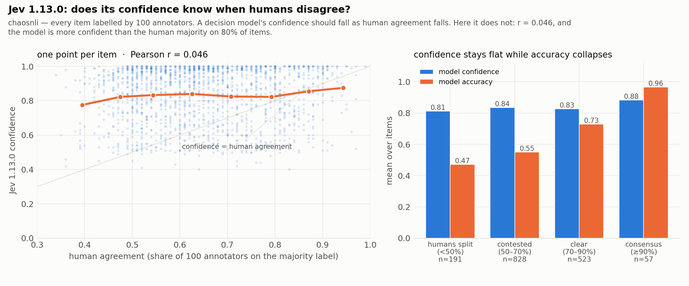
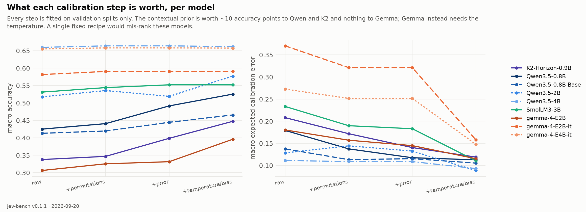
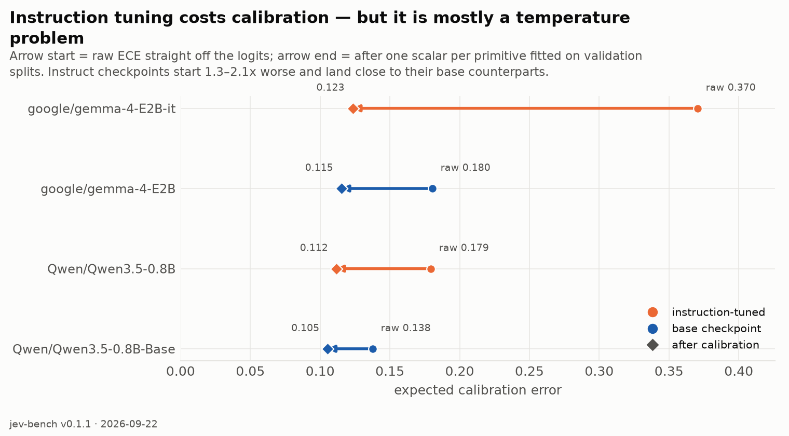
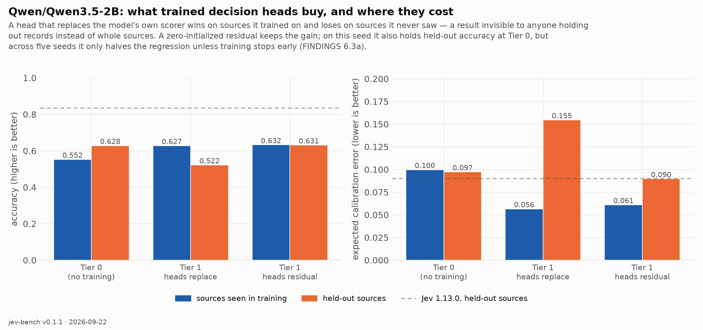
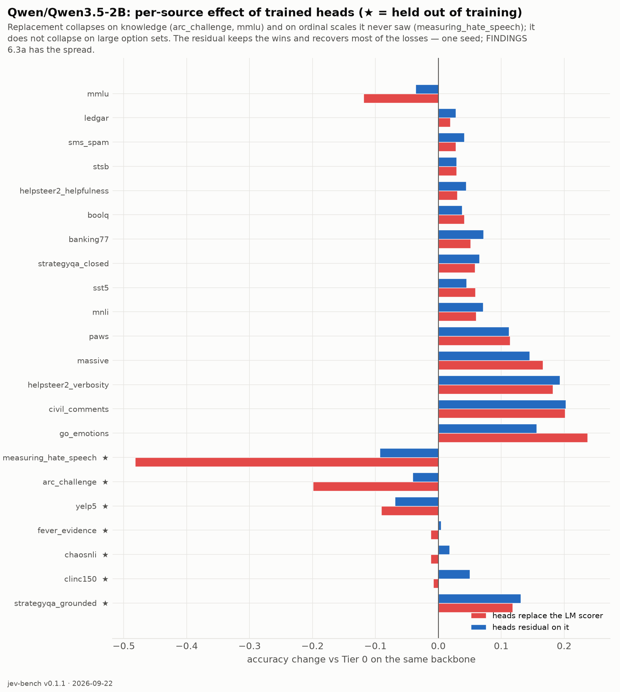

# Findings

Everything this project has established, with the evidence and the caveats. Each entry names
where the number comes from so it can be checked or rerun. Findings about **Jev** come from
22,773 test records plus 14,800 controlled probe requests against the live API; findings about
**Jevified open models** come from nine Tier 0 checkpoints and two Tier 1 variants on the same
records.

Contents: [Jev's behaviour](#1-what-jev-actually-does) · [Controlled probes](#2-controlled-probes)
· [The benchmark itself](#3-what-we-got-wrong-in-the-benchmark) · [Tier 0](#4-tier-0-any-open-llm-with-no-training)
· [Instruction tuning](#5-does-instruction-tuning-hurt-calibration) · [Tier 1](#6-tier-1-trained-decision-heads)
· [Engineering](#7-engineering-findings) · [Open questions](#8-open-questions)

---

## 1. What Jev actually does

**1.1 Crisp, grounded decisions are excellent and well calibrated.** ARC-Challenge 0.979,
MMLU 0.923, FEVER-with-evidence 0.972, BoolQ 0.917, StrategyQA-grounded 0.956 — all at
ECE ≤ 0.06. As a router or a guard on well-specified questions, the confidence signal is
usable exactly as advertised. *(baseline, [report](../results/jev-1.13.0/README.md))*

**1.2 Where humans disagree, the probabilities do not track human uncertainty.** This is the
central negative finding about Jev. On ChaosNLI — 100 annotators per item — the mean distance
between Jev's distribution and the human one is **TVD 0.33**, with answers at p = 0.94–0.98 on
items where annotators split 60/40. On Measuring Hate Speech vote shares, TVD 0.43. On Civil
Comments it assigns ~0.29 "toxic" to comments **zero** annotators flagged. Calibration is the
product claim, and it fails on precisely the inputs where calibration is the thing you need.

**1.3 The System Two gap is measurable.** Same StrategyQA questions, closed-book 0.785 vs
grounded 0.956 — a 17-point gap that isolates retrieval from reasoning.

**1.4 LLM-response judging is weak.** HelpSteer2 helpfulness 0.363 and verbosity 0.341 exact,
0.81 / 0.84 within one level. Using Jev as an automatic judge of assistant outputs is not
supported by these numbers.

**1.5 Fine-grained emotion is its worst task.** GoEmotions 0.282 at ECE 0.384 — confidently
wrong. Note the ceiling: human raters agree with the plurality label only 66% of the time (§3.3).

**1.6 It over-flags toxicity relative to the annotators.** Civil Comments accuracy 0.729 on a
set that is ~92% non-toxic, with AUROC 0.829 — the *ranking* is fine, the *operating point* is
not. Anyone porting a threshold across question wordings should re-fit it.

**1.7 Confidence is a rescaled max-probability, not entropy.** Choice `confidence` is exactly
`(p_max − 1/K)/(1 − 1/K)` on every sample taken. Score `confidence` is not reproducible from the
published distribution by any standard statistic (a bimodal `[0.54, 0.15, 0.31]` scores 0.0;
a K=10 answer with p_max 0.52 scores 0.80), so Jevify defines and documents its own.
*(see [JEV_CONTRACT.md](JEV_CONTRACT.md))*

**1.8 Noul is absolute; Choice is relative.** TypeSafe's own docs show the same question
returning 0.22 as a Noul and 0.01/0.99 as a yes/no Choice, with `P(x) + P(¬x) = 1.19`. These are
separate instruments, which turns out to matter for how you *build* one (§2.6, §6.2).

**1.9 Operational facts.** Probabilities are rounded to 0.01 — which makes NLL explode on
high-K configs (GoEmotions 9.9) and means **Brier and ECE are the proper scores to read**.
Answers are not deterministic (±0.01–0.02 across identical calls). Latency is flat in the number
of questions per request: ~185 ms median over 22,773 single-question requests, and 12 questions
in one call took 527 ms.

---

**1.x Confidence that does not track agreement, in numbers.** Over the 1,599 ChaosNLI test items,
Pearson r between Jev's confidence and the annotators' agreement is **0.046**. By agreement band
— split (< 50%, n = 191), contested (50–70%, n = 828), clear (70–90%, n = 523), consensus (≥ 90%,
n = 57) — mean confidence is **0.81 / 0.84 / 0.83 / 0.88**, flat, while accuracy is
**0.47 / 0.55 / 0.73 / 0.96**. Jev is more confident than the human majority on 80% of items.

---

**1.y Where Jev's time goes.** Its round trip barely moves with the number of options (186 ms at
K=4, 219 ms at K=151), which invites guesses about caching, set encoders or fixed compute windows.
Controlled probes with the server's own clock (`x-envoy-upstream-service-time`, network excluded)
rule all of those out: **server time is ~75 ms fixed plus ~5.5 µs per input token, linear to
27,000 tokens, and an option token costs exactly what a state token costs.** Nonces in every option
(+851 tokens): +12 ms. Shuffled options: +0. Eight requests in flight: same server time as one.
Eight questions in one request: +3 ms. The flat curve is arithmetic — 1,300 option tokens × 5.5 µs
is 7 ms, invisible under the floor — and the difference from our engine (~120 µs/token on an A40
research path) is throughput, not architecture. At K=255 the API reports 2,570 *output* tokens in
128 ms of server time: an answer template of ~10 slots per option filled in one pass, not decoded.
~180k input tokens/s per request is the throughput of a ~2B model on one H100-class GPU; a 30B
model would need ~8-way tensor parallelism and, at $0.042/M input tokens, would lose money
saturated. A bound from the outside, not an observation — but it makes the "30B-class" guess
the expensive hypothesis. *(probes: `results/jev-latency-probe/`)*

---

## 2. Controlled probes

Within-item experiments: the same state and gold answer, one factor changed, 200 items per
source, 14,800 requests. *(full write-up: [probes](../results/jev-1.13.0/probes/README.md))*

**2.1 Decision-set size is a cost, not a cliff.** With the gold option always present and K−1
distractors added: clinc150 0.995 → 0.910 from K=2 to K=151; banking77 0.995 → 0.820 at K=77;
ledgar 1.000 → 0.775 at K=100. Roughly 1.5–3 accuracy points per doubling of K, ECE staying
≤ 0.10.

**2.2 Ambiguity is the cliff.** GoEmotions is 0.850 at K=2 and 0.300 by K=25, where it flattens,
with ECE climbing to 0.34. What hurts Jev is human disagreement, not cardinality — and the
cross-dataset view would have suggested the opposite, since large-K datasets score lower.

**2.3 Option order flips 0–13% of answers**, scaling with ambiguity rather than K: MMLU 0.000,
ARC 0.005, MNLI 0.025, clinc150 (K=151) 0.040, ledgar 0.075, GoEmotions 0.130.

**2.4 It reads option semantics, not label strings.** Replacing option keys with
`option_1 … option_K` while keeping descriptions costs nothing (banking77 0.820 → 0.810,
clinc150 0.905 → 0.915). Removing the descriptions too drops it to chance (0.005–0.020). Useful
if you route to internal IDs.

**2.5 Nonsense options attract ≤ 3.3% of the probability mass**, and flip the answer ≤ 1.5% of
the time.

**2.6 The primitive is an instrument, not a skin.** The same yes/no question is roughly **twice
as well calibrated as a Noul than as a two-option Choice** at equal accuracy (BoolQ ECE 0.028 vs
0.054; Civil Comments 0.056 vs 0.126). Score beats an unordered Choice over the same levels by
~2.5 accuracy points on all three ordinal tasks. This directly shaped the Tier 1 head design.

---

## 3. What we got wrong in the benchmark

Low scores can mean a weak model or a broken benchmark. Every weak result was checked by reading
samples of the model's actual errors. *(full audit: [report](../results/jev-1.13.0/README.md))*

**3.1 Most labels hold up and Jev's low scores are real.** ChaosNLI, Civil Comments, Measuring
Hate Speech and SST-5 errors are genuine — overconfidence on items where annotators split, and a
stricter toxicity threshold than the raters used.

**3.2 HelpSteer2 verbosity was our bug.** v0.1 framed levels 0/1 as "too short" and 2 as
"appropriate". NVIDIA's verbatim scale is a *length* scale: 0 succinct → 4 verbose. The wrong
wording pushed normal-length answers to 2–3 when annotators said 1. Replaced with the paper's
exact wording (helpfulness too) in v0.1.1 and re-run.

**3.3 GoEmotions hid its own disagreement.** The single-label subset discards the fact that
raters disagree; several of Jev's "errors" were better than the label (*"You're a life saver,
wish you a blessed new year"* labelled `admiration`, Jev says `gratitude` at p = 1.00 — Jev is
right). Rebuilt in v0.1.1 from the raw per-rater annotations with vote shares as soft labels.
**Mean rater agreement with the plurality label is 0.66**, which is the ceiling for exact
accuracy on that config.

**3.4 A benchmark must not rebalance classes.** jev-bench samples each source's natural label
distribution. Stratifying would make a calibrated model look miscalibrated by shifting base
rates; `--stratify` exists for building training mixes only.

---

## 4. Tier 0: any open LLM, with no training

Render the question, score the allowed answers from the model's own logits, then fit a recipe
(permutation averaging, contextual-prior correction, per-primitive temperature and a Platt bias
for Noul) on **validation splits only**. Nine checkpoints, all 22,773 test records.

**4.1 Tier 0 reaches Jev's calibration without any training.** Macro ECE 0.089–0.158 across the
sweep against Jev's 0.113 — and **Qwen3.5-4B (0.093) and Qwen3.5-2B (0.089) are better calibrated
than Jev.** What is missing is accuracy: 0.396–0.662 vs Jev's 0.733.

**4.2 Every model needs a different recipe.** The contextual prior is worth ~10 Choice-accuracy
points to Qwen and K2 and **exactly nothing** to Gemma, which instead needs aggressive temperature
scaling (raw ECE 0.370 → 0.158). A single fixed recipe would mis-rank these models; the per-primitive
search finds this automatically. 

**4.3 A Platt bias on Noul is not optional for small models.** A temperature cannot move a binary
decision threshold. Adding a learned bias on the yes log-score took Qwen3.5-0.8B's Noul accuracy
from 0.654 to 0.759 and K2's from 0.517 to 0.670.

**4.4 Permutation averaging is cheap insurance.** Raw, small models show severe first-option bias
(Gemma-4-E2B base picks the first-listed option 91% of the time against Jev's 7%). Averaging two
orderings recovers 2–4 Choice-accuracy points and cuts Choice ECE by a third.

---

## 5. Does instruction tuning hurt calibration?

Yes, measurably — and less than you would expect after calibration.

**5.1 Instruct checkpoints start 1.3–1.8× worse calibrated.** Raw macro ECE: Qwen3.5-0.8B 0.191
vs its base 0.146; Gemma-4-E2B-it **0.361** vs its base 0.201. Gemma-4-E2B-it is the worst-calibrated
model in the sweep before calibration. This is the overconfidence/mode-dropping effect TypeSafe's
own AI primer describes, reproduced.

**5.2 But it is almost entirely a temperature problem, and temperature is free.** After one scalar
per primitive fitted on validation, Gemma-it goes 0.361 → 0.158 and the pairs nearly converge
(0.113 vs 0.105; 0.158 vs 0.115). Instruction tuning distorts the confidence *scale*, not the
*ranking* — Gemma-it's accuracy barely moves under calibration (0.598 → 0.591).

**5.3 The accuracy gain dwarfs the residual calibration cost.** Gemma-4-E2B-it is **+0.195 accuracy**
over its base checkpoint for +0.043 ECE; Qwen3.5-0.8B is +0.060 for +0.008. Discrimination is the
thing calibration cannot manufacture — temperature only rescales an existing ranking — and it shows
in Brier, which penalizes both (0.502 vs 0.609 for the Gemma pair).

**5.4 So: take the instruct checkpoint, and always fit the temperature.** The early hypothesis that
base models would win because "RLHF wrecks calibration" was wrong in this setting, and the sweep
is what corrected it. *Caveat:* base checkpoints run without a chat template, so prompt format
differs between rows of a pair; the Qwen pair is the cleaner of the two and shows the same direction
with a smaller gap.

---

## 6. Tier 1: trained decision heads

A small head reads the backbone's hidden state at each option's own line, so it can score what an
option *means* rather than how likely its identifier token is. Trained with strictly proper scoring
rules — log score for Choice/Noul, ranked probability score for the ordinal Score. Six sources are
held out of training entirely, plus ChaosNLI which has no train split.
*(full write-up: [tier1](../reports/tier1/README.md))*

**6.1 The finding: in-distribution evaluation would have shipped the wrong design.** A head that
**replaces** the LM scorer gains +0.077 mean accuracy on trained sources (14 of 15 improved, ECE
0.100 → 0.056) and loses **−0.098 on held-out sources**. Held out *records* would have shown only
the win; held out *sources* showed the harm.

**6.2 Structure generalizes; knowledge does not.** clinc150 has 151 options and the heads trained
with at most 16 — it barely moves (−0.008), so the K-agnostic design works. What collapses is
knowledge (`arc_challenge` −0.199, `mmlu` −0.119 **even though mmlu was in training**) and ordinal
scales never seen (`measuring_hate_speech` −0.482, `yelp5` −0.091). The head discards what the
backbone knows and relearns a scorer from 8,685 examples.

**6.3 The fix is to correct the model's prior, not replace it.**
`score_i = w·lm_i + f([h_dec, h_i, h_dec ⊙ h_i])` with `f`'s last layer zero-initialized, so training
provably *starts at Tier 0* — a unit test asserts an untrained residual head reproduces Tier 0's
distribution to 1e-4. Result on Qwen3.5-2B: trained +0.080, **held-out −0.000**, better calibrated
in both regimes.

**6.3b It replicates, and strengthens, on Qwen3.5-4B.** Held-out **+0.035** (0.714 → 0.749) and
trained **+0.039** (0.641 → 0.680), better calibrated in both. At 2B the residual erased the
regression; at 4B it turns it into a gain.

**6.4 Both heads chose to keep the prior at full strength.** Learned LM weights came out
**0.95 / 0.98 / 1.01** on 2B and **0.96 / 0.97 / 1.01** on 4B for choice / score / noul — two
independently trained heads on different backbones agreeing to within 0.02 that the Tier 0 scorer
was worth keeping. That is the cleanest evidence that replacement was the wrong design.

**6.5 Jevified open models now beat Jev on calibration and on human agreement.** Qwen3.5-2B reaches
macro ECE **0.069** against Jev's 0.113; Qwen3.5-4B reaches TVD to human label distributions **0.360**
against Jev's 0.432 and Score accuracy **0.507** against 0.503 — on the exact axis where Jev's
calibration claim is weakest (§1.2). On raw macro accuracy Jev still leads, but the gap is now
**0.733 vs 0.698**.

**6.6 What the heads actually buy** is semantic matching, not recall: GoEmotions +0.156,
Civil Comments +0.203, HelpSteer2 verbosity +0.193, MASSIVE +0.145. These are tasks where the answer
depends on reading option semantics — exactly where a learned matching function should beat a logit
on an identifier token.

**6.7 Ordinal generalization is the remaining weak spot.** Both held-out `score` sources still
regress (−0.093, −0.069). Only four ordinal sources are in training and they share a
sentiment/quality flavour, so an unseen scale gets mapped onto them.

---

## 7. Tier 2: letting the backbone move

Tier 1 froze the backbone and asked a head to read judgment out of hidden states that were
never trained to hold it. Tier 2 adds LoRA — rank 16 on every attention and MLP projection,
10.9M trainable parameters, 0.58% of the model — trained jointly with the same zero-initialized
residual heads. Qwen3.5-2B, the same 5,885 training records, the same six held-out sources,
2.5 hours on one A40.

**7.1 It overfits after a single pass.** Validation loss went 0.774 → 0.835 → 0.863 across three
epochs while training loss fell 0.568 → 0.351 → 0.173. Early stopping kept epoch 0. Whatever a 2B
backbone can learn about *deciding* from 5,885 records, it learns in one pass; after that it
memorizes them. The published checkpoint is that single pass, taken at a learning rate that was
still ramping up. The learned LM weights are 0.98 / 0.98 / 0.99 — still, as at Tier 1, ≈ 1.

**7.2 Even one pass buys accuracy the head could not — on held-out sources too.** Same
protocol as Section 6 (Tier 0 refitted without the held-out sources, for fairness):

| Qwen3.5-2B | held-out acc | held-out ECE | held-out Brier | trained acc | trained ECE | trained Brier |
|---|---|---|---|---|---|---|
| Tier 0 | 0.628 | 0.097 | 0.436 | 0.552 | 0.100 | 0.506 |
| Tier 1 replace | 0.522 | 0.155 | 0.550 | 0.627 | 0.056 | 0.446 |
| Tier 1 residual | 0.631 | **0.090** | 0.459 | 0.632 | **0.061** | 0.439 |
| **Tier 2 (LoRA + residual)** | **0.697** | 0.109 | **0.384** | **0.680** | 0.119 | **0.420** |
| Jev 1.13.0 | 0.835 | 0.090 | 0.235 | 0.694 | 0.122 | 0.391 |

+0.066 held-out accuracy over the residual head, and the Brier score — a strictly proper score
that charges for both miscalibration and missed answers — improves on both splits. On the
sources it trained on, a 2B model is now within 0.014 accuracy of Jev. Macro over all 22 configs:
accuracy **0.685** (from 0.632), Score accuracy **0.508** — the best of any model tested, Jev
included.

**7.3 What moved is the Tier 1 weak spot: ordinal scales.** Section 6 left held-out *ordinal*
generalization as the open problem. It is where LoRA helps most: `measuring_hate_speech`, a
held-out ordinal scale, gains **+0.219** accuracy *and* drops from ECE 0.106 to 0.037;
`strategyqa_grounded` improves on both axes; `sst5` +0.128; `helpsteer2_verbosity` ECE halves.

**7.4 What it costs is the base model's humility on ambiguous questions.** ECE rises on nearly
every Choice source: ChaosNLI 0.077 → **0.215** (Jev: 0.222), GoEmotions 0.069 → 0.242, `mmlu`,
`mnli`, `clinc150`, `ledgar` all +0.10 or more. Macro ECE goes 0.069 → 0.116 — now marginally
*worse* than Jev's 0.113. The residual head had preserved the base model's uncertainty where
humans disagree; letting the backbone move erased it. On the models map the Tier 2 point sits
between the Tier 1 residual and Jev: **LoRA moves an open model toward Jev's profile — Jev's
accuracy, and Jev's overconfidence on ambiguity.**

**7.5 Two hypotheses for the overconfidence, tested.** Either the *loss* caused it — cross-entropy,
RPS and BCE against the hard majority label, even on the sources that carry human vote
distributions — or the *learning rate* did, since one pass already overfits. Both were run as
separate arms, same seed, same data, same held-out sources:

| Qwen3.5-2B, Tier 2 arm | macro acc | macro ECE | held-out acc | held-out ECE | TVD→human |
|---|---|---|---|---|---|
| hard labels, LoRA lr 1e-4, 3 epochs (7.2–7.4) | 0.685 | 0.116 | 0.697 | 0.109 | 0.370 |
| hard labels, **lr 3e-5**, 2 epochs | **0.690** | **0.103** | **0.714** | **0.086** | **0.332** |
| **soft labels** (human distributions where they exist), lr 1e-4 | 0.674 | 0.116 | 0.672 | 0.139 | 0.433 |
| Tier 1 residual, for reference | 0.632 | 0.069 | 0.631 | 0.090 | 0.374 |

**The learning rate was the cause; the loss was not.** At 3e-5 the LoRA arm gains *more*
accuracy than at 1e-4 and recovers the calibration: held-out ECE 0.086 is better than the Tier 1
residual and equal to Jev, and TVD to human distributions 0.332 is the best of any model tested
(Jev: 0.432). Soft-label training, the hypothesis I wrote as "most likely" in the previous
revision, is a negative result: it improves ECE exactly where the distributions were used in
training (GoEmotions 0.242 → 0.084) but *worsens* agreement with human distributions overall — TVD
0.433, identical to Jev's, and 0.099 → 0.280 on `civil_comments` — which is the one metric it was
built to optimize. Why it fails on the Noul source is not yet understood, and the obvious
combination (soft labels at the low learning rate) has not been run. Every arm is one seed; the
seed study in Section 6 is what bounds how much of a 0.02 difference is noise.

One general lesson survives either way: with LoRA capacity, a small change in learning rate moves
calibration by more than the entire Tier 0 → Tier 1 step did. Calibration under fine-tuning is a
hyperparameter question before it is an objective question.

*Reproduce: `python -m jevify.train tier2 --model-id Qwen/Qwen3.5-2B --run-id qwen35-2b-t2`, then
`scripts/process_tier1.py --run-id qwen35-2b-t2 --tier0 qwen35-2b`. Results: `results/qwen35-2b-t2/`.*

---

## 8. Engineering findings

**7.1 One answer-cue convention keeps every candidate single-token across every tokenizer tested.**
`"Answer: "` followed by a bare candidate keeps digits, letters, two-letter identifiers and yes/no
to one token in Qwen3.5, Gemma 4, K2-Horizon, SmolLM3, Olmo 3 and Apertus. With a leading-space
candidate instead, Score digits silently became two tokens. Identifiers are then *discovered* per
tokenizer (A–Z, then single-token AA–ZZ), so Choice up to K=255 stays on the batched path.

**7.2 Tree attention is exact where it is supported, and must be verified per architecture.** Scoring
every candidate in one sequence under a block-diagonal mask matches naive recompute to 2e-5 in fp32.
In bf16 the difference reaches 0.04 in probability, so the engine's self-check runs in probability
space and falls back to cache expansion on any architecture that ignores a custom 4D mask. Large-K
items went 0.41 s → 0.15 s on an L4.

**7.3 The LM head over every position is the hidden memory cost.** A 32×1500-token batch over
Qwen's 250k vocab is a 24 GB logits tensor — an OOM that looks like a batch-size problem. Computing
logits only at needed positions fixed it.

**7.4 A feature extractor must reuse the scorer's exact tokenization.** Re-encoding the prompt text
put the decision position at the cue's trailing space instead of the merged `" A"` token one position
earlier — a ~0.5 nat disagreement that would have silently poisoned the residual. The two paths are
now pinned together by a test.

**7.5 Silent data bugs are the expensive ones.** The Modal job's dataset download never included
`train.jsonl`, so the first Tier 1 job trained on **zero records** and reported a plausible-looking
validation loss. A smoke run with tiny caps caught it before any real spend.

**7.6 Cost.** The entire study — nine Tier 0 checkpoints, two Tier 1 variants, all 22,773 records
each — ran for about **$11** of GPU on Modal (L4 for ≤1B, A100-80GB above), plus roughly $0.15 of
Jev API calls for 37,573 requests.

---

## 9. Vision: does any of this transfer?

The open questions used to end by asking whether a System One question survives
when the option semantics live in an image. It does, and more of the text findings come
with it than we expected.

**8.1 A VLM Jevifies without changing the contract.** `state` carries PIL images, the
question is the same typed object, and the answer set is the same single-token identifiers.
Qwen3-VL-2B-Instruct, no training, 4,244 records:

| source | primitive | n | acc | ECE | Brier | AUROC |
|---|---|---|---|---|---|---|
| `pope` (object hallucination) | noul | 2,000 | 0.899 | **0.083** | 0.090 | 0.960 |
| `aokvqa` (knowledge VQA) | choice K=4 | 744 | 0.793 | 0.124 | 0.331 | — |
| `ai2d` (science diagrams) | choice | 1,500 | 0.652 | 0.175 | 0.510 | — |

**8.2 The primitive ordering transfers intact.** In text we found Noul roughly twice as
well calibrated as 2-way Choice. In vision, with a different model, different data and a
different modality, the same ordering appears: Noul 0.083, Choice 0.124 and 0.175. Whatever
makes an absolute yes/no question easier to calibrate than a relative one is not a property
of text.

**8.3 Nearly a quarter of a "2B" VLM is vision.** The inventory `describe()` returns for
Qwen3-VL-2B: a 407M-parameter, 24-layer `Qwen3VLVisionModel` tower (19.1% of the model) plus
a 75.5M projector (3.6%) — 22.7% in front of a 1.65B decoder. Tier 0 and Tier 1 read the
decoder, so that entire stage is upstream of anything the decision head can fix.

**8.4 Starving the encoder degrades accuracy and calibration together — the model knows it
knows less.** Same records, same prompt, same decoder; only the pixel budget moves. 400
records per source:

| budget (28×28 patches) | measured tokens | ai2d acc / ECE | aokvqa acc / ECE | pope acc / ECE | macro acc | macro ECE |
|---|---|---|---|---|---|---|
| 64 | 42 | 0.593 / 0.225 | 0.705 / 0.195 | 0.875 / 0.109 | 0.724 | 0.176 |
| 128 | 88 | 0.615 / 0.217 | 0.748 / 0.155 | 0.892 / 0.092 | 0.752 | 0.155 |
| 256 | 187 | 0.623 / 0.208 | 0.785 / 0.136 | 0.907 / 0.073 | 0.772 | 0.139 |
| 512 | 280 | 0.630 / 0.191 | 0.777 / 0.138 | 0.897 / 0.081 | 0.768 | 0.137 |
| 1024 | 280 | 0.637 / 0.195 | 0.780 / 0.136 | 0.897 / 0.082 | 0.772 | 0.137 |

Between 42 and 187 tokens, macro accuracy rises 0.048 **and** macro ECE falls 0.037. The
dangerous regime — losing accuracy while holding confidence — does not appear at any budget
we tested. On POPE specifically, the most starved encoder (42 tokens) is still better
calibrated (0.109) than either Choice task at *any* budget. A hallucination-prone setting did
not produce confident hallucination; it produced appropriate doubt.

**8.5 The budget saturates, and only the measured token count reveals it.** Budgets of 512 and
1024 patches both yield 280 median tokens, and score within noise of each other — the images
are simply smaller than the budget. A deployment reading its own config would believe it had
doubled the visual signal. This is why `pixel_budget()` reports what applied and
`image_tokens()` measures the consequence: the nominal setting is not evidence. Practically,
~187 tokens captures essentially all the accuracy available to this model on these sources.

*Caveat: the sweep uses 400 records per source and the Tier 0 table above uses the full test
caps, so the two tables are not directly comparable. Within the sweep, every budget sees the
identical records, which is the comparison that matters.*

**8.6 Scoping LoRA to a vision tower cannot be expressed with suffix names.** peft matches
`target_modules` against the end of a module path, and `q_proj` is a suffix on both halves of
a VLM. A suffix list meaning "adapt the encoder" silently adapts the whole model — the kind of
mistake that produces a result rather than an error. `lora_pattern()` returns a full-path regex
instead, and a test asserts the vision pattern matches nothing under the decoder.

**8.7 What we deliberately did not build.** Swapping one vision tower for another. The
projector is trained against a specific encoder's output geometry, so the swap succeeds
mechanically and destroys the model. Doing it honestly means retraining the projector, which is
a larger job than Jevification and a different claim.

---

## 10. Open questions

- **How far does the residual finding go?** It replicates on two backbones (2B, 4B) with one seed
  each, and strengthens with scale. Whether it holds at 7B+ and across families is untested.
- **Can ordinal generalization be fixed with data?** More diverse ordinal scales in training is the
  obvious lever, and jev-bench has only four.
- **Is the held-out set difficulty-matched?** It is not — it contains several of Jev's strongest
  configs, which is why Jev scores *higher* on held-out (0.835) than on trained (0.694) sources.
  Compare models within a column, never across. A matched split would be a better protocol.
- **Why does soft-label training hurt agreement with human distributions on Noul?** It helps on
  GoEmotions and fails on `civil_comments` (7.5). Soft labels at the low learning rate, and a look at
  what the Noul head actually predicts under soft targets, are the next two runs.
- **Does the LoRA learning-rate result hold at 4B?** In progress.
- **Does a vision-scoped LoRA help where a decoder-scoped one cannot?** Section 8 makes the
  tower addressable but does not adapt it. The natural test is AI2D, the weakest source by a
  wide margin (0.652) and the one whose difficulty is most plausibly perceptual rather than
  linguistic.
- **Does the budget/calibration relationship hold for a model that is badly calibrated to
  begin with?** Qwen3-VL-2B degrades gracefully. A model that starts overconfident may not.
