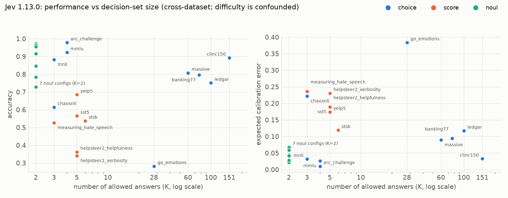

# Baseline: TypeSafe Jev 1.13.0 on jev-bench (test splits)

Run 2026-09-20 (three configs re-run after the v0.1.1 fixes below) via `POST /v1/systemone` (`jev-latest` → `jev-1.13.0`), one request per
record, 22,773 records, 0 errors, median latency 192 ms from a 2-core sandbox in us-east.
Predictions and full metrics (including reliability bins) are archived in the dataset repo
under `results/jev-1.13.0/`; the command was

```bash
jevify-run api    --records data/jev-bench --out preds/jev-1.13.0_test.jsonl --split test --concurrency 4
jevify-run report --records data/jev-bench --preds preds/jev-1.13.0_test.jsonl --md test_report.md --json test_metrics.json
```

## Results

See [`test_report.md`](test_report.md) for the full table. Columns: accuracy of the argmax
(or the 0.5 threshold for noul), top-label ECE (15 equal-width bins), Brier, NLL, selective
accuracy on the most-confident 90% / 50%, AURC, ranked-probability score and MAE (ordinal),
AUROC (noul), and total variation distance to the human label distribution where one exists.

Within-one-level accuracy for the ordinal (score) configs, which the table does not show:
helpsteer2_helpfulness 0.81, helpsteer2_verbosity 0.84, measuring_hate_speech 0.79,
sst5 0.95, stsb 0.95, yelp5 0.99.

## Figures

**Reliability diagrams** — observed accuracy vs. stated confidence, one panel per config (dot size = records in bin).
Diagonal = perfectly calibrated. Flat lines (`go_emotions`, `helpsteer2_verbosity`) mean confidence carries no information.


**Calibration map** — where each config lands on accuracy vs. ECE.


**Risk–coverage** — error rate if you act only on the most-confident fraction of records. This is the curve a
confidence-gated router actually lives on.


**Model vs. human probability** on the three calibration-gold configs. Dots are (item, option) pairs; the line is the
binned mean. On ChaosNLI the *average* tracks humans but individual answers are pinned near 0/1; on Civil Comments the
model says ~0.29 "toxic" when zero annotators did; on hate speech the model barely moves as human consensus goes 0→1.


**Latency** — client-observed per request from a 2-core sandbox (us-east), one question per request.


**Performance vs decision-set size** — cross-dataset, so difficulty is confounded; a hypothesis view. Note that Choice does
not degrade with K (clinc150 at K=151 beats go_emotions at K=28): what hurts is human ambiguity, not set size.



## Reading

1. **Crisp tasks are excellent and well calibrated.** Knowledge MCQ (ARC 97.9%, MMLU 92.3%),
   grounded yes/no (FEVER-with-evidence 97.2%, BoolQ 91.7%, StrategyQA-grounded 95.6%) and
   NLI (88.3%) all land with ECE ≤ 0.06 and selective accuracy that rises cleanly with
   confidence. As a router or a guard on well-specified questions, the confidence signal is
   usable as advertised.
2. **Where humans disagree, the probabilities do not track human uncertainty.** On ChaosNLI
   (100 annotators per item) the TVD to the human distribution is 0.33 and ECE is 0.22; on
   Measuring Hate Speech vote shares TVD is 0.43. Jev is overconfident on genuinely ambiguous
   inputs. This is the axis an open System One model should be judged on, because it is the
   one that "calibrated" is supposed to mean.
3. **The System Two gap is measurable**: 78.5% closed-book vs 95.6% grounded on the same
   StrategyQA questions. TypeSafe's jaggedness page predicts exactly this.
4. **LLM-response judging and fine-grained emotion are weak.** HelpSteer2 helpfulness /
   verbosity: 36% / 34% exact level (81% / 84% within one). GoEmotions: 32% on 28 classes with
   ECE 0.35 — confidently wrong.
5. **Civil Comments: 72.9% accuracy on a ~92%-negative set** means Jev flags far more comments
   as toxic than Jigsaw's annotators did (AUROC 0.83: the ranking is fine, the operating point
   is not). Absolute Noul semantics plus a broad `criteria.true` string moved the threshold;
   worth remembering when porting any threshold from one question wording to another.
6. **Large-K routing degrades gracefully** (clinc150 89%, massive 81%, banking77 80%,
   ledgar 75% over 100 legal categories) with ECE around 0.1.

## Are the labels right? A manual audit of Jev's errors

Low scores on a benchmark can mean the model is weak or the labels are wrong, so I read random
samples of Jev's errors on every weak config and judged them myself.

| config | verdict | what the errors actually are |
|---|---|---|
| `chaosnli` | **labels right, Jev overconfident** | Jev answers *neutral* at p=0.94–0.98 on items where 56–68% of 100 annotators said *entailment* (e.g. *"A button on the Chatterbox page will make this easy, so please do join in"* → *"They wanted to make the site user friendly"*). Reasonable people split; 0.98 is indefensible. This is the calibration failure the config exists to expose. |
| `civil_comments` | **labels right, Jev's threshold stricter** | Confident false positives are condescension and name-calling that Jigsaw raters scored 0.0–0.4 (*"Your comments lack dignity, logic and reason."* → Jev 0.80). The question uses Jigsaw's own toxicity definition verbatim; Jev's operating point is simply harsher than the raters'. |
| `measuring_hate_speech` | **labels contested by design** | Items with 75/25 rater splits; Jev's calls are defensible-but-different and its probabilities do not reflect the split. TVD to the human distribution is the right headline here, not exact accuracy. |
| `sst5` | **known label noise** | Non-adjacent errors are 5% and sit on sarcasm/mixed sentences where the SST label is as disputable as Jev's (*"has all the poignancy of a hallmark card…"* is labeled *neutral*). Within-one-level accuracy is 0.95. |
| `go_emotions` | **benchmark improved (v0.1.1)** | Many "errors" were better answers than the label (*"You're a life saver, wish you a blessed new year"* labeled *admiration*; Jev says *gratitude* at p=1.00 — Jev is right). The single-label subset hid rater disagreement, so v0.1.1 rebuilds the config from the raw per-rater votes: soft labels, plurality hard label, ≥3 raters. Mean rater agreement with the plurality is **0.66**, which is the ceiling for exact accuracy; Jev's TVD to the human vote shares (0.68) is the number that matters. |
| `helpsteer2_verbosity` | **benchmark bug fixed (v0.1.1)** | My level descriptions framed 0/1 as "too short" and 2 as "appropriate". NVIDIA's verbatim scale is a *length* scale: 0 succinct, 1 pretty short, 2 average, 3 moderately long, 4 verbose. The wrong wording pushed normal-length answers to 2–3 when annotators said 1. Levels replaced with the paper's wording (helpfulness aligned verbatim too); Jev re-run. Exact accuracy stays ~34% (within-one 0.84): the task is genuinely hard, but the config no longer misdescribes it. |

Everything else in the table is a real, reproducible property of the model on faithful questions.

## Caveats

- The API rounds probabilities to 0.01, so a true label reported at 0.00 contributes
  −ln(1e-12) to NLL. NLL is therefore inflated on high-K configs (GoEmotions 9.1); use Brier
  and ECE as the proper scores for rounded outputs.
- Choice `confidence` from the API is the rescaled max-probability; Score `confidence` is
  TypeSafe's undisclosed statistic. Selective-accuracy columns use whatever the API returned.
- Single run; the API is not deterministic (±0.01–0.02 per probability), so treat the third
  decimal as noise.
- Label noise is part of the benchmark by design: SST-5 and Yelp-5 human agreement is
  itself limited, and GoEmotions single-label rows are the least ambiguous subset only.
