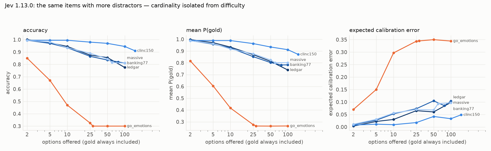

# Behavioral probes: Jev 1.13.0

Within-item experiments derived from jev-bench test records: the same state and the same gold
answer, one factor changed. 200 items per source, 14,800 requests, 0 errors, median latency 185 ms.
Generated by `jevify-bench probe`, scored by `jevify-run api`, analyzed by `jevify-bench probe-report`
(full tables in [`probes.md`](probes.md), raw numbers in [`probes.json`](probes.json)).

## 1. Decision-set size, isolated from difficulty

Same items, gold option always present, K−1 random distractors from the source's own label set.

- **Crisp routing degrades gracefully and stays calibrated.** clinc150 goes 99.5% → 91.0% from K=2 to
  K=151, banking77 99.5% → 82.0% (K=77), ledgar 100% → 77.5% (K=100), massive 99.5% → 81.5% (K=60).
  Roughly 1.5–3 points of accuracy per doubling of K, with ECE rising from ~0.01 to 0.05–0.10 and
  mean P(gold) tracking accuracy within a few points the whole way. Large K is a cost, not a cliff.
- **Ambiguity is a cliff.** GoEmotions is 85% even at K=2 (gold vs one random other emotion) and 30%
  by K=25, where it flattens (K>28 repeats the full option set). Mean rater agreement with the
  plurality label is 0.66, so a large share of this is the task, not the model — but Jev's ECE of
  0.34 there is the model: it stays confident while it is wrong.
- Conclusion for the cross-dataset picture: **what hurts Jev is human disagreement, not cardinality.**

## 2. Option order

Original vs shuffled option order, same items.

| source | K | argmax flip rate | mean TVD between the two answers |
|---|---|---|---|
| mmlu | 4 | 0.000 | 0.020 |
| arc_challenge | 3–5 | 0.005 | 0.008 |
| mnli | 3 | 0.025 | 0.023 |
| clinc150 | 151 | 0.040 | 0.041 |
| chaosnli | 3 | 0.045 | 0.030 |
| banking77 | 77 | 0.050 | 0.046 |
| ledgar | 100 | 0.075 | 0.068 |
| go_emotions | 28 | 0.130 | 0.107 |

Position bias exists but is modest, and it scales with ambiguity rather than with K: 0–2.5% flips on
crisp small-K tasks, 4–7.5% on large-K routing, 13% on GoEmotions. (The API's own run-to-run jitter
contributes ~0.02 TVD to every row.)

## 3. Opaque option keys

Option keys replaced by `option_1 … option_K`.

| source | original | opaque keys, descriptions kept | opaque keys, no descriptions |
|---|---|---|---|
| banking77 | 0.820 | 0.810 | 0.020 |
| clinc150 | 0.905 | 0.915 | 0.005 |
| massive | 0.815 | 0.805 | 0.015 |

Accuracy is unchanged when descriptions remain and falls to chance without them: Jev reads the
option *semantics*, not the key strings, and nothing here is memorized label vocabulary. Useful
for anyone routing to internal ids.

## 4. Distractor injection

Three irrelevant options added to small-K questions ("The state is about cooking recipes",
"…written in French", "None of the other options applies").

| source | argmax flips | probability mass on the distractors | accuracy original → injected |
|---|---|---|---|
| arc_challenge | 0.010 | 0.013 | 0.990 → 0.975 |
| mmlu | 0.005 | 0.033 | 0.930 → 0.915 |
| mnli | 0.015 | 0.005 | 0.855 → 0.845 |

Robust: ≤3% of the mass leaks to nonsense options.

## 5. The same question through a different primitive

| source | comparison | argmax flip | TVD | accuracy A / B | ECE A / B |
|---|---|---|---|---|---|
| boolq | noul → choice(yes/no) | 0.010 | 0.047 | 0.930 / 0.940 | **0.028** / 0.054 |
| paws | noul → choice(yes/no) | 0.045 | 0.050 | 0.855 / 0.875 | **0.052** / 0.072 |
| civil_comments | noul → choice(yes/no) | 0.050 | 0.088 | 0.745 / 0.730 | **0.056** / 0.126 |
| sst5 | score → choice(levels) | 0.050 | 0.049 | 0.580 / 0.555 | **0.182** / 0.223 |
| yelp5 | score → choice(levels) | 0.045 | 0.053 | 0.605 / 0.580 | **0.244** / 0.255 |
| helpsteer2_helpfulness | score → choice(levels) | 0.110 | 0.069 | 0.355 / 0.340 | **0.233** / 0.246 |

Two findings:

- **Noul is better calibrated than a two-option Choice on the same yes/no question** — ECE roughly
  halves (0.028 vs 0.054, 0.056 vs 0.126) at equal accuracy. The absolute binary readout is a
  better-calibrated instrument than the relative softmax. This supports the hypothesis that Jev's
  competence is conditioned on the *geometry of the decision schema*, not only on the task.
- **Score beats an unordered Choice over the same levels** by ~2.5 points of accuracy and lower ECE
  on all three ordinal tasks: the ordinal framing carries information the model uses.

## What this changes for Jevify

The recipe should treat the primitives as different instruments, not one softmax with three
skins: an absolute head for Noul (Tier 1), an ordinal readout for Score, and a Choice readout whose
calibration must hold as K grows — the within-item cardinality curve above is now a regression
test any Jevified model has to pass.
