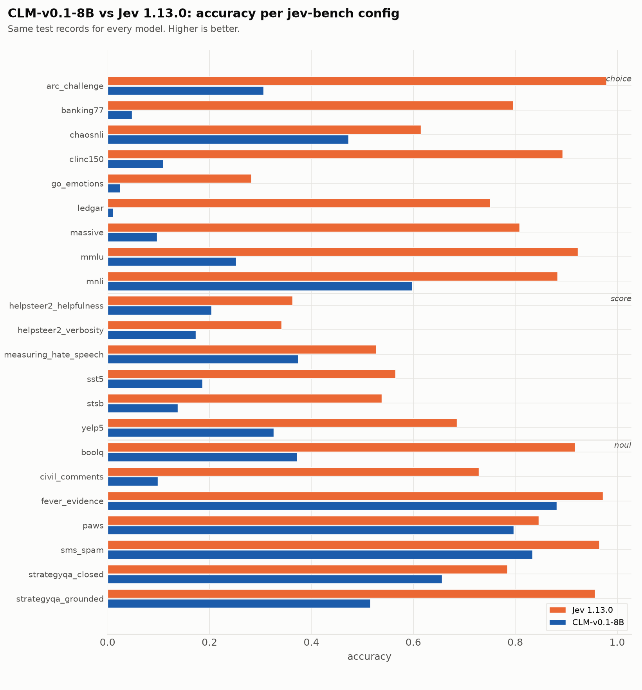
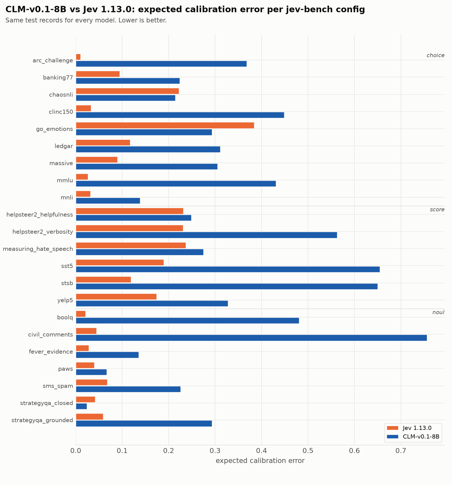

| source | prim | Jev 1.13.0 acc | Jev 1.13.0 ECE | Jev 1.13.0 Brier | CLM-v0.1-8B acc | CLM-v0.1-8B ECE | CLM-v0.1-8B Brier |
|---|---|---|---|---|---|---|---|
| `arc_challenge` | choice | 0.979 | 0.010 | 0.037 | 0.306 | 0.368 | 0.994 |
| `banking77` | choice | 0.796 | 0.095 | 0.317 | 0.048 | 0.224 | 1.068 |
| `chaosnli` | choice | 0.615 | 0.222 | 0.583 | 0.473 | 0.215 | 0.799 |
| `clinc150` | choice | 0.893 | 0.033 | 0.159 | 0.109 | 0.449 | 1.230 |
| `go_emotions` | choice | 0.282 | 0.384 | 1.040 | 0.025 | 0.294 | 1.151 |
| `ledgar` | choice | 0.751 | 0.117 | 0.374 | 0.011 | 0.311 | 1.139 |
| `massive` | choice | 0.808 | 0.090 | 0.295 | 0.097 | 0.305 | 1.089 |
| `mmlu` | choice | 0.923 | 0.027 | 0.124 | 0.252 | 0.431 | 1.066 |
| `mnli` | choice | 0.883 | 0.032 | 0.176 | 0.598 | 0.138 | 0.648 |
| `boolq` | noul | 0.917 | 0.021 | 0.061 | 0.372 | 0.481 | 0.469 |
| `civil_comments` | noul | 0.729 | 0.045 | 0.183 | 0.099 | 0.756 | 0.680 |
| `fever_evidence` | noul | 0.972 | 0.028 | 0.025 | 0.881 | 0.136 | 0.118 |
| `paws` | noul | 0.846 | 0.040 | 0.109 | 0.797 | 0.066 | 0.149 |
| `sms_spam` | noul | 0.965 | 0.068 | 0.035 | 0.834 | 0.226 | 0.188 |
| `strategyqa_closed` | noul | 0.785 | 0.042 | 0.144 | 0.656 | 0.024 | 0.212 |
| `strategyqa_grounded` | noul | 0.956 | 0.059 | 0.038 | 0.515 | 0.293 | 0.314 |
| `helpsteer2_helpfulness` | score | 0.363 | 0.232 | 0.812 | 0.204 | 0.249 | 0.935 |
| `helpsteer2_verbosity` | score | 0.341 | 0.231 | 0.793 | 0.173 | 0.562 | 1.250 |
| `measuring_hate_speech` | score | 0.527 | 0.237 | 0.669 | 0.374 | 0.275 | 0.792 |
| `sst5` | score | 0.565 | 0.190 | 0.618 | 0.186 | 0.654 | 1.359 |
| `stsb` | score | 0.538 | 0.119 | 0.594 | 0.138 | 0.650 | 1.349 |
| `yelp5` | score | 0.685 | 0.174 | 0.483 | 0.326 | 0.328 | 0.914 |
| **macro** | | **0.733** | **0.113** | **0.349** | **0.340** | **0.338** | **0.814** |

