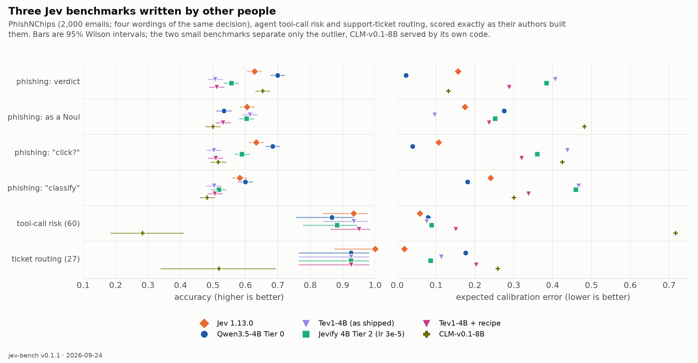

# Three Jev benchmarks written by other people

Every other number in this repository is on a benchmark this project built. These three were
written by other people, to test Jev, before any Jevified model existed:

| benchmark | source (pinned commit) | what it asks | records |
|---|---|---|---|
| PhishNChips | [anisselbd/jev-phishing-bench](https://github.com/anisselbd/jev-phishing-bench/tree/1d56e8c64d029a9554a0874e2ef2901ed196e230) + [AreLit/PhishNChips](https://huggingface.co/datasets/AreLit/PhishNChips) v5.2 | is this email phishing? — four wordings: the verdict (Choice), the same as a Noul, "should the user click?", "classify this email" | 2,000 emails × 4 |
| agent tool-call risk | [themsquared/jev-benchmark](https://github.com/themsquared/jev-benchmark/tree/d699d44558e27c9071caef8d5cea51615d5a3131) | readonly / destructive / privileged / exfiltration; tagged clear, ambiguous, adversarial | 60 |
| support-ticket routing | [WallerChen/jev-measured](https://github.com/WallerChen/jev-measured/tree/4a12dfb3e59fe368760af44607745c97b65e3fa9) | which team handles this ticket (5 queues); plus 6 deliberately ambiguous tickets with no label | 27 + 6 |

Records are built by [`scripts/build_community.py`](../../scripts/build_community.py), which reads
the questions, criteria and labels from each repository at the pinned commit (parsed, not retyped)
and checks the PhishNChips file against the SHA-256 its benchmark pins. They are identical — all 2,087
— to the frozen inputs Together AI used to test Tev1 on the same benchmarks. Nothing from these
repositories is republished here: the predictions carry ids and scores only.

**Nothing was fitted on them.** Jev and CLM answer as served; every Tier 0 model answers with the
recipe it was fitted with on jev-bench validation; the Tier 2 model with its trained heads.

The full tables — accuracy with 95% Wilson intervals, ECE, Brier, phishing recall / false-positive
rate / flag rate / AUROC, accuracy by difficulty, answers held at p ≥ 0.9, paired McNemar tests
against Jev, and the confidence drop on the ambiguous tickets — are in [`tables.md`](tables.md);
every number is in [`report.json`](report.json). Findings: FINDINGS §12 (and §13 for CLM).

In short:

- **An untrained open 12B beats Jev by twenty points on phishing.** Gemma-4-12B, Tier 0: 0.825 on
  the verdict against Jev's 0.628 (McNemar p = 10⁻⁸⁷). The untrained Qwen3.5-4B readout: 0.700 at
  ECE 0.023.
- **Fine-tuning broke both fine-tuned 4Bs here — Together's Tev1 and our own Tier 2.** They flag
  0.6% and 6.1% of emails as phishing against their shared base's 23.6%; the base in Tev1's own prompt
  still flags 16.3%, so the prompt is not the cause.
- **The two small benchmarks cannot separate Jev and the Jevified models**; only CLM-v0.1-8B falls
  outside (tool risk 0.283, tickets 0.519).
- **Jev stays confident on the deliberately ambiguous tickets** (mean top probability 0.981 on the
  clear ones, 0.882 on the ambiguous ones), where Gemma-4-12B drops from 0.950 to 0.694.
- **Local Tev1 is Together's Tev1**: read as it ships (one option order, no recipe), it gives the same
  answer as Together's hosted endpoint on 2,086 of the 2,087 shared items.

Reproduce: `scripts/build_community.py`, then `jevify-run api` for API models,
`python -m jevify.train tier0 --bench <root>` + `scripts/community_eval.py apply` for Tier 0 models,
`scripts/community_eval.py heads` for models with heads, and `scripts/community_report.py` +
`scripts/tev1_figures.py --community` for this page.
