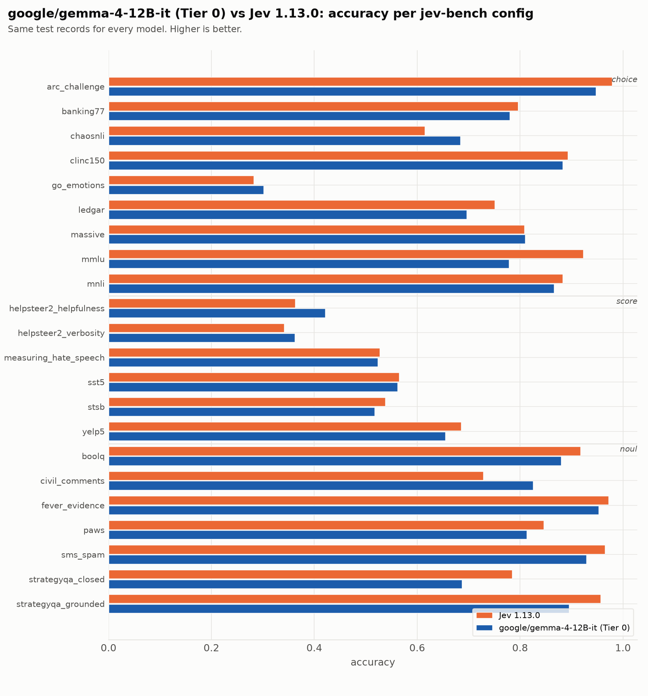
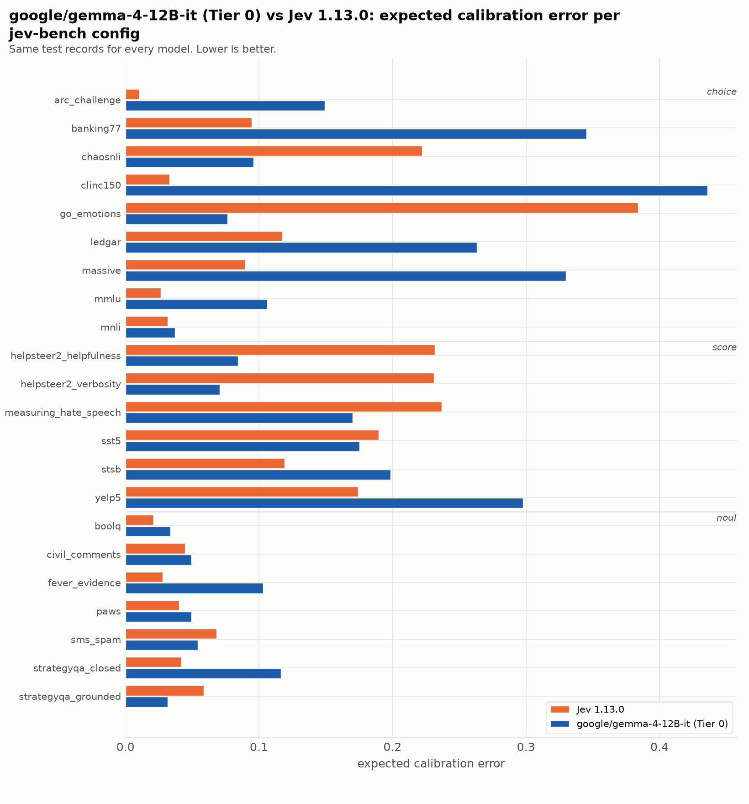

| source | prim | Jev 1.13.0 acc | Jev 1.13.0 ECE | Jev 1.13.0 Brier | google/gemma-4-12B-it (Tier 0) acc | google/gemma-4-12B-it (Tier 0) ECE | google/gemma-4-12B-it (Tier 0) Brier |
|---|---|---|---|---|---|---|---|
| `arc_challenge` | choice | 0.979 | 0.010 | 0.037 | 0.947 | 0.149 | 0.119 |
| `banking77` | choice | 0.796 | 0.095 | 0.317 | 0.780 | 0.345 | 0.467 |
| `chaosnli` | choice | 0.615 | 0.222 | 0.583 | 0.684 | 0.096 | 0.466 |
| `clinc150` | choice | 0.893 | 0.033 | 0.159 | 0.883 | 0.436 | 0.391 |
| `go_emotions` | choice | 0.282 | 0.384 | 1.040 | 0.301 | 0.076 | 0.850 |
| `ledgar` | choice | 0.751 | 0.117 | 0.374 | 0.696 | 0.263 | 0.523 |
| `massive` | choice | 0.808 | 0.090 | 0.295 | 0.810 | 0.330 | 0.411 |
| `mmlu` | choice | 0.923 | 0.027 | 0.124 | 0.778 | 0.106 | 0.340 |
| `mnli` | choice | 0.883 | 0.032 | 0.176 | 0.866 | 0.037 | 0.217 |
| `boolq` | noul | 0.917 | 0.021 | 0.061 | 0.880 | 0.034 | 0.097 |
| `civil_comments` | noul | 0.729 | 0.045 | 0.183 | 0.826 | 0.049 | 0.117 |
| `fever_evidence` | noul | 0.972 | 0.028 | 0.025 | 0.953 | 0.103 | 0.057 |
| `paws` | noul | 0.846 | 0.040 | 0.109 | 0.813 | 0.049 | 0.136 |
| `sms_spam` | noul | 0.965 | 0.068 | 0.035 | 0.929 | 0.054 | 0.052 |
| `strategyqa_closed` | noul | 0.785 | 0.042 | 0.144 | 0.687 | 0.117 | 0.220 |
| `strategyqa_grounded` | noul | 0.956 | 0.059 | 0.038 | 0.895 | 0.032 | 0.084 |
| `helpsteer2_helpfulness` | score | 0.363 | 0.232 | 0.812 | 0.421 | 0.084 | 0.716 |
| `helpsteer2_verbosity` | score | 0.341 | 0.231 | 0.793 | 0.362 | 0.070 | 0.755 |
| `measuring_hate_speech` | score | 0.527 | 0.237 | 0.669 | 0.523 | 0.170 | 0.555 |
| `sst5` | score | 0.565 | 0.190 | 0.618 | 0.562 | 0.175 | 0.627 |
| `stsb` | score | 0.538 | 0.119 | 0.594 | 0.517 | 0.199 | 0.679 |
| `yelp5` | score | 0.685 | 0.174 | 0.483 | 0.655 | 0.298 | 0.621 |
| **macro** | | **0.733** | **0.113** | **0.349** | **0.717** | **0.149** | **0.386** |

