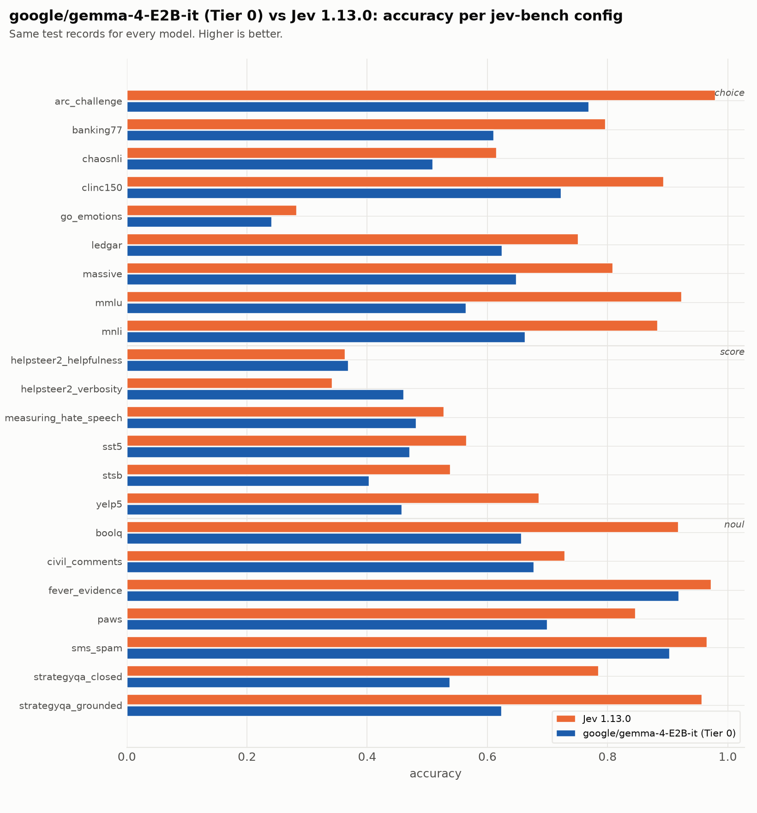
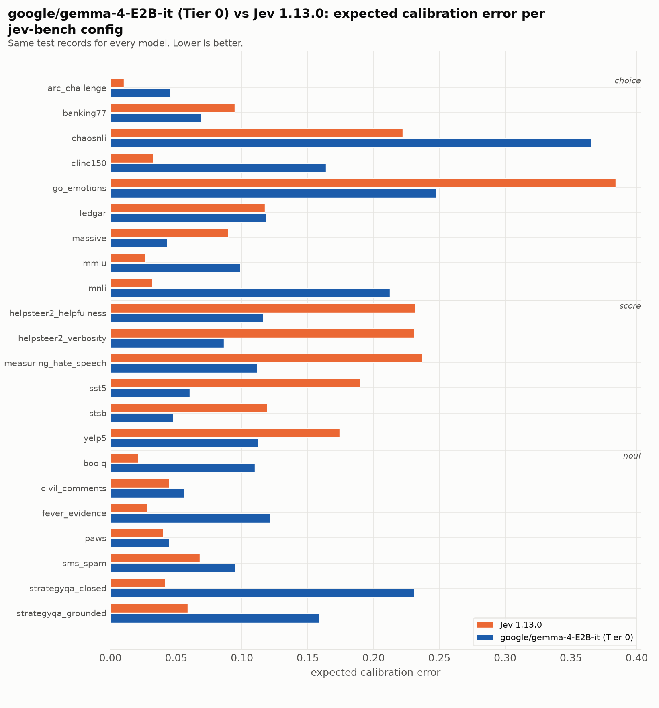

| source | prim | Jev 1.13.0 acc | Jev 1.13.0 ECE | Jev 1.13.0 Brier | google/gemma-4-E2B-it (Tier 0) acc | google/gemma-4-E2B-it (Tier 0) ECE | google/gemma-4-E2B-it (Tier 0) Brier |
|---|---|---|---|---|---|---|---|
| `arc_challenge` | choice | 0.979 | 0.010 | 0.037 | 0.768 | 0.046 | 0.338 |
| `banking77` | choice | 0.796 | 0.095 | 0.317 | 0.610 | 0.069 | 0.562 |
| `chaosnli` | choice | 0.615 | 0.222 | 0.583 | 0.508 | 0.365 | 0.807 |
| `clinc150` | choice | 0.893 | 0.033 | 0.159 | 0.722 | 0.164 | 0.449 |
| `go_emotions` | choice | 0.282 | 0.384 | 1.040 | 0.241 | 0.248 | 0.976 |
| `ledgar` | choice | 0.751 | 0.117 | 0.374 | 0.624 | 0.118 | 0.564 |
| `massive` | choice | 0.808 | 0.090 | 0.295 | 0.648 | 0.043 | 0.463 |
| `mmlu` | choice | 0.923 | 0.027 | 0.124 | 0.564 | 0.099 | 0.573 |
| `mnli` | choice | 0.883 | 0.032 | 0.176 | 0.662 | 0.212 | 0.551 |
| `boolq` | noul | 0.917 | 0.021 | 0.061 | 0.656 | 0.110 | 0.221 |
| `civil_comments` | noul | 0.729 | 0.045 | 0.183 | 0.677 | 0.056 | 0.200 |
| `fever_evidence` | noul | 0.972 | 0.028 | 0.025 | 0.918 | 0.121 | 0.084 |
| `paws` | noul | 0.846 | 0.040 | 0.109 | 0.699 | 0.045 | 0.201 |
| `sms_spam` | noul | 0.965 | 0.068 | 0.035 | 0.902 | 0.095 | 0.082 |
| `strategyqa_closed` | noul | 0.785 | 0.042 | 0.144 | 0.537 | 0.231 | 0.290 |
| `strategyqa_grounded` | noul | 0.956 | 0.059 | 0.038 | 0.623 | 0.159 | 0.226 |
| `helpsteer2_helpfulness` | score | 0.363 | 0.232 | 0.812 | 0.368 | 0.116 | 0.741 |
| `helpsteer2_verbosity` | score | 0.341 | 0.231 | 0.793 | 0.460 | 0.086 | 0.683 |
| `measuring_hate_speech` | score | 0.527 | 0.237 | 0.669 | 0.481 | 0.112 | 0.610 |
| `sst5` | score | 0.565 | 0.190 | 0.618 | 0.470 | 0.060 | 0.647 |
| `stsb` | score | 0.538 | 0.119 | 0.594 | 0.403 | 0.048 | 0.712 |
| `yelp5` | score | 0.685 | 0.174 | 0.483 | 0.457 | 0.112 | 0.662 |
| **macro** | | **0.733** | **0.113** | **0.349** | **0.591** | **0.123** | **0.484** |

