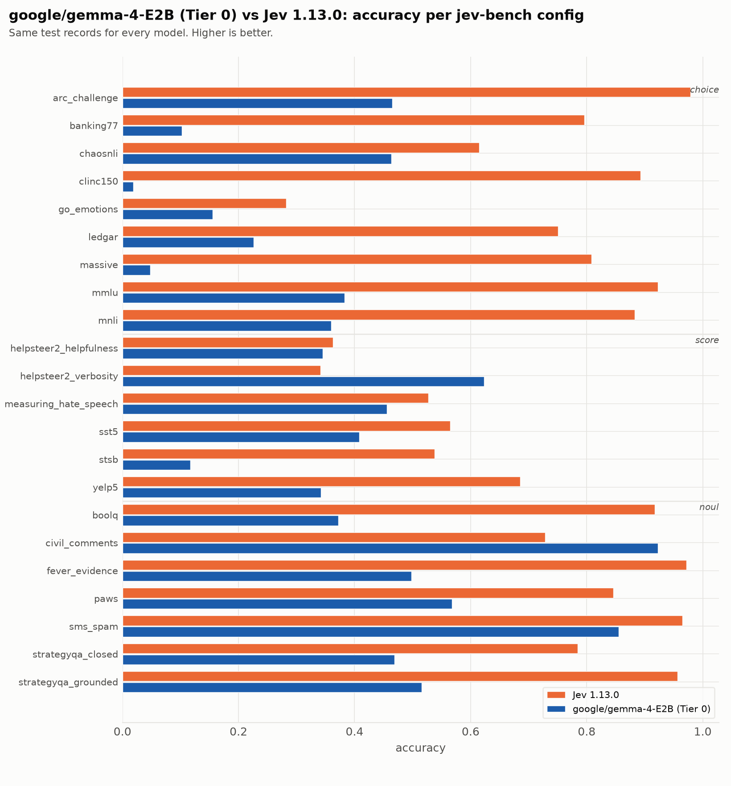
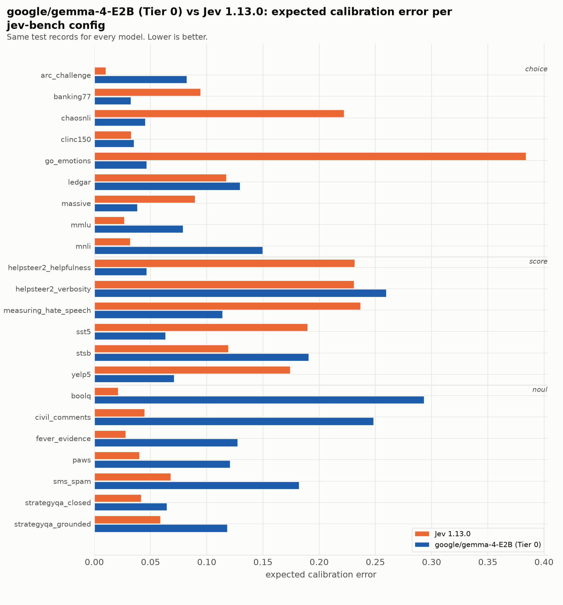

| source | prim | Jev 1.13.0 acc | Jev 1.13.0 ECE | Jev 1.13.0 Brier | google/gemma-4-E2B (Tier 0) acc | google/gemma-4-E2B (Tier 0) ECE | google/gemma-4-E2B (Tier 0) Brier |
|---|---|---|---|---|---|---|---|
| `arc_challenge` | choice | 0.979 | 0.010 | 0.037 | 0.465 | 0.082 | 0.652 |
| `banking77` | choice | 0.796 | 0.095 | 0.317 | 0.102 | 0.032 | 0.957 |
| `chaosnli` | choice | 0.615 | 0.222 | 0.583 | 0.463 | 0.045 | 0.660 |
| `clinc150` | choice | 0.893 | 0.033 | 0.159 | 0.019 | 0.035 | 0.991 |
| `go_emotions` | choice | 0.282 | 0.384 | 1.040 | 0.155 | 0.046 | 0.928 |
| `ledgar` | choice | 0.751 | 0.117 | 0.374 | 0.226 | 0.130 | 0.915 |
| `massive` | choice | 0.808 | 0.090 | 0.295 | 0.048 | 0.038 | 0.974 |
| `mmlu` | choice | 0.923 | 0.027 | 0.124 | 0.383 | 0.079 | 0.691 |
| `mnli` | choice | 0.883 | 0.032 | 0.176 | 0.360 | 0.150 | 0.694 |
| `boolq` | noul | 0.917 | 0.021 | 0.061 | 0.372 | 0.293 | 0.318 |
| `civil_comments` | noul | 0.729 | 0.045 | 0.183 | 0.923 | 0.248 | 0.134 |
| `fever_evidence` | noul | 0.972 | 0.028 | 0.025 | 0.498 | 0.127 | 0.251 |
| `paws` | noul | 0.846 | 0.040 | 0.109 | 0.568 | 0.121 | 0.259 |
| `sms_spam` | noul | 0.965 | 0.068 | 0.035 | 0.855 | 0.182 | 0.157 |
| `strategyqa_closed` | noul | 0.785 | 0.042 | 0.144 | 0.469 | 0.064 | 0.255 |
| `strategyqa_grounded` | noul | 0.956 | 0.059 | 0.038 | 0.515 | 0.118 | 0.262 |
| `helpsteer2_helpfulness` | score | 0.363 | 0.232 | 0.812 | 0.345 | 0.047 | 0.715 |
| `helpsteer2_verbosity` | score | 0.341 | 0.231 | 0.793 | 0.623 | 0.260 | 0.657 |
| `measuring_hate_speech` | score | 0.527 | 0.237 | 0.669 | 0.456 | 0.114 | 0.651 |
| `sst5` | score | 0.565 | 0.190 | 0.618 | 0.408 | 0.063 | 0.709 |
| `stsb` | score | 0.538 | 0.119 | 0.594 | 0.117 | 0.191 | 0.869 |
| `yelp5` | score | 0.685 | 0.174 | 0.483 | 0.342 | 0.071 | 0.705 |
| **macro** | | **0.733** | **0.113** | **0.349** | **0.396** | **0.115** | **0.609** |

