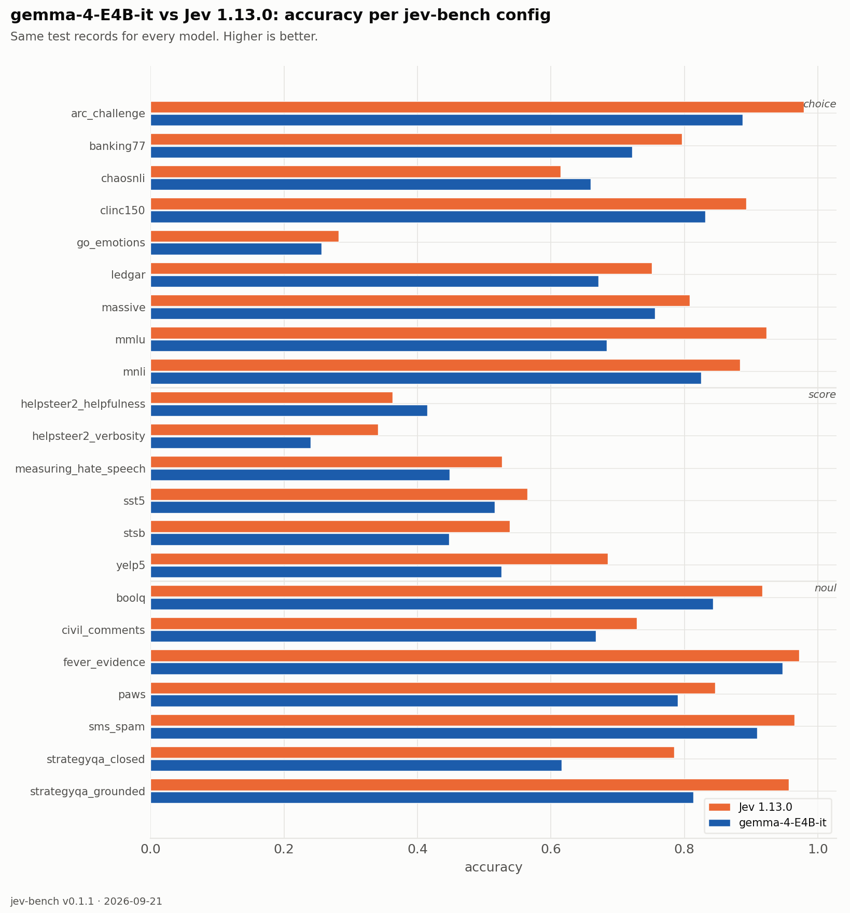
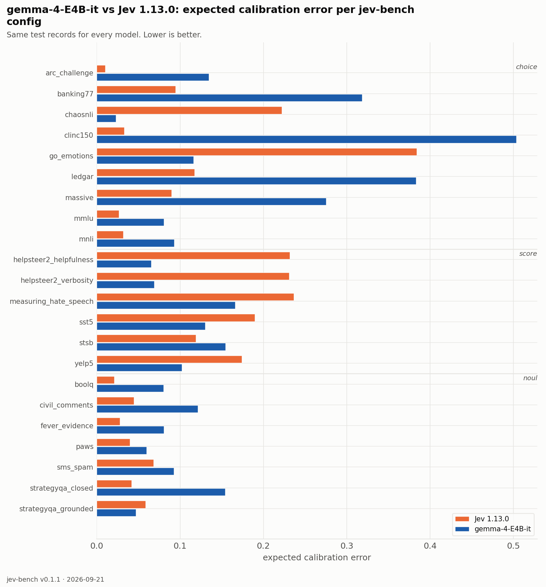

| source | prim | Jev 1.13.0 acc | Jev 1.13.0 ECE | Jev 1.13.0 Brier | Gemma-4-E4B-it (Tier 0) acc | Gemma-4-E4B-it (Tier 0) ECE | Gemma-4-E4B-it (Tier 0) Brier |
|---|---|---|---|---|---|---|---|
| `arc_challenge` | choice | 0.979 | 0.010 | 0.037 | 0.887 | 0.135 | 0.183 |
| `banking77` | choice | 0.796 | 0.095 | 0.317 | 0.722 | 0.319 | 0.517 |
| `chaosnli` | choice | 0.615 | 0.222 | 0.583 | 0.660 | 0.023 | 0.476 |
| `clinc150` | choice | 0.893 | 0.033 | 0.159 | 0.831 | 0.504 | 0.528 |
| `go_emotions` | choice | 0.282 | 0.384 | 1.040 | 0.256 | 0.116 | 0.887 |
| `ledgar` | choice | 0.751 | 0.117 | 0.374 | 0.671 | 0.383 | 0.631 |
| `massive` | choice | 0.808 | 0.090 | 0.295 | 0.756 | 0.275 | 0.431 |
| `mmlu` | choice | 0.923 | 0.027 | 0.124 | 0.684 | 0.081 | 0.417 |
| `mnli` | choice | 0.883 | 0.032 | 0.176 | 0.825 | 0.093 | 0.269 |
| `boolq` | noul | 0.917 | 0.021 | 0.061 | 0.843 | 0.080 | 0.130 |
| `civil_comments` | noul | 0.729 | 0.045 | 0.183 | 0.667 | 0.121 | 0.204 |
| `fever_evidence` | noul | 0.972 | 0.028 | 0.025 | 0.947 | 0.080 | 0.055 |
| `paws` | noul | 0.846 | 0.040 | 0.109 | 0.790 | 0.060 | 0.150 |
| `sms_spam` | noul | 0.965 | 0.068 | 0.035 | 0.909 | 0.093 | 0.073 |
| `strategyqa_closed` | noul | 0.785 | 0.042 | 0.144 | 0.616 | 0.154 | 0.250 |
| `strategyqa_grounded` | noul | 0.956 | 0.059 | 0.038 | 0.814 | 0.047 | 0.140 |
| `helpsteer2_helpfulness` | score | 0.363 | 0.232 | 0.812 | 0.415 | 0.065 | 0.709 |
| `helpsteer2_verbosity` | score | 0.341 | 0.231 | 0.793 | 0.240 | 0.069 | 0.765 |
| `measuring_hate_speech` | score | 0.527 | 0.237 | 0.669 | 0.448 | 0.166 | 0.608 |
| `sst5` | score | 0.565 | 0.190 | 0.618 | 0.516 | 0.130 | 0.624 |
| `stsb` | score | 0.538 | 0.119 | 0.594 | 0.447 | 0.155 | 0.703 |
| `yelp5` | score | 0.685 | 0.174 | 0.483 | 0.526 | 0.102 | 0.610 |
| **macro** | | **0.733** | **0.113** | **0.349** | **0.658** | **0.148** | **0.426** |

