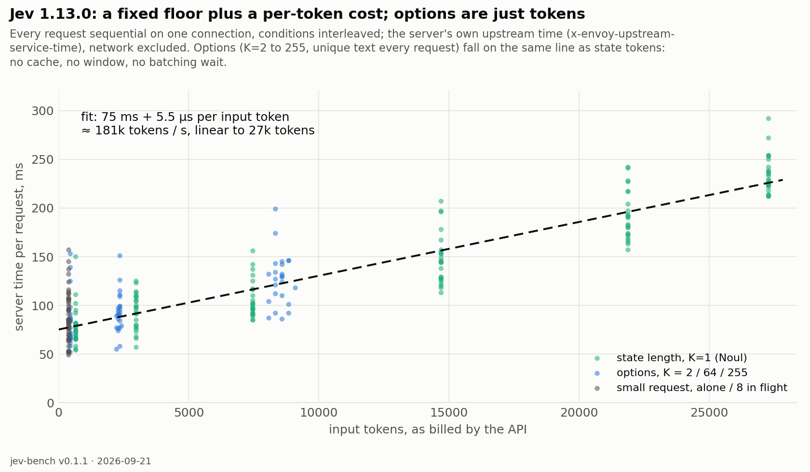

# Where Jev's time goes

Jev's round trip barely moved with the number of options in our baseline (186 ms at K=4, 219 ms at K=151), while
the same options cost our engine 1,300 tokens of prefill. The baseline could not say why: every request for a config
carried the identical option set, it ran eight requests in flight, and it never varied one thing at a time. These
probes do. Every request is sequential on one keep-alive connection, conditions are interleaved round-robin, and the
second round records the server's own clock (`x-envoy-upstream-service-time`), so the network is out of the picture.

## The answer

**Server time = ~75 ms fixed + ~5.5 µs per input token, linear to 27,000 tokens — and an option token costs exactly
what a state token costs.** Options for K = 2 → 255 (unique text every request, so nothing can be cached) fall on the
same line as state tokens. There is no option-specific mechanism to find:

- **No caching.** A nonce inside every one of 151 options (+851 tokens) costs +12 ms client-side; shuffling costs +0.
- **No fixed window.** State length 400 → 27,000 tokens is linear, no cliff, no quadratic blow-up.
- **No batching wait.** Server time is 85 ms alone and 84 ms with eight requests in flight.
- **Questions are just tokens too.** Eight questions in one request cost what their tokens cost (+3 ms).
- **The answer is a template, not a decode.** At K=255 the API reports 2,570 *output* tokens in 128 ms of server
  time — ~10 slot tokens per option filled in one pass. Ten-token labels instead of one-token: +7 ms.

So the flat curve in the baseline is arithmetic: 1,300 option tokens × 5.5 µs = **7 ms**, invisible under a 75 ms
server floor and ~70 ms of network. Our engine pays ~120 µs per token on the A40 research path — roughly 20× more —
which is the entire reason our curve rises and theirs does not. Throughput, not a trick.

## What ~5.5 µs per token bounds

~180,000 input tokens per second per request is the throughput of a **~2B-parameter model on one H100-class GPU at
realistic utilization**. A 30B dense model would need roughly 8-way tensor parallelism on top-end cards to match it,
and at $0.042 per million input tokens such a node earns about $21/hour saturated against ~$35/hour of hardware.
Economics and the documented failure profile (literal reading, no counting) point the same way. This is a bound
from the outside, not an observation of their hardware: a 30B-class Jev is now the expensive hypothesis, not the
default one.

## Round 1 — client round trip (network included)

| block | condition | n | p50 ms | server p50 | input tok | output tok |
|---|---|---|---|---|---|---|
| A | identical | 35 | 164 | — | 2622 | 1301 |
| A | nonce_in_options | 35 | 176 | — | 3473 | 1301 |
| A | nonce_in_state | 35 | 167 | — | 2628 | 1301 |
| A | shuffled_order | 35 | 164 | — | 2622 | 1301 |
| B | state_1600 | 35 | 153 | — | 1803 | 45 |
| B | state_400 | 35 | 163 | — | 723 | 45 |
| B | state_50 | 35 | 170 | — | 399 | 45 |
| B | state_6400 | 35 | 173 | — | 6123 | 45 |
| C | k_128 | 35 | 184 | — | 4395 | 1300 |
| C | k_2 | 35 | 158 | — | 447 | 40 |
| C | k_32 | 35 | 171 | — | 1363 | 340 |
| C | k_8 | 35 | 164 | — | 623 | 100 |
| D | labels_10tok | 35 | 164 | — | 1939 | 934 |
| D | labels_1tok | 35 | 157 | — | 1331 | 340 |
| E | questions_1 | 35 | 150 | — | 514 | 61 |
| E | questions_8 | 35 | 153 | — | 1523 | 467 |

## Round 2 — with the server's own clock

| block | condition | n | p50 ms | server p50 | input tok | output tok |
|---|---|---|---|---|---|---|
| F | state_16000 | 24 | 218 | 144 | 14697 | 20 |
| F | state_24000 | 24 | 261 | 186 | 21879 | 20 |
| F | state_3000 | 24 | 167 | 96 | 2979 | 20 |
| F | state_30000 | 24 | 306 | 231 | 27279 | 20 |
| F | state_400 | 24 | 143 | 74 | 657 | 20 |
| F | state_8000 | 24 | 172 | 100 | 7461 | 20 |
| G | k_2 | 24 | 144 | 74 | 449 | 40 |
| G | k_255 | 24 | 201 | 128 | 8586 | 2570 |
| G | k_64 | 24 | 160 | 90 | 2355 | 660 |
| H | 8_in_flight | 24 | 180 | 84 | 387 | 20 |
| H | alone | 24 | 155 | 85 | 387 | 20 |

Blocks: A caching (K=151, identical / nonce in every option / shuffled / nonce in state); B state length at K=4;
C options K=2..128 with unique text; D one- vs ten-token labels at K=32; E 1 vs 8 questions; F state length to 30K;
G K = 2 / 64 / 255; H alone vs 8 in flight. Reproduce: `python scripts/probe_jev_latency.py --blocks A,B,C,D,E` and
`--blocks F,G,H --tag _round2`, then `scripts/probe_jev_latency_figure.py`. Raw rows in `probe*.json`.
