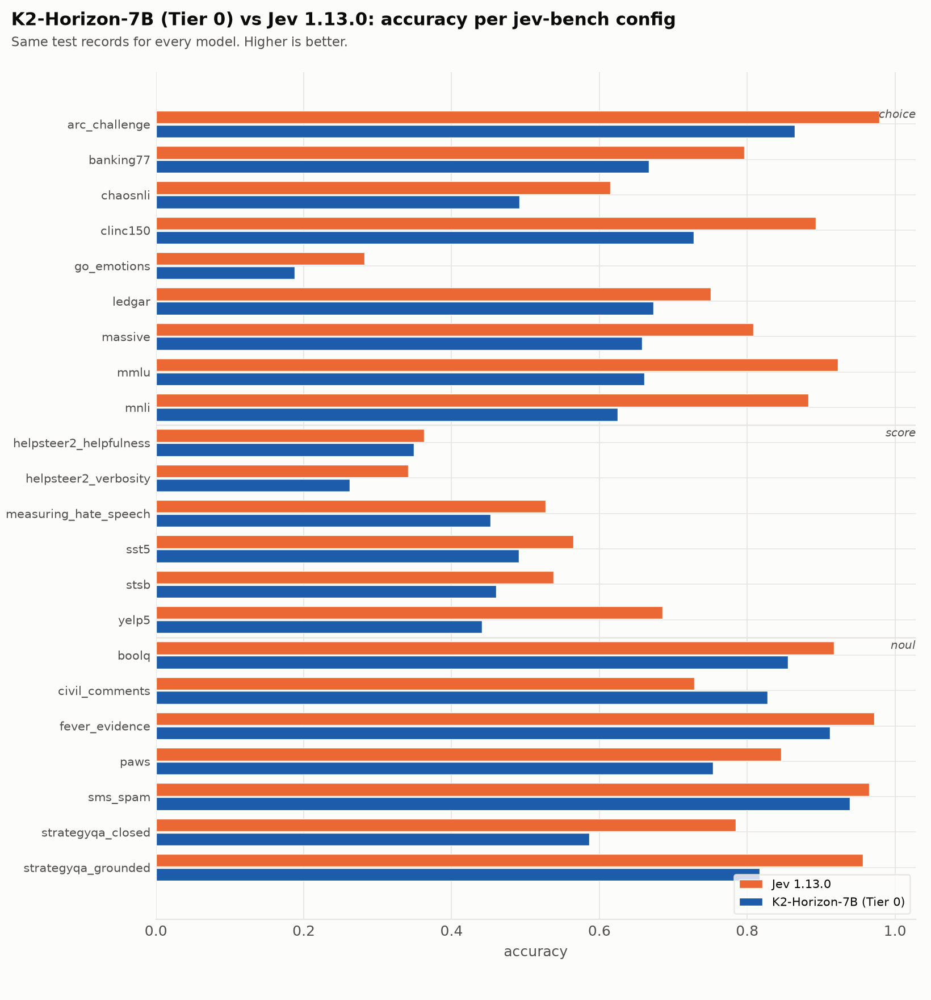
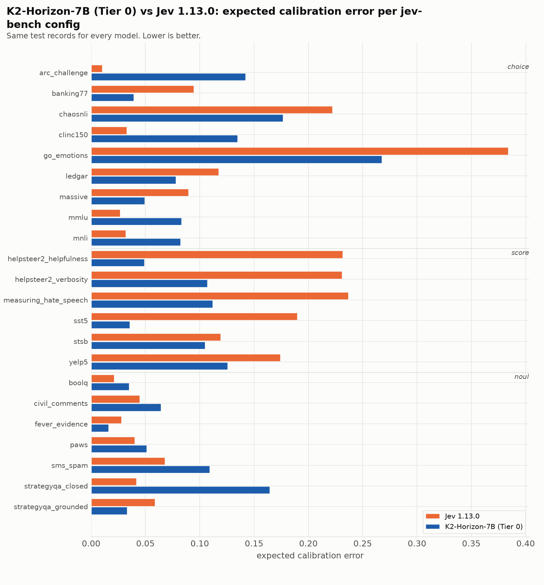

| source | prim | Jev 1.13.0 acc | Jev 1.13.0 ECE | Jev 1.13.0 Brier | K2-Horizon-7B (Tier 0) acc | K2-Horizon-7B (Tier 0) ECE | K2-Horizon-7B (Tier 0) Brier |
|---|---|---|---|---|---|---|---|
| `arc_challenge` | choice | 0.979 | 0.010 | 0.037 | 0.864 | 0.142 | 0.243 |
| `banking77` | choice | 0.796 | 0.095 | 0.317 | 0.667 | 0.039 | 0.452 |
| `chaosnli` | choice | 0.615 | 0.222 | 0.583 | 0.492 | 0.177 | 0.605 |
| `clinc150` | choice | 0.893 | 0.033 | 0.159 | 0.728 | 0.135 | 0.444 |
| `go_emotions` | choice | 0.282 | 0.384 | 1.040 | 0.188 | 0.267 | 1.006 |
| `ledgar` | choice | 0.751 | 0.117 | 0.374 | 0.673 | 0.078 | 0.480 |
| `massive` | choice | 0.808 | 0.090 | 0.295 | 0.658 | 0.049 | 0.447 |
| `mmlu` | choice | 0.923 | 0.027 | 0.124 | 0.661 | 0.083 | 0.456 |
| `mnli` | choice | 0.883 | 0.032 | 0.176 | 0.625 | 0.082 | 0.461 |
| `boolq` | noul | 0.917 | 0.021 | 0.061 | 0.855 | 0.035 | 0.103 |
| `civil_comments` | noul | 0.729 | 0.045 | 0.183 | 0.828 | 0.064 | 0.130 |
| `fever_evidence` | noul | 0.972 | 0.028 | 0.025 | 0.912 | 0.016 | 0.065 |
| `paws` | noul | 0.846 | 0.040 | 0.109 | 0.754 | 0.051 | 0.172 |
| `sms_spam` | noul | 0.965 | 0.068 | 0.035 | 0.939 | 0.109 | 0.062 |
| `strategyqa_closed` | noul | 0.785 | 0.042 | 0.144 | 0.587 | 0.164 | 0.257 |
| `strategyqa_grounded` | noul | 0.956 | 0.059 | 0.038 | 0.817 | 0.033 | 0.122 |
| `helpsteer2_helpfulness` | score | 0.363 | 0.232 | 0.812 | 0.349 | 0.049 | 0.715 |
| `helpsteer2_verbosity` | score | 0.341 | 0.231 | 0.793 | 0.262 | 0.107 | 0.796 |
| `measuring_hate_speech` | score | 0.527 | 0.237 | 0.669 | 0.453 | 0.112 | 0.610 |
| `sst5` | score | 0.565 | 0.190 | 0.618 | 0.491 | 0.036 | 0.612 |
| `stsb` | score | 0.538 | 0.119 | 0.594 | 0.460 | 0.105 | 0.665 |
| `yelp5` | score | 0.685 | 0.174 | 0.483 | 0.441 | 0.126 | 0.687 |
| **macro** | | **0.733** | **0.113** | **0.349** | **0.623** | **0.094** | **0.436** |

