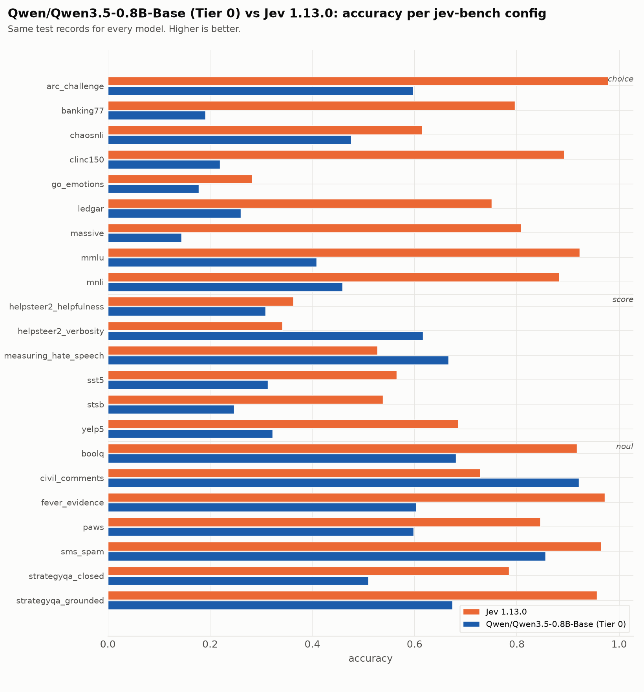
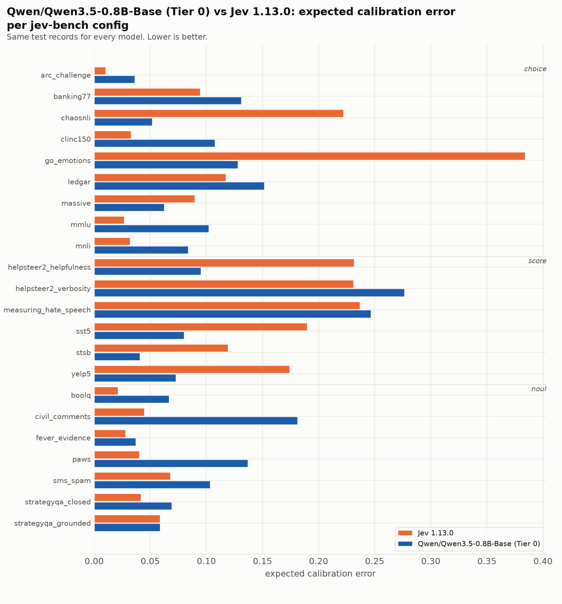

| source | prim | Jev 1.13.0 acc | Jev 1.13.0 ECE | Jev 1.13.0 Brier | Qwen/Qwen3.5-0.8B-Base (Tier 0) acc | Qwen/Qwen3.5-0.8B-Base (Tier 0) ECE | Qwen/Qwen3.5-0.8B-Base (Tier 0) Brier |
|---|---|---|---|---|---|---|---|
| `arc_challenge` | choice | 0.979 | 0.010 | 0.037 | 0.597 | 0.036 | 0.521 |
| `banking77` | choice | 0.796 | 0.095 | 0.317 | 0.191 | 0.131 | 0.952 |
| `chaosnli` | choice | 0.615 | 0.222 | 0.583 | 0.476 | 0.052 | 0.620 |
| `clinc150` | choice | 0.893 | 0.033 | 0.159 | 0.219 | 0.108 | 0.946 |
| `go_emotions` | choice | 0.282 | 0.384 | 1.040 | 0.178 | 0.128 | 0.920 |
| `ledgar` | choice | 0.751 | 0.117 | 0.374 | 0.260 | 0.152 | 0.898 |
| `massive` | choice | 0.808 | 0.090 | 0.295 | 0.144 | 0.063 | 0.946 |
| `mmlu` | choice | 0.923 | 0.027 | 0.124 | 0.408 | 0.102 | 0.693 |
| `mnli` | choice | 0.883 | 0.032 | 0.176 | 0.459 | 0.084 | 0.622 |
| `boolq` | noul | 0.917 | 0.021 | 0.061 | 0.681 | 0.067 | 0.189 |
| `civil_comments` | noul | 0.729 | 0.045 | 0.183 | 0.921 | 0.181 | 0.111 |
| `fever_evidence` | noul | 0.972 | 0.028 | 0.025 | 0.603 | 0.037 | 0.237 |
| `paws` | noul | 0.846 | 0.040 | 0.109 | 0.598 | 0.137 | 0.219 |
| `sms_spam` | noul | 0.965 | 0.068 | 0.035 | 0.856 | 0.103 | 0.135 |
| `strategyqa_closed` | noul | 0.785 | 0.042 | 0.144 | 0.509 | 0.069 | 0.256 |
| `strategyqa_grounded` | noul | 0.956 | 0.059 | 0.038 | 0.674 | 0.059 | 0.210 |
| `helpsteer2_helpfulness` | score | 0.363 | 0.232 | 0.812 | 0.308 | 0.095 | 0.737 |
| `helpsteer2_verbosity` | score | 0.341 | 0.231 | 0.793 | 0.616 | 0.276 | 0.667 |
| `measuring_hate_speech` | score | 0.527 | 0.237 | 0.669 | 0.666 | 0.246 | 0.584 |
| `sst5` | score | 0.565 | 0.190 | 0.618 | 0.313 | 0.080 | 0.751 |
| `stsb` | score | 0.538 | 0.119 | 0.594 | 0.247 | 0.041 | 0.813 |
| `yelp5` | score | 0.685 | 0.174 | 0.483 | 0.322 | 0.073 | 0.774 |
| **macro** | | **0.733** | **0.113** | **0.349** | **0.466** | **0.105** | **0.582** |

