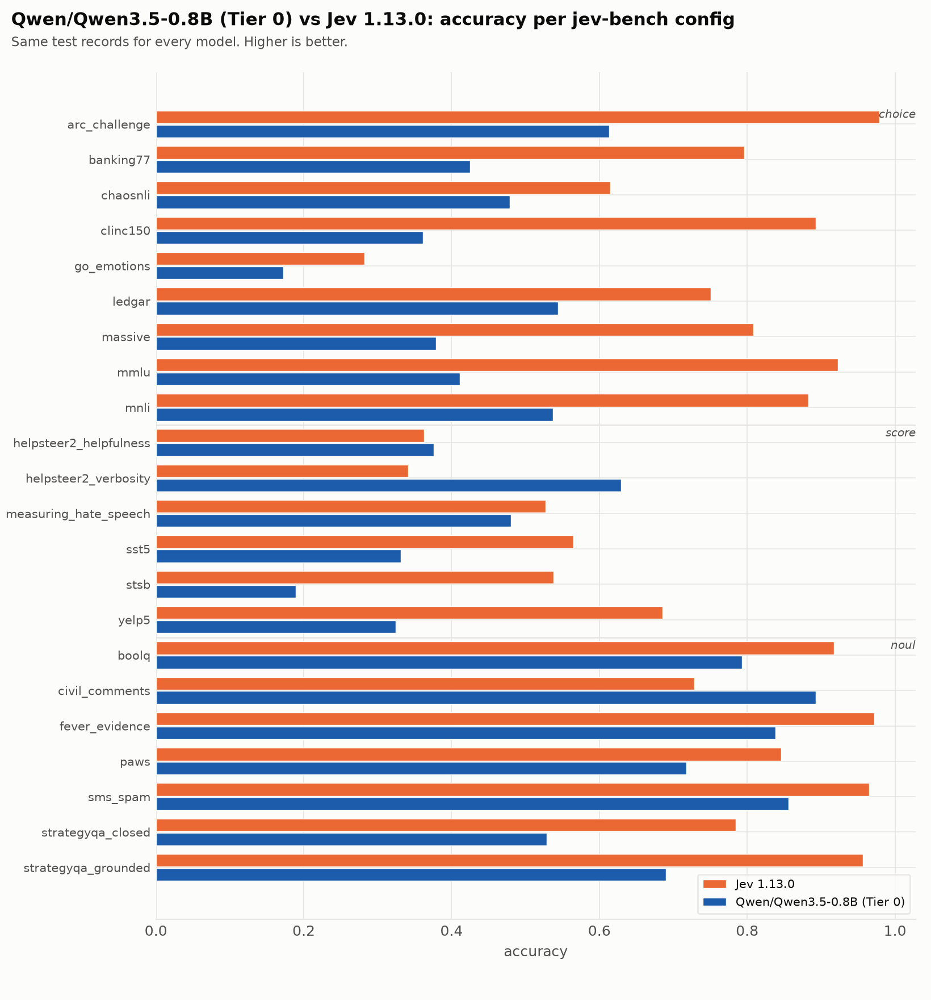
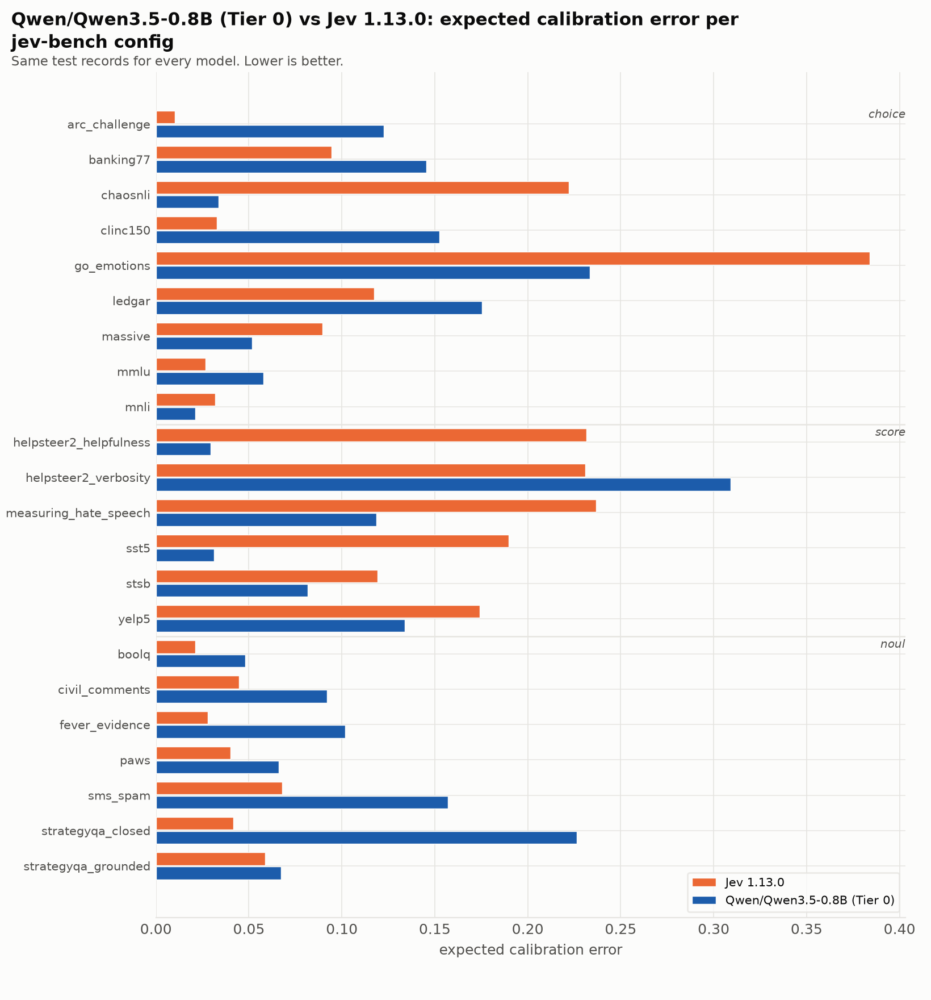

| source | prim | Jev 1.13.0 acc | Jev 1.13.0 ECE | Jev 1.13.0 Brier | Qwen/Qwen3.5-0.8B (Tier 0) acc | Qwen/Qwen3.5-0.8B (Tier 0) ECE | Qwen/Qwen3.5-0.8B (Tier 0) Brier |
|---|---|---|---|---|---|---|---|
| `arc_challenge` | choice | 0.979 | 0.010 | 0.037 | 0.613 | 0.123 | 0.531 |
| `banking77` | choice | 0.796 | 0.095 | 0.317 | 0.425 | 0.145 | 0.744 |
| `chaosnli` | choice | 0.615 | 0.222 | 0.583 | 0.478 | 0.034 | 0.616 |
| `clinc150` | choice | 0.893 | 0.033 | 0.159 | 0.361 | 0.152 | 0.824 |
| `go_emotions` | choice | 0.282 | 0.384 | 1.040 | 0.172 | 0.233 | 1.011 |
| `ledgar` | choice | 0.751 | 0.117 | 0.374 | 0.544 | 0.175 | 0.672 |
| `massive` | choice | 0.808 | 0.090 | 0.295 | 0.379 | 0.052 | 0.745 |
| `mmlu` | choice | 0.923 | 0.027 | 0.124 | 0.411 | 0.058 | 0.665 |
| `mnli` | choice | 0.883 | 0.032 | 0.176 | 0.537 | 0.021 | 0.573 |
| `boolq` | noul | 0.917 | 0.021 | 0.061 | 0.793 | 0.048 | 0.149 |
| `civil_comments` | noul | 0.729 | 0.045 | 0.183 | 0.892 | 0.092 | 0.088 |
| `fever_evidence` | noul | 0.972 | 0.028 | 0.025 | 0.838 | 0.102 | 0.127 |
| `paws` | noul | 0.846 | 0.040 | 0.109 | 0.718 | 0.066 | 0.188 |
| `sms_spam` | noul | 0.965 | 0.068 | 0.035 | 0.856 | 0.157 | 0.129 |
| `strategyqa_closed` | noul | 0.785 | 0.042 | 0.144 | 0.528 | 0.226 | 0.309 |
| `strategyqa_grounded` | noul | 0.956 | 0.059 | 0.038 | 0.690 | 0.067 | 0.202 |
| `helpsteer2_helpfulness` | score | 0.363 | 0.232 | 0.812 | 0.376 | 0.029 | 0.713 |
| `helpsteer2_verbosity` | score | 0.341 | 0.231 | 0.793 | 0.629 | 0.309 | 0.690 |
| `measuring_hate_speech` | score | 0.527 | 0.237 | 0.669 | 0.480 | 0.118 | 0.646 |
| `sst5` | score | 0.565 | 0.190 | 0.618 | 0.331 | 0.031 | 0.735 |
| `stsb` | score | 0.538 | 0.119 | 0.594 | 0.189 | 0.082 | 0.815 |
| `yelp5` | score | 0.685 | 0.174 | 0.483 | 0.324 | 0.134 | 0.760 |
| **macro** | | **0.733** | **0.113** | **0.349** | **0.526** | **0.112** | **0.542** |

