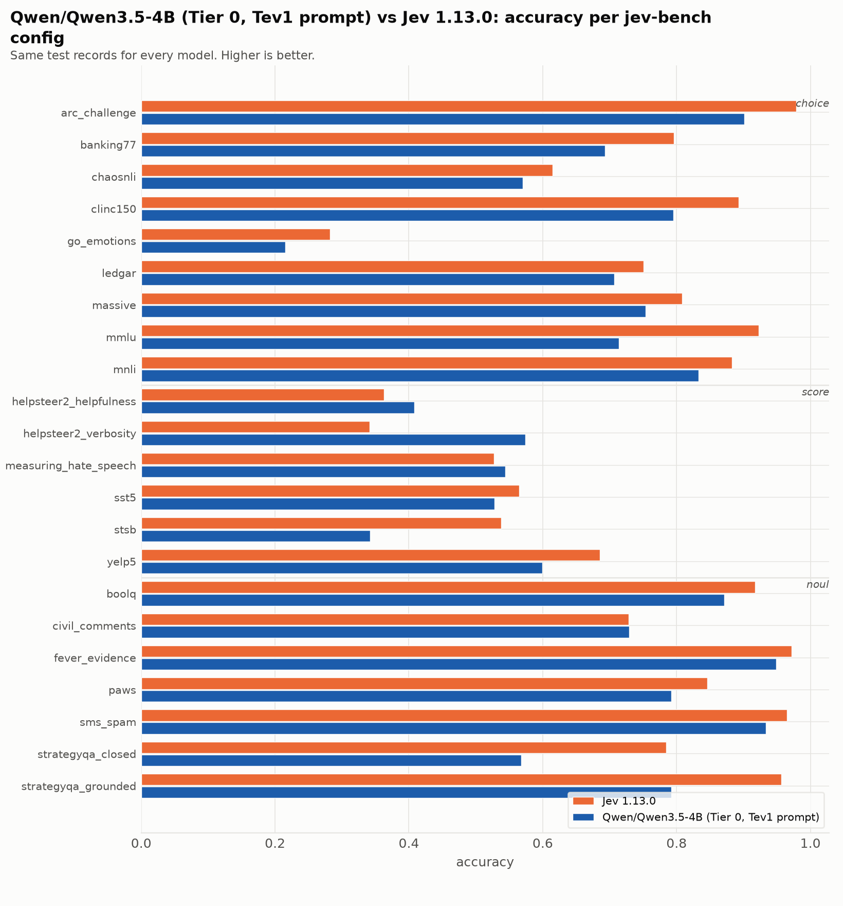
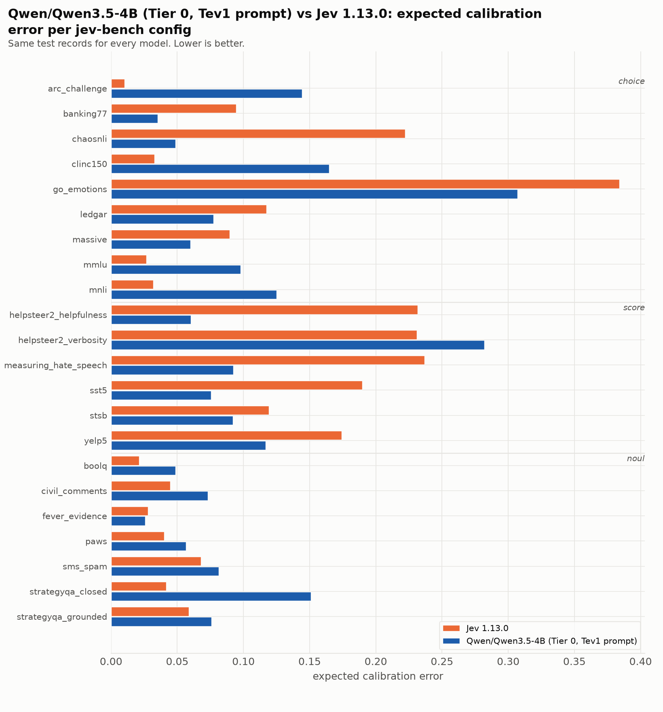

| source | prim | Jev 1.13.0 acc | Jev 1.13.0 ECE | Jev 1.13.0 Brier | Qwen/Qwen3.5-4B (Tier 0, Tev1 prompt) acc | Qwen/Qwen3.5-4B (Tier 0, Tev1 prompt) ECE | Qwen/Qwen3.5-4B (Tier 0, Tev1 prompt) Brier |
|---|---|---|---|---|---|---|---|
| `arc_challenge` | choice | 0.979 | 0.010 | 0.037 | 0.901 | 0.144 | 0.179 |
| `banking77` | choice | 0.796 | 0.095 | 0.317 | 0.693 | 0.035 | 0.418 |
| `chaosnli` | choice | 0.615 | 0.222 | 0.583 | 0.570 | 0.048 | 0.536 |
| `clinc150` | choice | 0.893 | 0.033 | 0.159 | 0.795 | 0.165 | 0.352 |
| `go_emotions` | choice | 0.282 | 0.384 | 1.040 | 0.215 | 0.307 | 1.037 |
| `ledgar` | choice | 0.751 | 0.117 | 0.374 | 0.707 | 0.077 | 0.428 |
| `massive` | choice | 0.808 | 0.090 | 0.295 | 0.754 | 0.060 | 0.357 |
| `mmlu` | choice | 0.923 | 0.027 | 0.124 | 0.714 | 0.098 | 0.418 |
| `mnli` | choice | 0.883 | 0.032 | 0.176 | 0.833 | 0.125 | 0.267 |
| `boolq` | noul | 0.917 | 0.021 | 0.061 | 0.871 | 0.049 | 0.096 |
| `civil_comments` | noul | 0.729 | 0.045 | 0.183 | 0.729 | 0.073 | 0.179 |
| `fever_evidence` | noul | 0.972 | 0.028 | 0.025 | 0.949 | 0.026 | 0.042 |
| `paws` | noul | 0.846 | 0.040 | 0.109 | 0.792 | 0.056 | 0.141 |
| `sms_spam` | noul | 0.965 | 0.068 | 0.035 | 0.934 | 0.081 | 0.063 |
| `strategyqa_closed` | noul | 0.785 | 0.042 | 0.144 | 0.568 | 0.151 | 0.246 |
| `strategyqa_grounded` | noul | 0.956 | 0.059 | 0.038 | 0.792 | 0.076 | 0.124 |
| `helpsteer2_helpfulness` | score | 0.363 | 0.232 | 0.812 | 0.408 | 0.060 | 0.723 |
| `helpsteer2_verbosity` | score | 0.341 | 0.231 | 0.793 | 0.574 | 0.282 | 0.715 |
| `measuring_hate_speech` | score | 0.527 | 0.237 | 0.669 | 0.544 | 0.092 | 0.561 |
| `sst5` | score | 0.565 | 0.190 | 0.618 | 0.528 | 0.076 | 0.639 |
| `stsb` | score | 0.538 | 0.119 | 0.594 | 0.342 | 0.092 | 0.751 |
| `yelp5` | score | 0.685 | 0.174 | 0.483 | 0.599 | 0.117 | 0.569 |
| **macro** | | **0.733** | **0.113** | **0.349** | **0.673** | **0.104** | **0.402** |

