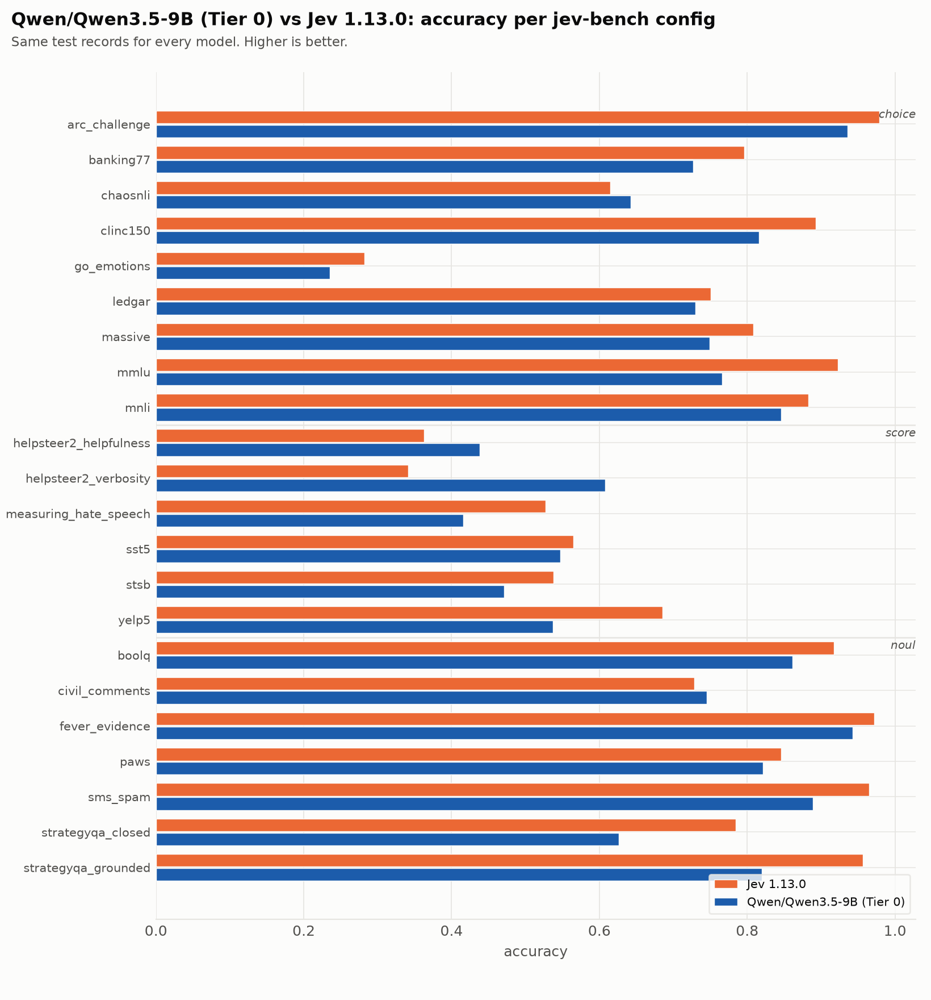
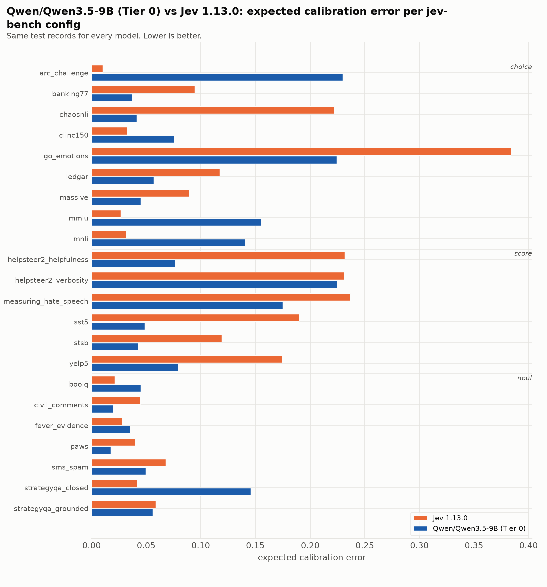

| source | prim | Jev 1.13.0 acc | Jev 1.13.0 ECE | Jev 1.13.0 Brier | Qwen/Qwen3.5-9B (Tier 0) acc | Qwen/Qwen3.5-9B (Tier 0) ECE | Qwen/Qwen3.5-9B (Tier 0) Brier |
|---|---|---|---|---|---|---|---|
| `arc_challenge` | choice | 0.979 | 0.010 | 0.037 | 0.936 | 0.230 | 0.164 |
| `banking77` | choice | 0.796 | 0.095 | 0.317 | 0.727 | 0.037 | 0.380 |
| `chaosnli` | choice | 0.615 | 0.222 | 0.583 | 0.642 | 0.041 | 0.464 |
| `clinc150` | choice | 0.893 | 0.033 | 0.159 | 0.816 | 0.075 | 0.276 |
| `go_emotions` | choice | 0.282 | 0.384 | 1.040 | 0.235 | 0.224 | 0.943 |
| `ledgar` | choice | 0.751 | 0.117 | 0.374 | 0.730 | 0.057 | 0.384 |
| `massive` | choice | 0.808 | 0.090 | 0.295 | 0.749 | 0.045 | 0.353 |
| `mmlu` | choice | 0.923 | 0.027 | 0.124 | 0.766 | 0.155 | 0.362 |
| `mnli` | choice | 0.883 | 0.032 | 0.176 | 0.846 | 0.141 | 0.249 |
| `boolq` | noul | 0.917 | 0.021 | 0.061 | 0.861 | 0.045 | 0.117 |
| `civil_comments` | noul | 0.729 | 0.045 | 0.183 | 0.746 | 0.020 | 0.166 |
| `fever_evidence` | noul | 0.972 | 0.028 | 0.025 | 0.943 | 0.036 | 0.048 |
| `paws` | noul | 0.846 | 0.040 | 0.109 | 0.821 | 0.017 | 0.127 |
| `sms_spam` | noul | 0.965 | 0.068 | 0.035 | 0.889 | 0.050 | 0.083 |
| `strategyqa_closed` | noul | 0.785 | 0.042 | 0.144 | 0.626 | 0.146 | 0.237 |
| `strategyqa_grounded` | noul | 0.956 | 0.059 | 0.038 | 0.820 | 0.056 | 0.131 |
| `helpsteer2_helpfulness` | score | 0.363 | 0.232 | 0.812 | 0.438 | 0.077 | 0.694 |
| `helpsteer2_verbosity` | score | 0.341 | 0.231 | 0.793 | 0.608 | 0.225 | 0.629 |
| `measuring_hate_speech` | score | 0.527 | 0.237 | 0.669 | 0.416 | 0.175 | 0.684 |
| `sst5` | score | 0.565 | 0.190 | 0.618 | 0.547 | 0.049 | 0.594 |
| `stsb` | score | 0.538 | 0.119 | 0.594 | 0.471 | 0.043 | 0.640 |
| `yelp5` | score | 0.685 | 0.174 | 0.483 | 0.537 | 0.080 | 0.612 |
| **macro** | | **0.733** | **0.113** | **0.349** | **0.689** | **0.092** | **0.379** |

