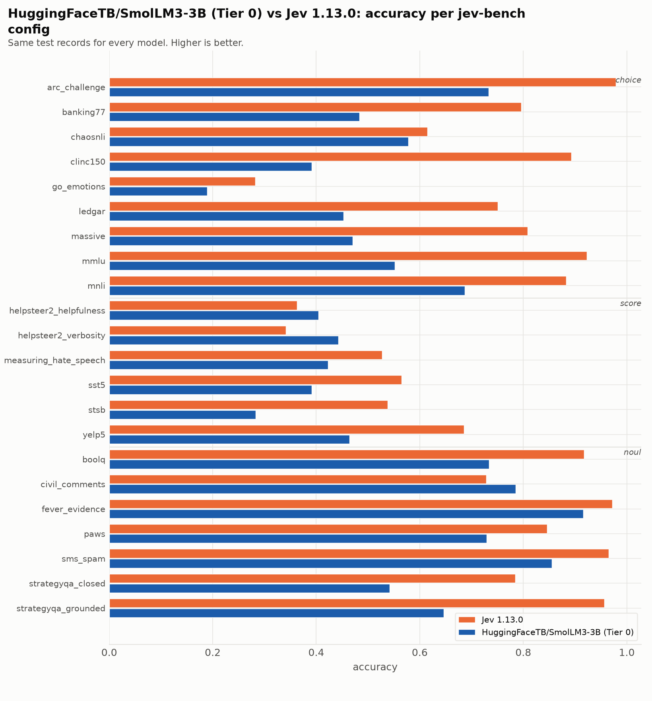
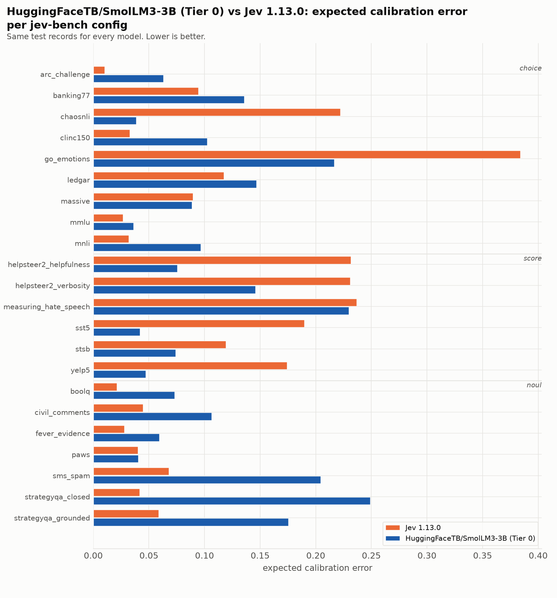

| source | prim | Jev 1.13.0 acc | Jev 1.13.0 ECE | Jev 1.13.0 Brier | HuggingFaceTB/SmolLM3-3B (Tier 0) acc | HuggingFaceTB/SmolLM3-3B (Tier 0) ECE | HuggingFaceTB/SmolLM3-3B (Tier 0) Brier |
|---|---|---|---|---|---|---|---|
| `arc_challenge` | choice | 0.979 | 0.010 | 0.037 | 0.733 | 0.063 | 0.378 |
| `banking77` | choice | 0.796 | 0.095 | 0.317 | 0.483 | 0.136 | 0.688 |
| `chaosnli` | choice | 0.615 | 0.222 | 0.583 | 0.578 | 0.039 | 0.548 |
| `clinc150` | choice | 0.893 | 0.033 | 0.159 | 0.391 | 0.102 | 0.743 |
| `go_emotions` | choice | 0.282 | 0.384 | 1.040 | 0.189 | 0.217 | 1.002 |
| `ledgar` | choice | 0.751 | 0.117 | 0.374 | 0.453 | 0.147 | 0.768 |
| `massive` | choice | 0.808 | 0.090 | 0.295 | 0.470 | 0.089 | 0.691 |
| `mmlu` | choice | 0.923 | 0.027 | 0.124 | 0.552 | 0.036 | 0.589 |
| `mnli` | choice | 0.883 | 0.032 | 0.176 | 0.687 | 0.097 | 0.447 |
| `boolq` | noul | 0.917 | 0.021 | 0.061 | 0.734 | 0.073 | 0.180 |
| `civil_comments` | noul | 0.729 | 0.045 | 0.183 | 0.785 | 0.106 | 0.159 |
| `fever_evidence` | noul | 0.972 | 0.028 | 0.025 | 0.916 | 0.059 | 0.068 |
| `paws` | noul | 0.846 | 0.040 | 0.109 | 0.729 | 0.040 | 0.177 |
| `sms_spam` | noul | 0.965 | 0.068 | 0.035 | 0.855 | 0.204 | 0.154 |
| `strategyqa_closed` | noul | 0.785 | 0.042 | 0.144 | 0.541 | 0.249 | 0.302 |
| `strategyqa_grounded` | noul | 0.956 | 0.059 | 0.038 | 0.646 | 0.175 | 0.220 |
| `helpsteer2_helpfulness` | score | 0.363 | 0.232 | 0.812 | 0.404 | 0.075 | 0.713 |
| `helpsteer2_verbosity` | score | 0.341 | 0.231 | 0.793 | 0.443 | 0.146 | 0.721 |
| `measuring_hate_speech` | score | 0.527 | 0.237 | 0.669 | 0.423 | 0.230 | 0.738 |
| `sst5` | score | 0.565 | 0.190 | 0.618 | 0.391 | 0.042 | 0.693 |
| `stsb` | score | 0.538 | 0.119 | 0.594 | 0.283 | 0.074 | 0.781 |
| `yelp5` | score | 0.685 | 0.174 | 0.483 | 0.464 | 0.047 | 0.650 |
| **macro** | | **0.733** | **0.113** | **0.349** | **0.552** | **0.111** | **0.519** |

