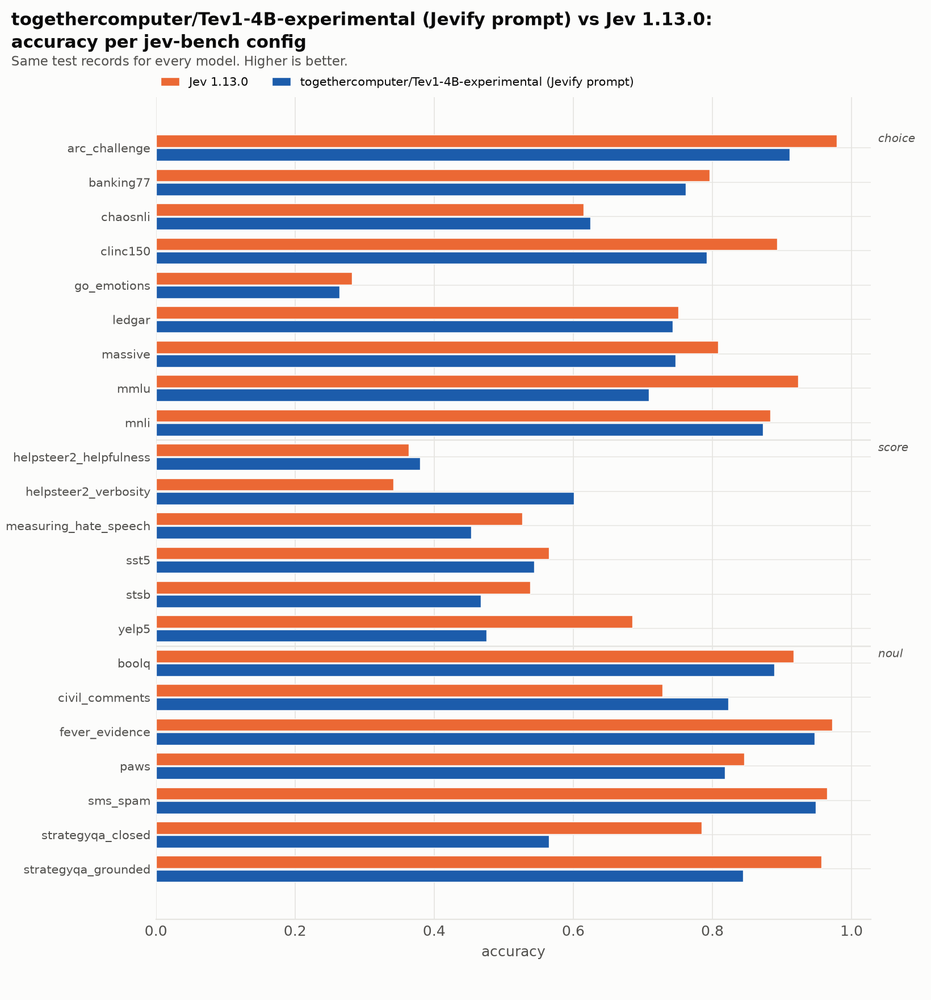
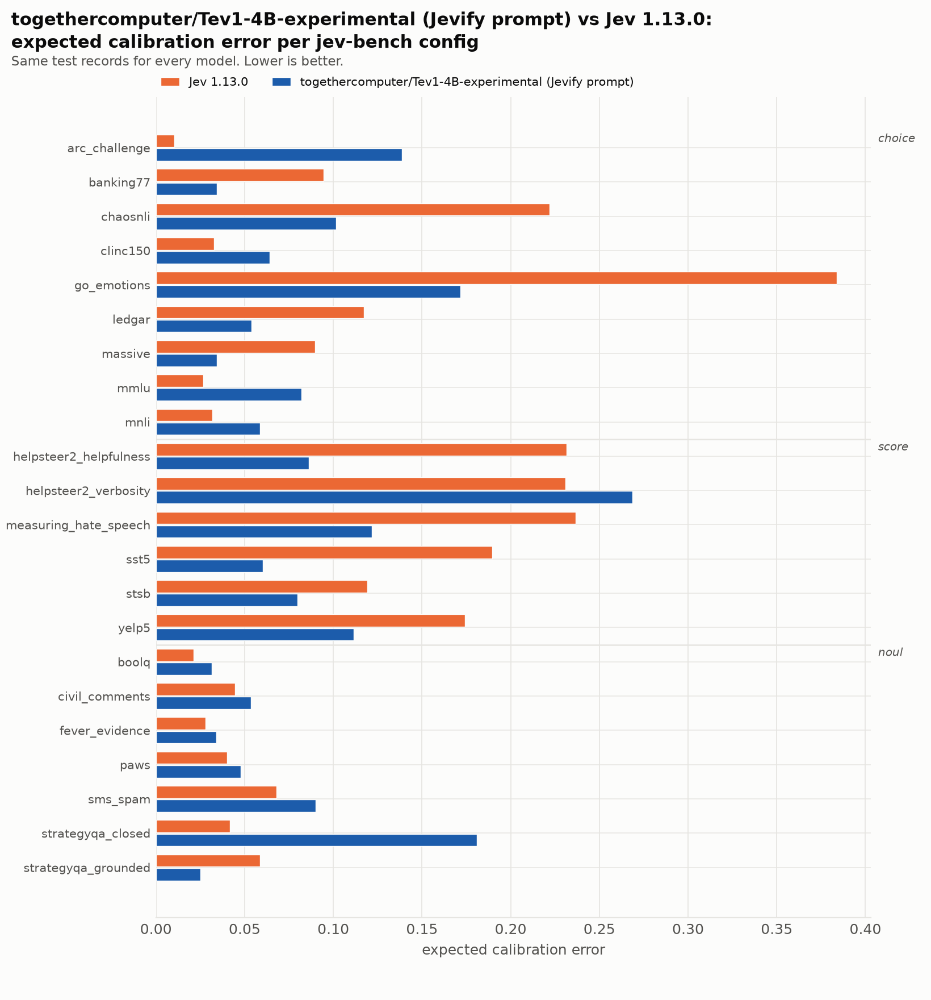

| source | prim | Jev 1.13.0 acc | Jev 1.13.0 ECE | Jev 1.13.0 Brier | togethercomputer/Tev1-4B-experimental (Jevify prompt) acc | togethercomputer/Tev1-4B-experimental (Jevify prompt) ECE | togethercomputer/Tev1-4B-experimental (Jevify prompt) Brier |
|---|---|---|---|---|---|---|---|
| `arc_challenge` | choice | 0.979 | 0.010 | 0.037 | 0.911 | 0.139 | 0.150 |
| `banking77` | choice | 0.796 | 0.095 | 0.317 | 0.762 | 0.034 | 0.332 |
| `chaosnli` | choice | 0.615 | 0.222 | 0.583 | 0.625 | 0.102 | 0.485 |
| `clinc150` | choice | 0.893 | 0.033 | 0.159 | 0.792 | 0.064 | 0.292 |
| `go_emotions` | choice | 0.282 | 0.384 | 1.040 | 0.264 | 0.172 | 0.902 |
| `ledgar` | choice | 0.751 | 0.117 | 0.374 | 0.743 | 0.054 | 0.370 |
| `massive` | choice | 0.808 | 0.090 | 0.295 | 0.747 | 0.034 | 0.351 |
| `mmlu` | choice | 0.923 | 0.027 | 0.124 | 0.709 | 0.082 | 0.389 |
| `mnli` | choice | 0.883 | 0.032 | 0.176 | 0.873 | 0.059 | 0.187 |
| `boolq` | noul | 0.917 | 0.021 | 0.061 | 0.889 | 0.031 | 0.089 |
| `civil_comments` | noul | 0.729 | 0.045 | 0.183 | 0.823 | 0.054 | 0.122 |
| `fever_evidence` | noul | 0.972 | 0.028 | 0.025 | 0.947 | 0.034 | 0.043 |
| `paws` | noul | 0.846 | 0.040 | 0.109 | 0.818 | 0.048 | 0.131 |
| `sms_spam` | noul | 0.965 | 0.068 | 0.035 | 0.949 | 0.090 | 0.051 |
| `strategyqa_closed` | noul | 0.785 | 0.042 | 0.144 | 0.565 | 0.181 | 0.252 |
| `strategyqa_grounded` | noul | 0.956 | 0.059 | 0.038 | 0.844 | 0.025 | 0.102 |
| `helpsteer2_helpfulness` | score | 0.363 | 0.232 | 0.812 | 0.380 | 0.086 | 0.711 |
| `helpsteer2_verbosity` | score | 0.341 | 0.231 | 0.793 | 0.601 | 0.269 | 0.660 |
| `measuring_hate_speech` | score | 0.527 | 0.237 | 0.669 | 0.453 | 0.122 | 0.645 |
| `sst5` | score | 0.565 | 0.190 | 0.618 | 0.544 | 0.060 | 0.575 |
| `stsb` | score | 0.538 | 0.119 | 0.594 | 0.467 | 0.080 | 0.644 |
| `yelp5` | score | 0.685 | 0.174 | 0.483 | 0.475 | 0.112 | 0.637 |
| **macro** | | **0.733** | **0.113** | **0.349** | **0.690** | **0.088** | **0.369** |

